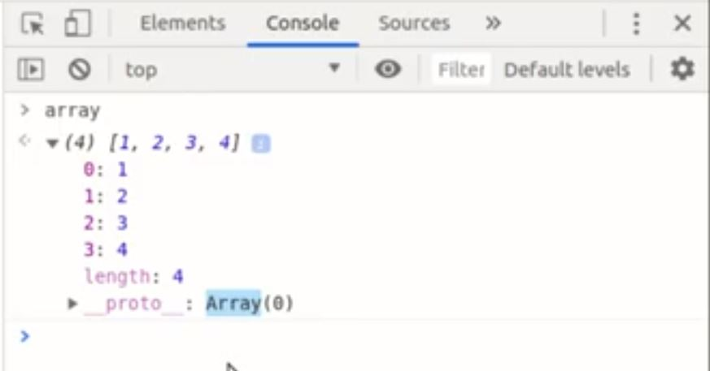
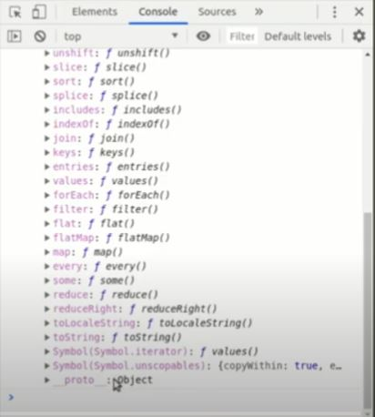
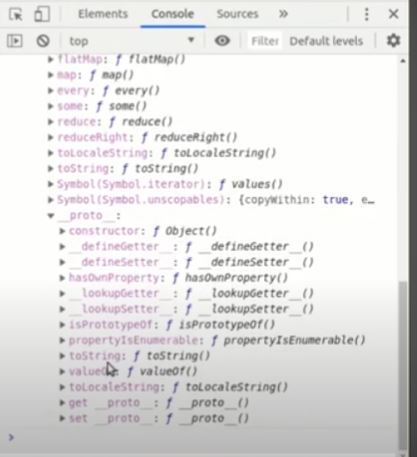

# **MODULO 7**
># Clases y Prototypes
¿Como se construye una clases y como funcionan los prototype para usar sus propiedades y añadir metodos a los constructores existentes?

¿Que beneficios nos brindan las clases en la resolusion de problemas?


## **Metodos Y Propiedades en una Clase**

La entidad es una representacion del mundo real. Por ejemplo, en vez de hablar referente al muno, si nos colocamos en el contexto de Instagram, en ese entrono existen como ejemplo 2 entidades; usuario y publicaciones

La forma de crear una clases, son de la siguiente manera: 

A) Funcion constructura
B) Expresion de clase

* Cuando se declara una clase la primera letra de su nombre debe de ser mayuscula.

* Las clases tienen dos tipos de datos; propiedades y meetodos

* La clase es un dato de tipo _Lista_

* En Java Script hay una forma de crear plantillas que nos permiten crear bloques de informacion para represar una entidad en nuestro codigo, estas planillas se denominan clases.

A continuacion se mostrara un ejemplo de como se declara una clase de la forma _funcion constructora_:

```javascript
function Auto(puertas, color, marca, anio, llantas){ 
    // Propiedades
    this.puertas = puertas;
    this.color = color;
    this.marca = marca;
    this.anio = anio;
    this.llantas = llantas;

    //Metodos
    this.informacion = function(){
        console.log("Este es un carro con "+ this.puertas + ' puertas y color ' + this.color);
    };
}

let miPrimerAuto = new Auto(4, 'rojo', 'Ferrari', 2023, 4);
console.log(miPrimerAuto);
console.log(miPrimerAuto.anio);
miPrimerAuto.informacion();
```

En el codigo anterior se muestra como se utiliza l apalabra reservada function, seguido con el nombre de la clase con la primera letra en mayuscula, ademas, se recibe como parametro cada propiedad y para declarar estas propiedades se utiliza la palabra reservada this. 

Posteriormente se inicializa la clase auto, utilizar la plantilla. Para esto vamos a declarar una variable _miPrimerAuto_ esta variable sera igual a la palabra reservadada _new_ que nos permitira una nueva instancia (en POO, la palabra instancia se utiliza para indicar que un objeto pertenece a otro) de la clase Auto.

Ahora veremos la creacion de una clase utilizando el metodo de _Expresion de clase_:

```javascript
class Auto{
    constructor(puertas, color, marca, anio, llantas){
        this.puertas = puertas;
        this.color = color;
        this.marca = marca;
        this.anio = anio;
        this.llantas = llantas;
    };

    informacion() {
        console.log("Este es un carro con "+ this.puertas + ' puertas y color ' + this.color);
    }
}

let miPrimerAuto = new Auto(4, 'rojo', 'Ferrari', 2023, 4);
console.log(miPrimerAuto);
console.log(miPrimerAuto.color);
miPrimerAuto.informacion();
```
Una de las diferencias entre Funcion de clase y Expresion de clase es la sintaxis

**Recortatorio:** El objeto _this_ nos permite indicar de que contexto se va obtener informacion. 

## **Concepto _Prototipo_ y _Herencia_**

Prácticamente, un prototipo es una propiedad que tiene cada uno de los objetos (mecanismo) exepto el objeto _Object_. Gracias al prototipo se pueden compartir propiedades y métodos entre objetos relacionados, el cual tiene como nombre, esta actividad, heredad o herencia.  Si definimos el siguiente array:

```javascript
let arreglo = [1, 2, 3, 4];
```
Se sabe que se definio como un objeto, con las siguientes propiedades, incluyendo la propiedad _Prototipo_



Ahora, si abrimos el primer prototipo, observaremos que contiene metodos del objeto Array(0):



Se observa en la imagen anterior que el propio objeto Array, contiene tambien otro metodo _Prototype_ llamado _Object_, que es JavaScript, es el Objeto Null. Si abrimos el metodo _Prototipo: Object_ se observa lo siguiente:



EL proceso en el que los objetos globales de JavaScript le extienenden metodos y propiedades a cualquier tipo de dato se denomina _Herencia_

**¿Como se agrega un nuevo metodo a un objeto?**

Tomando como ejemplo al objeto padre (_Object_), agregaremos en el un nuevo metodo llamado _saludar_:

```javascript
Object.prototype.saludar = function(){
    console.log("Hola, como estas?");
}
```
El cual se obitne el siguiente resultado:


**Ejemplo del concepto prototipo:**

Primero creamos un objeto llamado persona, de una de las dos formas que se muestran a continuacion:

```javascript
//PRIMER CODIGO - PRIMERA OPCION
const persona = {
    nombre: 'Misael',
    edad: 25,
    saludo: function(){
        console.log(nombre + " esta saludando!");
    }
}

//SEGUNDO CODIGO - SEGUNDA OPCION
const persona = new Object({
    nombre: 'Misael',
    edad: 25,
    saludo: function(){
        console.log(nombre + " esta saludando!");
    }})
// LAS DOS FORMAS ANTEIRORES DE CREAR UN OBJETO SON COMPLETAMENTE IGUALES PERO LA SYNTAXIS CAMBIA
```
Una vez echo lo anterior, crearemos una nueva variable _persona2_ usando el metodo _create()_ del objeto _Object_ y colocando en su parametro al objeto _persona_, osea, crearemos una nueva instancia:

```javascript
const lider = Object.create(persona)
// Cabe recalcar que unicamente se pueden agregar directamente nuevos prototipos al objeto _Object_
```
Ahora, agregaremos un nuevo metodo al objeto _Object_:
