# **APUNTES**
## **RECURSION**

Una recursion, es cuando una funcion invica a su misma funcion. Se aplica a problemas que requieren ejecutar la misma funcion hasta llegar a una condicion: 

``` javascript
  function recursiva(num) {
    
    // planteamos un caso base que cuando llegue a este retorne un valor
    if(`caso base`) return

    // acá pondríamos que operación se tendría que repetir, puede ser tan
    // simple como puedan imaginar o increíblemente compleja
    c = a + b

    // una vez realizada la operación lo que queda es repetirla hasta llegar
    // al caso base, entonces necesitamos una `llamada recursiva`.
    return recursiva(c)
    // y finalmete retornaria el resultado que vayamos devolviendo
  }
```

## **ESTRUCTURA DE DATOS 1**

> ### Recursion

Se podria decir que una recursion es una funcion que se llama asi misma. 

> ### Estructura de datos

Se refiere a como organizamos los datos cuando programamos

* Un arreglo es una estructura de datos

* El comando Set() nos permite eliminar datos repetidos de un arreglo y convierte ese arreglo en un objeto tipo Set que se denominan como coleccionadores de valores.

* Para agregar un elemento a un nuevo objeto Set, se utiliza el metodo add().

* Para verificar que un valor se encuentra en un objeto tipo Set, se utiliza el metodo has()

> ### Pilas (stacks)

La pila es un sistema de tipo FILO (First in Last Out)
El codigo del arreglo coomo pila seria el siguiente: 

```javascript
let array = [];
array.push(1); //[1]
array.push(10); //[1,10]
array.push(11); //[1,10,11]
//Extrae el ultimo numero del array y lo guarda en i
let i = array.pop();    //i = 11
console.log(array);     //[1,10]     
console.log(i); 
```
Definir una pila con un arreglo no es recomendable, ya que otro programador podria utilizar el metodo _shift()_ en el arreglo (objeto) y resultaria que este dejaria de funcionar como un stack, por lo tanto se realizo lo siguiente:

```javascript
class Stack{
    constructor(){
        this.array = [];
    }
}

Stack.prototype.push = function(elem){
    this.array.push(elem);
    }

Stack.prototype.pop = function(){
    return this.array.pop();
}

let stackDePrueba = new Stack();
stackDePrueba.push(1);
stackDeprueba.push(2);
stackDePrueba.push(3);
stackDePrueba.pop();
console.log(stackDePrueba);
```
Se obta por agregar directamente el metodo _pop_ y _push_ al objeto stackDePrueba, esto con el fin de no tener que escribir la siguiente expresion:

```javascript
stackDePrueba.array.push();
```

Y, sin embargo, solo utilizar:

```javascript
stackDePrueba.push(); // Ya que unicamnete estamos
//mandando a llamar el metodo push del objeto stackDePrueba.
```

>### Queue

La simulacion de la estructura de datos tipo queue, se podria realizar de la siguiente menera (FIFO):

```javascript
let queue = [];
queue.push(1);  //[1]
queue.push(4);  //[1,4]
queue.push(5);  //[1,4,5]
queue.push(3);  //[1,4,5,3]
let i = queue.shift();
console.log(i); // i = 1
console.log(queue); // [4,5,3]
```
La fomra de expresar la estructura de datos tipo queue que se mostro anteriormente no es del todo funcional. Esto es debido a que si un usuario ejecuta el metodo pop() ya no se comportaria como se requiere. Por lo tanto, se sugiere utilizar el siguiente codigo que implica utilizar clases:

```javascript
class Queue{
    constructor(){
        this.array = [];
    }
}

Queue.prototype.push = function(elem){
    this.array.push(elem);
}

Queue.prototype.shift = function(){
    return this.array.shift();
}

let QueueDePrueba = new Queue();
QueueDePrueba.push(1);  //[1]
QueueDePrueba.push(4);  //[1,4]
QueueDePrueba.push(5);  //[1,4,5]
QueueDePrueba.push(3);  //[1,4,5,3]
let i = QueueDePrueba.shift();
console.log(i); // i = 1
console.log(QueueDePrueba.array); // [4,5,3]
```
///////////////////////////////////////////////////////////////////////////////////////////////////////////////////////////////////
## **ESTRUCTURA DE DATOS 2**

 >## **Listas enlazadas**

Una lista enlasada en una estructura de datos. La slistas contienen nodos, y los nodos contienen 2 partes:

* Dato
* Apuntador

La diferencia entre un array y una lista enlazada es, que las direcciones de almacenamiento de cada valor que contiene una lista enlazada no deben de ser continuas y las direcciones de alamacenamiento de los datos el array y deben ser continuos. Una de las desventajas de las listas enlazadas es que son mas complejas codigificarlas a comparacion de un array. 

### **_Codificacion de una lista enlazada_**

La lista enlazada se codifica creando la estructura de la lista ensi y tambien, las estructura de un node.


```javascript
//CODIFICACION DE UNA LISTA ENLAZADA
//Se establece la clase de un nodo
function Node(data){
  this.data = data;
  this.next = null;
}

//Se establece la clase de una lista
function LinkedList(){
  this.length = 0;
  this.head = null;
}
```
Algunas operaciones que se pueden llevar acabo dentro de las listas enlzadas, son:

* Agregar un elemento (nodo) al final de la lista. Para esto, se crea un nuevo metodo a la clase LinkedList 
```javascript
LinkedList.prototype.add = function(value){
  let node = new Node(value); // node
  current = this.head;
  if(!current){
    this.head = node;
  }

  while(current.next){
    current = current.next;
  }
  current.next = node;
  this.length++;
} 
```
* Agregar un nodo al inicio de la lista. 
```javascript
LinkedList.prototype.addFirst = function(value){
  let node = new Node(value);
  // Se agrega el nodo al inicio
  let backUp = this.head;
  this.head = node;
  current = this.head;
  current.next = backUp;
  this.length++;
}
```
* Solicitar el numero de una posicion. 

```javascript
LinkedList.prototype.searchPosition = function(position){
  let current = this.head;
  let counter = 2;
  
  // Cuando la posicion deseada es 0 o cuando no hay nada en la lista

  if(!current || position === 0 || position <= this.length){
    return null;
  }

  // Cuando se desea el primer elemento
  if(position === 1){
    return current.value
  }

  // Cuando se solicita un numero despues de la posicion 2
  while(current.next.next !== null && counter !== position){
    current = current.next;
    counter++;
  }
  return current.next.value;
}


```
* Eliminar el ultimo nodo:
```javascript
LinkedList.prototype.remove = function () {
  let current = this.head;
  // head -> null
  if(!current){ // if (current === Null) {}
    return null; // Retorna Null
  }

  else if(current && !current.next){
    let aux = current.value
    this.head = null;
    return aux
  }
  // head -> 3 -> 4 - > 8 -> null
  //              ^          -
  while(current.next.next){
    current = current.next;
  }
  let aux = current.next.value;
  current.next = null;
  return aux;
}
``` 

>## **Tabla Hash**


**_El metodo charCodeAt()_**

El método charCodeAt() en JavaScript se utiliza para devolver el valor numérico del carácter Unicode en la posición especificada en una cadena de caracteres. Este método toma un parámetro obligatorio, que es el índice de la posición del carácter en la cadena.

Por ejemplo, si tenemos la cadena de caracteres "Hola Mundo" y queremos obtener el valor numérico del carácter en la posición 1 (que es la letra 'o'), podemos utilizar el método charCodeAt() de la siguiente manera:

```javaScript
let cadena = "Hola Mundo";
let valor = cadena.charCodeAt(1);
console.log(valor); // devuelve 111
```

## **ESTRUCTURA DE DATOS III**

>## **Arboles**

**Definición de los árboles:**

Un árbol es una estructura de datos no lineal que consiste en un conjunto de nodos interconectados mediante enlaces llamados ramas o arcos, que se organizan jerárquicamente.
La raíz es el nodo superior del árbol, el cual no tiene padres. Los nodos que no tienen hijos se llaman hojas. Los demás nodos se llaman nodos internos.
Cada nodo puede tener uno o varios nodos hijos. La relación entre un nodo y sus hijos es una relación padre-hijo.
Un árbol puede tener una altura máxima, que es la longitud del camino más largo desde la raíz hasta una hoja.

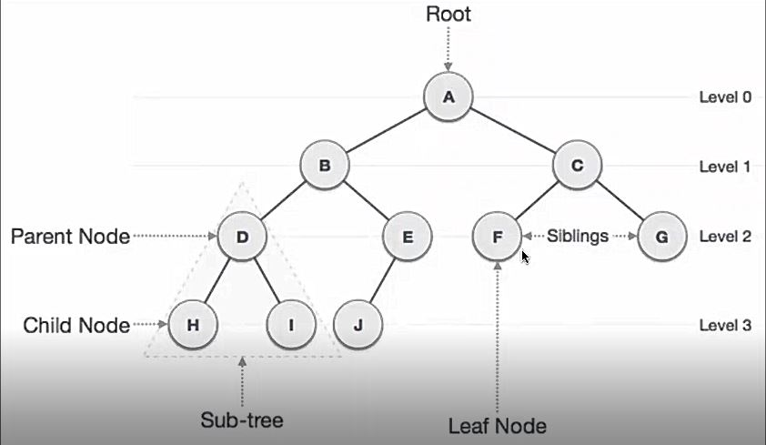

**Tipos de Arboles**

**_Binary Tree_**

Este es un árbol particular que tiene como característica que la cantidad de hijos que puede tener un nodo está restringida a dos (por eso se llama árbol binario).

Un árbol de este estilo puede estar _balanceado_ o no: vamos a decir que un árbol es _balanceado_ cuando la cantidad de nodos que haya a la izquierda del root sea igual (o no difiera en más de una unidad) a la cantidad de nodos en la parte izquierda.

Lo bueno de estos árboles, es que si se encuentra balanceado, necesitamos no más de log n pasos para llegar a cualquier nodo! Esto los hace excelente estructuras de datos para guardar información que luego vamos a tener que buscar.

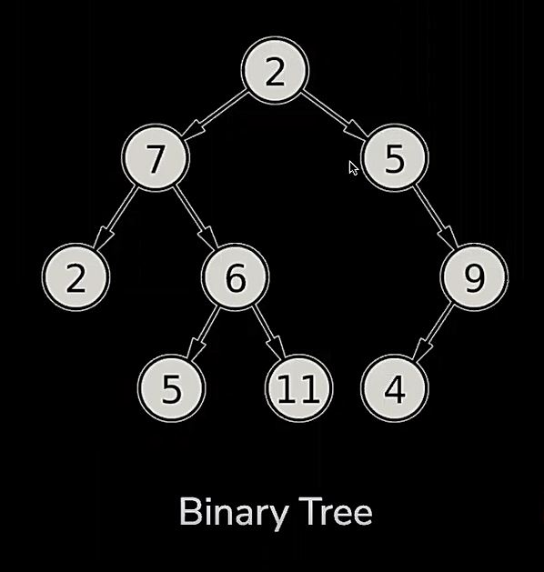

**_Codigo:_**

```javascript
class Nodo {
  constructor(valor) {
    this.valor = valor;
    this.izquierdo = null;
    this.derecho = null;
  }
}

class ArbolBinario {
  constructor() {
    this.raiz = null;
  }

  agregar(valor) {
    const nodo = new Nodo(valor);
    if (this.raiz === null) {
      this.raiz = nodo;
    } else {
      this.agregarNodo(this.raiz, nodo);
    }
  }

  agregarNodo(nodoActual, nodoNuevo) {
    if (nodoActual.izquierdo === null) {
      nodoActual.izquierdo = nodoNuevo;
    } else if (nodoActual.derecho === null) {
      nodoActual.derecho = nodoNuevo;
    } else {
      this.agregarNodo(nodoActual.izquierdo, nodoNuevo);
    }
  }
}
```
**_BinarySearchTree_**

Los árboles de búsqueda binarios son árboles binarios en los que cada nodo tiene un valor numérico asociado, y los valores en los nodos izquierdos son menores que el valor en el nodo padre, mientras que los valores en los nodos derechos son mayores.

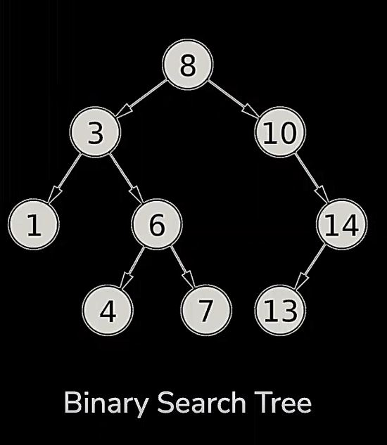

**_Codigo:_**

```javascript
class ArbolBusquedaBinario {
  constructor() {
    this.raiz = null;
  }

  agregar(valor) {
    const nodo = new Nodo(valor);
    if (this.raiz === null) {
      this.raiz = nodo;
    } else {
      this.agregarNodo(this.raiz, nodo);
    }
  }

  agregarNodo(nodoActual, nodoNuevo) {
    if (nodoNuevo.valor < nodoActual.valor) {
      if (nodoActual.izquierdo === null) {
        nodoActual.izquierdo = nodoNuevo;
      } else {
        this.agregarNodo(nodoActual.izquierdo, nodoNuevo);
      }
    } else {
      if (nodoActual.derecho === null) {
        nodoActual.derecho = nodoNuevo;
      } else {
        this.agregarNodo(nodoActual.derecho, nodoNuevo);
      }
    }
  }
}
```
**_AVL Tree (Auto Balanceo)_**

Un árbol AVL es un árbol binario de búsqueda auto-balanceado. En un árbol binario de búsqueda, cada nodo tiene como máximo dos hijos y el hijo izquierdo es menor que el nodo padre, mientras que el hijo derecho es mayor o igual que el nodo padre. Esta propiedad asegura que los elementos en el árbol estén ordenados.

En un árbol AVL, cada nodo tiene un factor de equilibrio, que es la diferencia entre las alturas de sus subárboles izquierdo y derecho. El factor de equilibrio puede tener uno de tres valores: -1, 0 o 1. El árbol se considera equilibrado si el factor de equilibrio de cada nodo es -1, 0 o 1. Si el factor de equilibrio de cualquier nodo está fuera de este rango, el árbol está desequilibrado y debe ser reequilibrado.

El objetivo de un árbol AVL es mantener el equilibrio mientras sigue proporcionando operaciones eficientes para buscar, insertar y eliminar nodos. Esto se logra a través de un proceso llamado rotación, que implica intercambiar nodos para mantener el factor de equilibrio.

Existen cuatro tipos de rotaciones que se pueden realizar en un árbol AVL: rotación a la derecha, rotación a la izquierda, rotación derecha-izquierda y rotación izquierda-derecha. Estas rotaciones se utilizan para reequilibrar el árbol cuando se agrega o elimina un nodo.

La complejidad temporal de las operaciones en un árbol AVL es O(log n) en el peor de los casos, lo que lo convierte en una estructura de datos eficiente para almacenar y buscar grandes cantidades de datos.

En resumen, un árbol AVL es un tipo de árbol binario de búsqueda auto-balanceado que mantiene el equilibrio a través de un proceso de rotación. Proporciona operaciones eficientes para buscar, insertar y eliminar nodos, y se usa comúnmente en aplicaciones como bases de datos y compiladores donde la eficiencia es crítica.

**Codigo:**

```javascript
class Node {
  constructor(value) {
    this.value = value;
    this.left = null;
    this.right = null;
    this.height = 1;
  }
}

class AVLTree {
  constructor() {
    this.root = null;
  }

  height(node) {
    if (node === null) {
      return 0;
    }
    return node.height;
  }

  max(a, b) {
    return a > b ? a : b;
  }

  rightRotate(y) {
    const x = y.left;
    const temp = x.right;

    x.right = y;
    y.left = temp;

    y.height = this.max(this.height(y.left), this.height(y.right)) + 1;
    x.height = this.max(this.height(x.left), this.height(x.right)) + 1;

    return x;
  }

  leftRotate(x) {
    const y = x.right;
    const temp = y.left;

    y.left = x;
    x.right = temp;

    x.height = this.max(this.height(x.left), this.height(x.right)) + 1;
    y.height = this.max(this.height(y.left), this.height(y.right)) + 1;

    return y;
  }

  getBalanceFactor(node) {
    if (node === null) {
      return 0;
    }
    return this.height(node.left) - this.height(node.right);
  }

  insert(value) {
    this.root = this._insert(this.root, value);
  }

  _insert(node, value) {
    if (node === null) {
      return new Node(value);
    }

    if (value < node.value) {
      node.left = this._insert(node.left, value);
    } else {
      node.right = this._insert(node.right, value);
    }

    node.height = this.max(this.height(node.left), this.height(node.right)) + 1;

    const balanceFactor = this.getBalanceFactor(node);

    if (balanceFactor > 1 && value < node.left.value) {
      return this.rightRotate(node);
    }

    if (balanceFactor < -1 && value > node.right.value) {
      return this.leftRotate(node);
    }

    if (balanceFactor > 1 && value > node.left.value) {
      node.left = this.leftRotate(node.left);
      return this.rightRotate(node);
    }

    if (balanceFactor < -1 && value < node.right.value) {
      node.right = this.rightRotate(node.right);
      return this.leftRotate(node);
    }

    return node;
  }

  preOrder(node) {
    if (node !== null) {
      console.log(node.value);
      this.preOrder(node.left);
      this.preOrder(node.right);
    }
  }

  inOrder(node) {
    if (node !== null) {
      this.inOrder(node.left);
      console.log(node.value);
      this.inOrder(node.right);
    }
  }

  postOrder(node) {
    if (node !== null) {
      this.postOrder(node.left);
      this.postOrder(node.right);
      console.log(node.value);
    }
  }

  print() {
    console.log('Preorder traversal:');
    this.preOrder(this.root);
    console.log('Inorder traversal:');
    this.inOrder(this.root);
    console.log('Postorder traversal:');
    this.postOrder(this.root);
  }
}

const tree = new AVLTree();

tree.insert(10);
tree.insert(20);
tree.insert(30);
tree.insert(40);
tree.insert(50);
tree.insert(25);

tree.print();

```

## **ALGORITMOS EN JAVASCRIPT I**

 >## **Algoritmo**

 Un algoritmo es un conjutno de pasos que al llevarlos acabo se llega a un objetivo especifico. 

 **¿Que hace que un algoritmo sea bueno?**

 * Resuelve un problema: Cumple con su objetivo al seguir los pasos

 * Debe ser comprensible: Que no solo yo lo comprenda, sino tambien la demas gente.

 * Hacerlo eficientemente: Que lo haga rapido y con bajos recursos. Aveces se pueden sacificar recursos si es mas importante para nosotros otros recuros. 

 **¿Como medimos la eficinecia de un algoritmo?**
 
 1. Tiempo: Cuanto tarda el algoritmo en ejecutarse
 2. Espacio: Cuatos recursos consume
 3. Otro: 
    - Red
    - Graficos
    - HardWare 

>## **O Big Notation**

**¿Que es la complejidad espacial y temporal?**

La complejidad espacial y temporal son conceptos que se utilizan en la teoría de la complejidad computacional para **analizar** la eficiencia de los algoritmos.

La **complejidad temporal** se refiere a la cantidad de tiempo que tarda un algoritmo en resolver un problema, medida en términos del número de operaciones o instrucciones que se deben realizar. Por lo tanto, la complejidad temporal se puede expresar como una función del tamaño de entrada del problema, es decir, cuántos datos se necesitan procesar para resolver el problema.

Por ejemplo, si tenemos una lista de números y queremos ordenarlos, la complejidad temporal del algoritmo de ordenamiento **determinará** cuánto tiempo tomará el algoritmo para ordenar la lista en función del número de elementos en la lista.

Ejemplo:
Existe otros 2  metodo para medir el tiempo de ejecucion de un algoritmo. Aun que, estos no son del todo precisos. Uno es usando el metodo performance():

```javascript
const performance = require(`perf_hooks`)

function sumaLosValores(str) {
  if(typeof str !== 'object'){
    return
  }
  let sum = 0;
  for(let i = 0; i < str.length; i++){
    sum += str[i]
  }

  return sum
}
let inicioTiempo = performance.performance.now();
let sum = sumaLosValores([1,2,3,4,5]);
let finalTiempo = performance.performance.now();
let duracion =  finalTiempo - inicioTiempo;
console.log(sum);
console.log(duracion)

OutPut:
// Se llevaron acabo 3 pruebas y los tiempos no fueron del todo precisos y estables. 
PS C:\Users\ingen\Desktop\CursoSoyHenry> node pruebaCodigos.js
15
0.029500000178813934
PS C:\Users\ingen\Desktop\CursoSoyHenry> node pruebaCodigos.js
15
0.05039999634027481
PS C:\Users\ingen\Desktop\CursoSoyHenry> node pruebaCodigos.js
15
0.030199997127056122
```
Ejemplo con **console.time()**:

```javascript
function sumaLosValores(str) {
  if(typeof str !== 'object'){
    return
  }
  let sum = 0;
  for(let i = 0; i < str.length; i++){
    sum += str[i]
  }

  return sum
}

console.time(`duracion-sumaLosValores`)
sumaLosValores([1, 2, 3, 4, 5, 6, 7, 8, 9, 10])
console.timeEnd(`duracion-sumaLosValores`)

OutPut:

PS C:\Users\ingen\Desktop\CursoSoyHenry> node pruebaCodigos.js
duracion-sumaLosValores: 0.089ms
PS C:\Users\ingen\Desktop\CursoSoyHenry> node pruebaCodigos.js
duracion-sumaLosValores: 0.089ms
PS C:\Users\ingen\Desktop\CursoSoyHenry> node pruebaCodigos.js
duracion-sumaLosValores: 0.105ms
PS C:\Users\ingen\Desktop\CursoSoyHenry> node pruebaCodigos.js
duracion-sumaLosValores: 0.088ms
PS C:\Users\ingen\Desktop\CursoSoyHenry> node pruebaCodigos.js
duracion-sumaLosValores: 0.088ms
PS C:\Users\ingen\Desktop\CursoSoyHenry> node pruebaCodigos.js
duracion-sumaLosValores: 0.091ms
```


La **complejidad espacial** se **refiere** a la cantidad de memoria que un algoritmo utiliza para resolver un problema, medida en términos de la cantidad de espacio de almacenamiento requerido para procesar los datos. En otras palabras, la complejidad espacial **mide** la cantidad de recursos de memoria que se necesitan para resolver un problema.

Por ejemplo, si tenemos un algoritmo que convierte un valor de 1D a 2D debemos saber cuanta memoria requerira el algoritmo para realizar dicha funcion. Osea, cuantas variables o cuantos arreglos se van a crear en el proceso del algoritmo

Ejem: 

```javascript
function intToString(array){ // TipoDato: Arreglo con datos de tipo entero
    let resultado = array.map(elemento => elemento.toString())
    return resultado; // Retorna un string
  }

function dosDimensiones(valor){ // TipoDato: Entero
 let array = new Array(valor);
 for (let i = 0; i < valor; i++) {
    array[i] = new Array(valor).fill('Jencita')
 }
 return array; // Retorna un string. 
}

  console.log(intToString([1 ,2 ,3,5, 7, 8]));
  console.log(dosDimensiones(5));

// Al observar ambas funciones (algoritmos) se observa que la funcion
// dosDimensiones requiere mas recursos que la funcion
// inToString
```
Los resultados obtenidos en los 4 ejemplos propuestos anteriromente, acerca de la complejidad temporal y espacial, nos brindar resultados dificles de interpretar y son bastante variables. De echo, a continuacion se muestran algunas graficas del analisis de 2 algoritmos distintos del tiempo requerido por el algoritmo en funcion de la cantidad de datos que se le ingresen al algoritmo. 

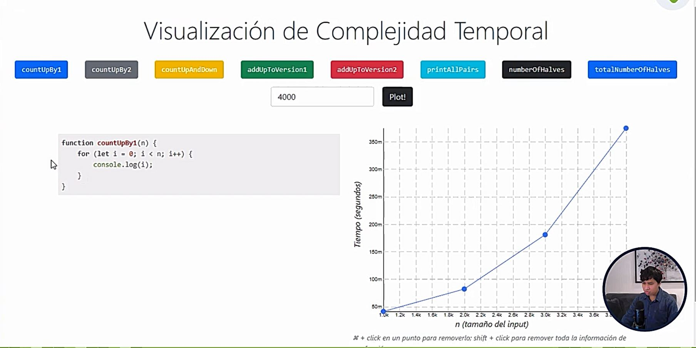


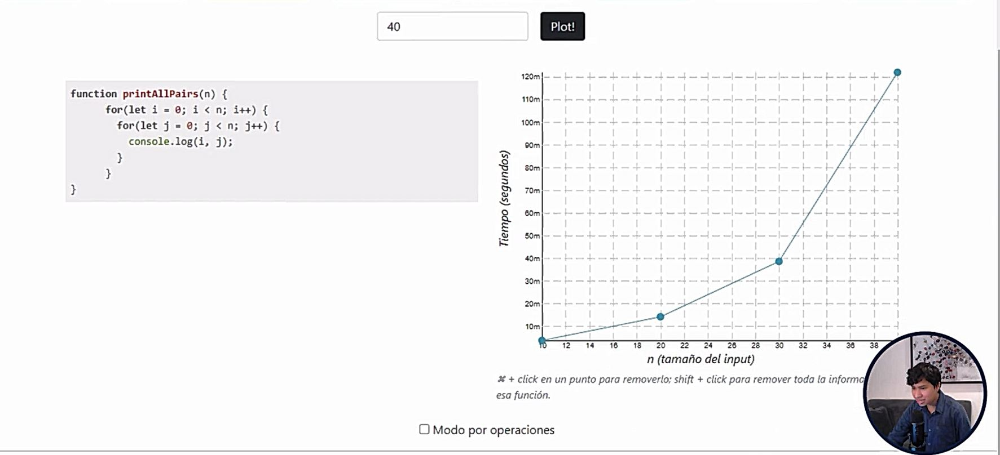

Para facilitar la interpretacion de cada algoritmo, buscaremos reducir la complejidad con ayuda de un **Analisis Asintotico (Asymptotic Analysis)**. Este analisis matematico nos permitira identificar hacia que funcion tiende la grafica obtenida por la complejidad espacial y temporal. De igual forma, este analisis nos permite evaluar si un algoritmo funciona en funcion a algo mas estandar y no en funcion al tiempo de operacion, los recursos ocupados, el hardaware de la computadora, los procesos que se estan ejecutando etc. Por lo tanto, utilizaremos la **Complejidad Big O**

En el ejemplo anterior. La primera grafica tiende hacer a una funcion lineal y, en el segundo ejemplo a una funcion cuadratica. Dado lo anterior, podremos asemejar cada algoritmo o procesos a una funcion dependiendo de la complejidad de esta. 

.JPG)

**Que es y para que sirve la Big "O" Notation**

Es una **herramienta**. El Big O Notatio, **mide** el tiempo de ejecucion y la complejidad de un algoritmo en termino de la cantidad de entrada que maneja. En otras palabras, se refiere a la máxima cantidad de tiempo o espacio que un algoritmo podría tomar para completar su tarea, dado un tamaño de entrada específico

_**Notacion Big O en complejidad temporal**_

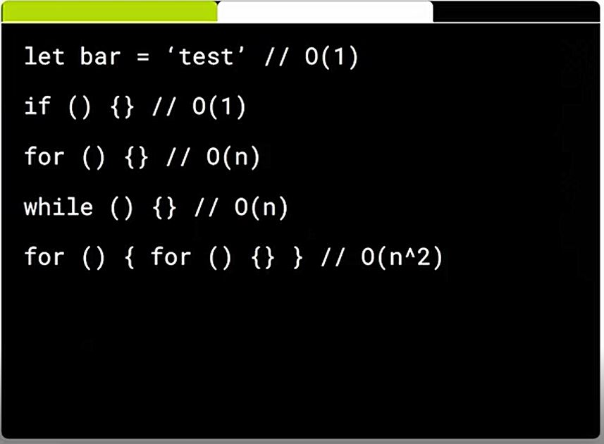

_**Notacion Big O en complejidad espacial**_

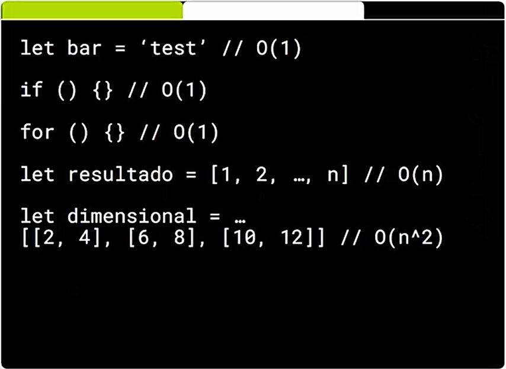

_**Comparación Gráfica**_

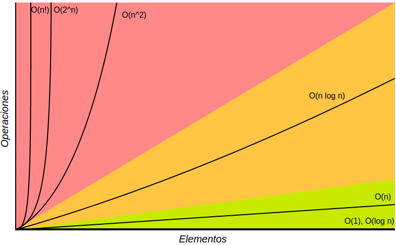

En la imagen de arriba podemos ver una comparación gráfica de las distintas complejidades de los algoritmos.

Si tuvieramos una compu es capaz de ejecutar 1.000.000 instrucciones por segundo (un poco optimista para las compus de hoy) , veamos cuanto tiempo tardarían algoritmos de distinta complejidad  en terminar de correr con un N de entrada de 1000.

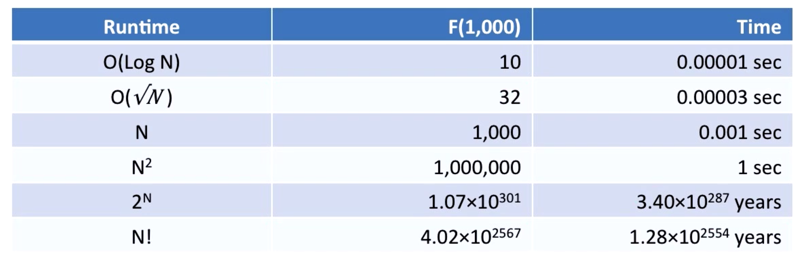

Sorprendente, no? Miren [esto](https://es.wikipedia.org/wiki/Torres_de_Han%C3%B3i#Historia)

Ahora pensemos el problema al reves. ¿Qué cantidad de datos podría procesar cada algoritmo en un segundo?:

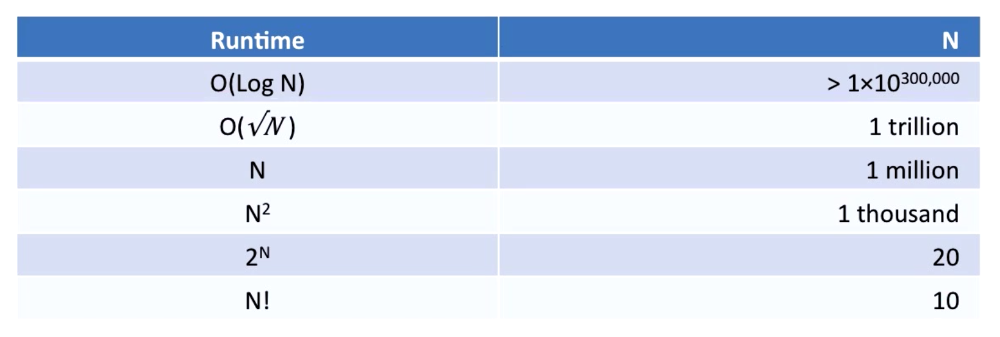

Al primero podemos tirarle la cantidad de datos que quisieramos! (de hecho tendriamos un problema de memoria, más que de tiempo).
A los últimos los vamos a poder usar sólamente con entradas que sean muy pequeñas... si no, vamos a tener que esperar mucho tiempo

A continucacion realizaremos 2 ejercicios aplicando la Big O Notatio: 

**Ej 1:**
```javascript
let max // O(1)
for(){  // O(N) 
  if() // do smth O(1)
  else() // do ngth O(1)
} // O(2*N) == O(N)
console.log(max) // O(1)

// Every thing => O(2 + N) => O(N) 
```
**Ej 2:**
```javascript
function sumArray(array, n){
  var fin = array.lenght -1; //O(1)
  var init = 0; // O(1)

  while(init < fin){ // O(N)
    var sum = array[ini] + array[fin]; // O(1)
    if(suma === n) return true;// O(1)
    if(suma > n) fin - fin -1;// O(1)
    if(suma < n) ini - ini +1;// O(1)
  } // O(4*N) => O(N)
  return false // O(1)
}; // O(3 + N) => O(N)
```

**Ej 3:**

#### Adivinando un número

Hagamos un pequeño juego para ver cómo distintos approachs a un mismo problema pueden tener distintas eficiencias, de hecho, para jugar vamos a crear un _algoritmo_ mental que vamos a seguir hasta ganar el juego.

Vamos a elegir aleatoriamente un numero entre una lista de números del 1 a 16. La persona que adivine ese número en la menor cantidad de pasos será el ganador. En cada caso, el que conoce el número dirá si el número adivinado es mayor o menor que el objetivo.

Empezemos a jugar. Cada uno va a intentar adivinar y nos va a contar qué técnica utilizó para agrandar sus chances de ganar.

#### Búsqueda Linear

Digamos que no queriamos pensar mucho, y decidimos atacar el problema con lo que se conoce como __Fuerza Bruta__, es decir, intentar de a una cada una de las soluciones posibles hasta dar con el resultado. En ese caso podríamos decidir empezar desde el 1 o el 16, e ir probando uno por uno hasta dar con el número. Ahora intentemos calcular de antemano cuantas veces tendríamos que adivinar para ganar, bueno dependiendo de nuestra suerte podriamos ganar en un paso (El número ganador es el 1 o el 16 y empezamos por ese extremo), o si la suerte no está de nuestro lado, el peor caso sería de 16 (el número es 1 o 16, pero empezamos por el extremo opuesto). Entonces podemos ganar el juego en una cantidad de veces que esté entre 1 y 16, no? De hecho si jugaramos muchas veces (como el que elige el número lo hace de forma aleatoria y están igualmente distribuidas las probabilidades) nos vamos a dar cuenta que __en promedio__ vamos a ganar el juego en 8 veces.

Ahora, como podriamos hacer para bajar la cantidad de veces que en promedio necesitamos? Bueno, como el que sabe el número nos dice si el número que elegimos es mayor o menor, podemos hacer uso de eso para optimizar nuestro juego. Tenemos que pensar lo siguiente: ¿Qué número tengo que elegir para obligar al que sabe el número a que descarte la mayor cantidad de números __EN PROMEDIO__?  Si pensamos en el número mas cercano al medio, estamos en lo correcto. Al quedar la mayor cantidad de número a la derecha y a la izquierda del número central, aprovecharemos al máximo la información que nos da el que sabe el número.
Ahora pensemos el mejor y el peor caso. De nuevo, si tenemos mucha suerte, y el número ganador es el central, vamos a ganar en una sólo jugada!
Ahora, en el peor de los casos vamos a ir dividiendo la lista en dos, hasta qué sólo quede un sólo número: el ganador!
Por ejemplo:

Aleatoriamente el número que salió es el __9__

```js
1-2-3-4-5-6-7-8-9-10 <- elegimos el 5  / 10 posibilidades

~~1-2-3-4-5-~~6-7-8-9-10 <- elegimos el 8  / 5 posibilidades

~~1-2-3-4-5-6-7-8~~-9-10 <- elegimos el 10 / 2 posibilidades

~~1-2-3-4-5-6-7-8-~~9~~-10~~ <- El número era el 9! / 1 posibilidad
```

En cada paso vamos a ir dividiendo la lista en dos, hasta que nos quedamos con una lista de sólo un número, en tal caso estamos seguros que es el número ganador. Para averiguar la cantidad máxima de pasos necesario vamos a necesitar un poco de matemáticas:

Sabemos que el número máximo de veces que vamos a necesitar sale de la cantidad de veces que podemos dividir la lista en dos hasta que el resultado sea uno, no? Lo podemos escribir en forma matemática así:

```js
1 = N / 2x // N es el largo de la lista y x el número que buscamos
```

Para despejar la potencia usamos logaritmo:

```js
log2(2x)    = log2 N
x * log2(2) = log2 N
x * 1         = log2 N
```

> ## **Algoritmos de ordenamiento**

### **BubbleSort**

Este algoritmo es muy simple:

 1. Recorré los elementos: si dos items adyacentes estan desordenados, hacé un swap.
 2. Si terminas un recorrido sin hacer un swap, ya está ordenado.

  

**Codigo:**

```javascript
function bubbleSort(numeros){
    let cambio = true;
    while(cambio){
        cambio = false;
        for(let i = 0; i < numeros.length-1; i++){
            if(numeros[i] > numeros[i +1]){
                cambio = true;
                let auxiliar = numeros[i];
                numeros[i] = numeros[i+1];
                numeros[i+1] = auxiliar
            }
        }
    }
    return numeros
}
let numerosDesordenados = [18, 20, 15, 4, 6, 11, 3, 12, 19, 16, 10, 14, 8, 5, 1, 7, 2, 17, 13, 9];
let numerosOrdenados = bubbleSort(numerosDesordenados);
console.log(numerosOrdenados)
```
### **InsertionSort**
Este algoritmo evalua dato por dato y evalua este dato con los datos anteriores y busca donde posicionarlo 


**Codigo:**
```javascript

let numeros = [6000, 200, 100, 3000, 3, 80]

function ordenarNumeros (numeros) {
  for (let i = 1; i <= numeros.length - 1; i++ ){
    let numeroAComparar = numeros[i]
        //  0 1 2 3
    // [3,2,4,5] 2, if numeroAComparar < numeros[i-j] 
    // i = 1 y j = 1         2              4                      
            
    //                                         
    //         numero[i]
    //                                   
    //         if (numeroAComparar < numeros[i - j])
    //             switch
    // num 
    for(let j = 1; (i-j) >= 0  && numeroAComparar < numeros[i - j]; j++){
      numeros[i - j + 1] = numeros[i - j];
      numeros[i - j] = numeroAComparar; 
    }
  }
  return numeros;
}

let numerosOrdenados = ordenarNumeros(numeros);
console.log(numerosOrdenados)

```
### **SelectionSort**
Este algortimo evalua dato por dato y analisa los datos posteriores y encuentra el minimo a este para hacer un intercambio. 

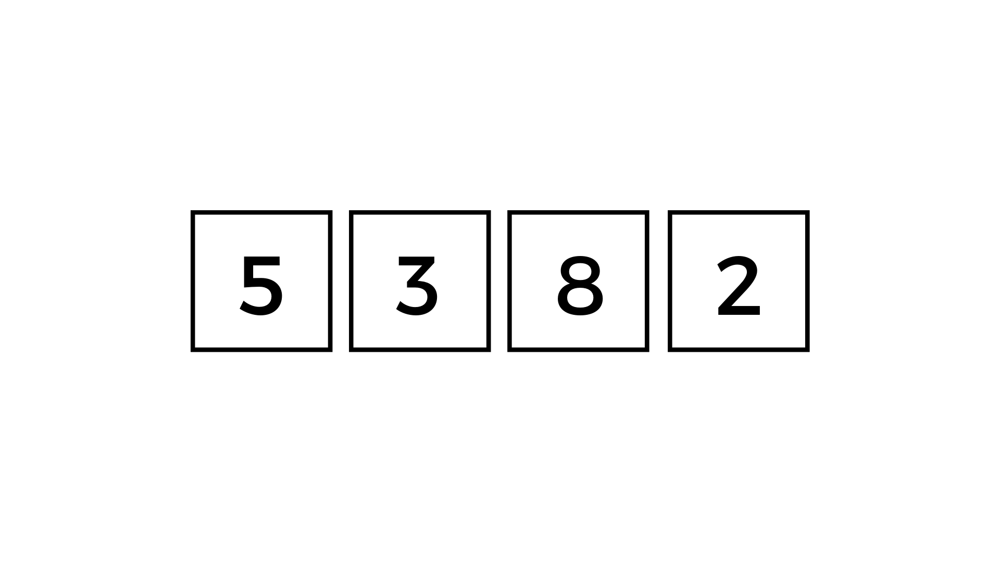

**Codigo:**

```javascript
let numerosDesordenados = [5,4,3,2,1,0,-3,-4]

function ordenarNumeros (numeros) {

  for (let i = 0; i < numeros.length; i++) { // i = 0
    let numeroMin = numeros[i]; // 10
    let posicionNumeroMinimo;
        // j =  4   4 < 4           
    for (let j = i + 1; j < numeros.length; j++) { 
      if (numeros[j] < numeroMin) { // 7 < 8
        numeroMin = numeros[j]; // 
        numeros[j] = numeros[i]
        numeros[i] = numeroMin;
      }

    }


  }
  return numeros
}

let numerosOrdenados = ordenarNumeros(numerosDesordenados);
console.log(numerosOrdenados)
```
>## **Algoritmo para factorear un numero**

```javascript
function factorear(num) {
  // Factorear el número recibido como parámetro y devolver en un array
  // los factores por los cuales se va dividiendo a dicho número (De menor a mayor)
  // Ej: factorear(180) --> [1, 2, 2, 3, 3, 5] Ya que 1x2x2x3x3x5 = 180 y son todos números primos
  // Tu código:
  //  180  | 2
  //  90   | 2
  //  45   | 3
  //  15   | 3
  //  5    | 3
  //  1    | 5
  
  let primos = [1];
  let valorDenominador = 2;
  let posicion = 1;

  while (num !== 1) {
    if (num % valorDenominador === 0) {
      num = num / valorDenominador;
      primos[posicion] = valorDenominador
      posicion ++
    }else{
      valorDenominador++nod
    }
  }
  return primos
}
```
///////////////////////////////////////////////////////////////
# **COMANDOS GIT AND GITHUB**
[3, 34, 5, ]


# **POWER SHELL**
> **ni ""**
Permite crear un nuevo archivo.

# **COMANDOS DE JS**
>**return**

El return, dentro de una funcion, nos permite retornar un valor para que este sea utilizado en la asigancion del dato de una variable. Esto no quiere decir que cambiara el valor de la variable. 

>**let**

El comando let, nos permite definir una variable de forma "temporal", para comprender mas esta situacion empezaremos explicando el siguiente caso:

```javascript
var instructor = "Tony";
if(true) {
    var instructor = "Franco";
}
console.log(instructor);

output: 'Tony'
        'Franco'
```
Al cambiar _var_ por _let_ en la variable _instructor = 'Franco'_ el output cambiara:

```javascript
var instructor = "Tony";
if(true) {
    let instructor = "Franco";
}
console.log(instructor);

output: 'Tony'
        'Tony'
```
Esto es debido a que _let_ nace y muere entre llaves _({})_.

### Diferencia entre let y var
Cuando se ejecuta el programa y se crea el contexto global, las variables definidas con _let_ no se guardan como un metodo(propiedad) en el objeto this y, por otro lado, cuando se utiliza _var_ siempre se mantendra en memoria este registro de la variable.

> # **bind**

```javascript

var persona = {
  nombre: 'Franco',
  apellido: 'Chequer',

  getNombre: function(){
    var nombreCompleto = this.nombre + ' ' + this.apellido;
    return nombreCompleto;
  }
}

var logNombre = function(){
  console.log(this.getNombre());
}
```

En este ejemplo, vamos a usar el keyword `this` para invocar el método del objeto persona. Como verán, el código de arriba produce un error, ya que cuando ejecutamos `logNombre()`, el `this` que está adentro hace referencia al objeto global, y ese objeto no tiene un método `getNombre`.

```javascript

var logNombrePersona = logNombre.bind(persona);
logNombrePersona();
```

La función `bind()` devuelve una __copia__ de la función, la cúal tiene internamente asociado el keyword `this` al objeto que le pasemos por parámtro. Si la llamamos sobre `logNombre` y le pasamos `persona` como argumento, vamos a ver que al ejecutar la _nueva_ función `logNombrePersona()` se va a loguear correctamente el nombre de `persona`.

> # **call()**
```JS
logNombre.call(persona);
```
En este caso, estamos invocando la función original logNombre, pero con call le estamos indicando a qué objeto tiene que hacer referencia this dentro de esa función. Este comando nos permite ejecutar luego luego la funcion a diferencia de bind a la que tenemos que asociarla a una variable para posteriormente invocarla. 
**Por lo tanto, se utiliza bind cuando no queremos ejecutar inmediatamente y call cuando si queremos**

El primer argumento de `call` es el objeto a usar cómo `this`. Despues de este puedo pasar otros argumentos, que serán pasados a la función que estamos invocando. Por ejemplo, si nuestra función recibiera argumentos, usariamos `call` de la siguiente manera:

```javascript
var logNombre = function(arg1, arg2){
  console.log(arg1 +' '+ this.getNombre() +' '+ arg2);
}

logNombre.call(persona, 'Hola', ', Cómo estas?'); //Hola Franco Chequer , Cómo estas?
```

> # **apply**

De hecho, la función `apply` es casi igual a `call`, excepto que recibe los argumentos de distinta manera. `apply` necesita dos arguemntos, el primero es el objeto a bindear con `this` (igual que `call`) y el segundo parámetro es un arreglo, en este arreglo pasamos los argumentos que va a usar la función que invocamos. Por ejemplo, para obtener el mismo comportamiento que arriba, pero con `apply`:

```javascript
var logNombre = function(arg1, arg2){
  console.log(arg1 +' '+ this.getNombre() +' '+ arg2);
}

logNombre.apply(persona, ['Hola', ', Cómo estas?']); //Hola Franco Chequer , Cómo estas?
```

Un arreglo puede ser más fácil de pasar cuando no sabemos a priori cuantos argumentos le voy a pasar.

># **Set()**
El comando set nos permite eliminar datos repetidos de un arreglo. Cuando ejecutamos ese comando, se obtiene una estructura de datos distinta el cual se llama, un objeto Set que se llaman recopiladores de valores. El metodo set tiene sus propios metodos. 

**Ejemplo:**

```javascript
var array = [1, 2, 4 , 5, 3, 3, 3, 1, 8, 6, 7];
var set1 = new Set(array);
console.log(array);
console.log(set1);

cout: [1, 2, 4, 5, 3, 3, 3, 1, 8, 6, 7]
      {1, 2, 4, 5, 3, 8, 6, 7}
```

># **add()**

Este metodo solo aplica para los objeto Set. El metodo set permite agregar un valor, cual sea el tipo de dato, a un objeto Set. Cada valor que va agregando lo agregara siempre al final. AHora, si se intenta agregar un valor repetido no nos lo va a permitir. Tambien se podrian agregar objetos al objeto set

**Eje:**
```javascript
let set1 = new Set();
set1.add(1);
set1.add('dato');
set1.add({a: 1})

output: {1, 'dato', {a: 1}}
```
Los objetos son referencias a memoria, por lo tanto, cada objeto que se agregue a un objeto Set, este lo aceptara ya que los objetos que se agregaron a Set son 2 objetos distintos. Ahora, si se define un objeto en una variable, y este objeto se trata de agregar haciendo mencion a la variable, se rechazara, esto debido a que estamos agregando el mimso objeto que tiene una misma direccion. 

> # **has()**

Para verificar que un valor se encuentra en un objeto tipo Set, se utiliza el metodo has()

**Eje:**

```javascript
let array = [1, 'misa', {a: 1}];
let set1 = new Set(array);
console.log(set1.has(1))
console.log(set1.has('mich'))

output: true
        false
```

># **delete()**

El metodo delete nos permite elminar el valor que establecemos en su argumento solo si este se encuentra dentro del objeto Set.

**Eje:**
```javascript
let set1 = new Set([1, 2, 3, 4, 5])
console.log(set1);
set1.delete(3);
console.log(set1);

output: {1,2,3,4,5}
        {1,2,4,5}
```


> # **Clouser**

**Cuando se nos pide en unas indicaciones que retornemos una funcion, esta hablando de clousers**
**Un clouser es un fenomeno. Es cuando una variable se define en una funcion, esta retorna otra funcion y cuando invocamos la nueva funcion nos permite acceder a cualquier variable establecida en la primera funcion y su valor definido en la funcion 2**

> **Function Borrowing**

Veamos un simple ejemplo donde podríamos usarlos, esto se conoce cómo __function borrowing__ (tomando prestadas funciones). Vamos a crear una segunda _persona_, pero que no tenga el método `getNombre` como la primera:

```javascript
var persona2 = {
  nombre: 'Manu',
  apellido: 'Barna'
};
```

Ahora, vamos a pedirle prestado el método `getNombre` a la primera _persona_ y la vamos a usar con la nueva.

```javascript
persona.getNombre.call(persona2); //'Manu Barna'
```

Con esto pudimos invocar un método de un objeto, pero usándolo con otro!

> **Function Currying (zurra o pelar)**

Veamos otro mini patron: _function currying_, este involucra `bind`.
Como `bind` crea una nueva función, si le pasamos parámetros, estos quedan __fijos__ en la nueva función. En el ejemplo no vamos a bindiar `this` con nada, pero si unos parámetros.
Digamos que tenemos una función que multiplica dos números recibidos por parámetro. Y nos gustaría construir una función que multiplique un número recibido por argumento por dos. Para esto podríamos usar `bind` y le pasamos cómo primer parámetro `this` (en este caso `this` hace referencia al contexto global), y como segundo parámetro un `2`. Guardamos el resultado en una nueva variable:

```javascript
function multiplica(a, b){
  return a * b;
}

var multiplicaPorDos = multiplica.bind(this, 2);
```

De esta forma, tenemos una nueva función donde el parámetro `a` es siempre `2`, gracias a `bind`. Nótese, que dentro de `multiplicaPorDos`, `this` sigue haciendo referencia al objeto global, porque cuando lo bindeamos le pasamos ese parámetro.

> **IMMEDIATE FUNCTIONS**

Las funciones inmediatas se ejecutan luego luego, ademas de que tambien pueden ser llamadas despues. Se escriben entre parentesis (function _funcion_(){})();

>**callback**

Las funciones callbacks son un tipo de funciones que se pasan por parametro a otras funciones. Supongamos qu etenemos una funcion 1 que recibe por parametro otra funcion 2. Cuando la funcion 1 ejecuta a la funcion 2 en su interior se produce un proceso llmado call back. **Esta funciones nos aseguran que una funcion no se va a completar antes de que se ejecute una tarea, funcion, se ejecuta despues de que una tarea se ejecuta**

**Ej. 1:**

```javascript
var devuelvoUsuario = function(){
    return 'Camilo';
};

var devuelvoSaludo = function(){
    return 'Hola'
};

var saludar = function(cb1,cb2){
    return cb1() + '' + cb2();
};

var resultado = saludar(devulevoSaludo, devuelvoUsuario);

console.log(resultado);
```


> **parseInt()**

Es muy similar al comando _number()_, solo que, _parseInt()_ convierte un string a un numero completamente entero. Si se ha de convertir un numero flotante de tipo string, este se redondeara al entero menor. 

>**boolean()**

Calcula el numero booleano de un numero.

> **hasOwnProperty()**

Es un metodo que nos permite saber si al objeto que asignamos tiene esa propiedad que definimos en su argumento. 


# **NOTAS RAPIDAS**

>1. boolean([]) -> true
>2. boolean(![]) -> false
>3. [] == ![] -> true // Ambos son booleans? -> si
>4. [] === ![] -> false // Ambos son booleans y del mismo tipo? -> no
>5. persona[arg] = cb(arg) ---> Asi se guarda una propiedad y su valor en un arreglo. El comando anterior (persona[arg]) nos indica que se guardara una propiedad llamada arg, o lo que contenga la variable arg, en el objeto persona, y su valor sera lo regrese la funcion cb(arg).
>6. La diferencia entre console.log(persona.arg) o console.log(persona[arg]) --> La diferencia es la forma en la que el programa lee el comando. El primer comando el interprete lo lee como: imprimir el valor de la propiedad con la palabra arg. El segundo lo lee como: Imprimir el valor de la propiedad de la variable arg, el cual, la variable arg es un string con un nombre que desconocemos. **Un comando interpreta la texto _arg_ como el nombre del objeto y el otro como una variable _que contiene un estring en ella osea, otro nombre_**.
> 