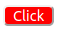
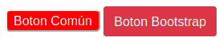
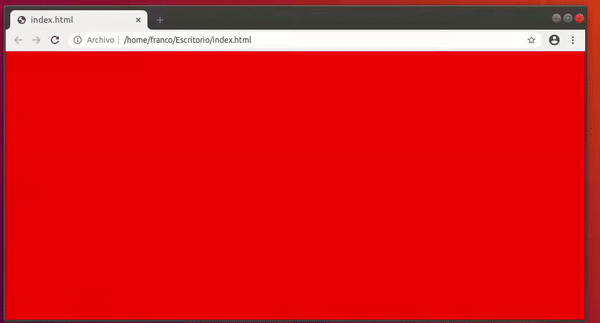
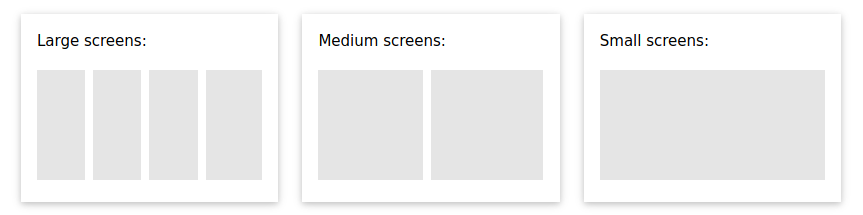
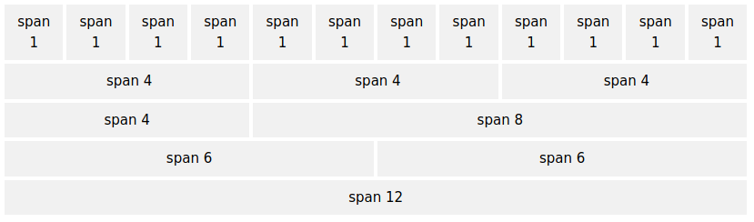
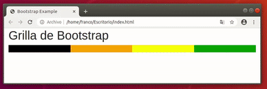

<table class="hide" width="100%" style='table-layout:fixed;'>
  <tr>
	  <td>
	  	<a href="https://airtable.com/shrHsDa2eamWqLAre?prefill_clase=02-CSS">
			
			<br>
			Hacé click acá para dejar tu feedback sobre esta clase.
	  	</a>
	  </td>
              <td>
	    <a href="https://quiz.soyhenry.com/evaluation/new/606f21f0656c8d23c2e60f10">
	    	
	    	<br>
	    	Hacé click acá completar el quiz teórico de esta lecture.
	    </a>
	 </td>
  </tr>
</table>

# **TAREA**
## **¿Que es un frameWork?**
Un framework(marco de trabajao), nos proporciona herramientas para facilitar la creacion de paginas web. Bootstrap en un framework para CSS, este nos proporciona estilos predefinidos para utlizar en HTML y herramientas para facilitar la creacion de las paginas web. 

## **¿Que es el preprocesador?**
Los preprocesadores es un programa de trabajo que nos permite agregar legibilidad a nuestro codigo CSS lo cual nos ayudara a entender mucho mejor nuestro codigo. Al utilizar los preprocesadores seremos capases de trabajar con variables, funciones, selectores anidados, mixens, entre otros. Cada preprocesador tiene su propia sintaxis. 

## **¿Que es el responsive WebSIte?**
Se refiere que tan adaptable es un sitio web a diferentes dispositivos electronicos (laptops, cell phones, tablets, etc).


# **DUDAS**
> Indagar en que son las pseudo clases y pseudo elementos. El over poria considerarse como un evento. 

>Explicar como funciona display: flex y aling-items. Checar en instagram de _thefullstackdevs_

>¿Como instalar LESS y sincronisarlo con CSS?

>¿Ver un video sel system grid?

>¿Que son los mixens?

R: Se le llama mixens a los selectores como una funcion dentro de css. Cuando utilizamos un preprocesador (less) al definir un selector, se puede mandar a llamar como una funcion. Tambien se pueden definir los argumentos.

>¿La diferencia entre los mixens y &:extend();?

R:
:extend() va a pasar exactamente lo mismo, y los mixens se pueden modificar de acuerdo a la definicion de los parametros. 

>@arguments

Es una palabra reservada que permite alinear cada uno de los argumentos. Del mixen


# **NOTAS**
## **¿Que es el responsive?**
Cuando utilizamos el término “responsive” (adaptable), nos referimos principalmente a “responsive design” (diseño web adaptable). Esto significa hacer que un sitio web sea accesible y adaptable(adaptable) en todos los devices(device): tabletas, smartphones, etc.
>The adaptability of a web page to the devices

## **¿Que es minificar?**
Minificar es reducir el tamaño de un fichero sin perder funcionalidad. Esto lo hace eliminando todos los espacios, saltos de línea, tabulaciones y comentarios, creando un fichero (en la mayoría de casos) de una sola línea.

Una version minificada de un archivo tiene consigo la extension .min, por ejemplo: _nombreDelArchivo_.min.txt

La ventaja de esto es que los archivos minificados se cargan mas rapido a un archivo html.

## **¿Que es un fichero?**
Un fichero(file) es igual a un archivo(archive)

## **¿Que es una ventana modal o cuadro dialogo (modal window or lightbox(caja lijera))?**
Son cuadros que aparecen sobre la página, bloqueando todas las funciones para concentrar el foco en una acción particular.

## **!important**
El important dentro de un atributo adelante del value nos permite indicar mayor gerarquia a ese atributo sobre otros del mismo tipo

## **Grid Sytem**
Es un servicio o sistema de BOOTSTARP que nos ayuda a acomodar el contenido conforme el viewport se va modificando. Nos permite distribuir el contenido.

```html
<style media="screen">
  .sq {
    border: 2px solid black;
  }

</style>

<div>
  <div class="col-sm-1 sq">col 1</div>
  <div class="col-sm-1 sq">col 2</div>
  <div class="col-sm-1 sq">col 3</div>
  <div class="col-sm-1 sq">col 4</div>
</div>
```

## **FrameWork CSS**
>* It means a bunch of defined styles, such as a button modifited
>* Los etilos definidos por un framework podran modificarse.
>* Hay algunos estilos que contienen el atributo importan lo cual hace dificil modificar (modifide) ese estilo.

 

### Algunos FrameWorks CSS


## **Bootstrap**
### **_Initial Bootstrap_**
La pagina [BOOTSTRAP.COM](https://getbootstrap.com/docs/5.3/getting-started/introduction/) nos proporciona las intrucciones para inicializar bootstrap a html.

# **NOTAS RAPIDAS**
> toDoText.addEventListener('click', completeToDo); -> Este tipo de eventos se establecen de forma sincronica. Osea, se activan cada vez que sucede el evento no immporta donde esten definidos

> Una manera de entender el metodo `map()` 
```javascript
let array = [1, 2, 3, 4, 5]
let arrayModi = array.map(operation)

function operation(value, index, arr){
    return value * 2;
}

Output: 
array: [1, 2, 3, 4, 5]
arrayModi: [2, 4, 6, 8, 10]
```

> los metodos map y filter devuelven un nuevo arreglo.

> Apendiar es añadiendo. Append - Añadir
> Hay otro evventLisener que se llama PressKey y evaluar si se aprita
> cuando se utiliza el atributo target en un event listener es para hacer referencia a la etiqueta a la cual se le hizo click. Ejemplo `event.target`

>Diferencia entre `h1.clase1` & `h1 .clase1`. La primera hace mencion a una misma etique, se lee: la etiqueta h1 cque contenga la clase con el nombre "clase1". El otro ejemplo habla de direntes etiquetas. Los elementos que contengan la clase "clase1" dentro de una etiqueta h1. 


# **CLASE: CSS Avanzado**

En esta Lesson se verán los siguientes temas:

* Frameworks CSS
* CSS Preprocessors

## **Frameworks CSS**

En primer lugar un 'Framework' es un marco de referencia o marco de trabajo que nos provee distintas herramientas que se puede utilizar para facilitar el desarrollo de aplicaciones, ofreciéndonos una forma estándar y por lo general más simple para programar. En particular para el caso de un 'Framework CSS', se refiere a un conjunto de estilos predefinidos que pueden utilizarse para elaborar una interfaz de usuario atractiva sin necesidad de tener que definir a mano todas y cada una de las propiedades CSS de nuestros elementos HTML.

Existen una gran variedad de Frameworks CSS pero entre los más utilizados en la actualidad se encuentran:

* Bootstrap
* Foundation
* Bulma
* Ulkit
* Semantic UI

La desventaje es que, perdemos experiencia en codificar en css. 
* Si se pueden modificar los elementos que nos ofrecen los FrameWorks
En esta lesson nos centraremos en Bootstrap que es el más utilizado de ellos. Las ventajas que nos ofrece este Framework es que ya tiene componentes con estilos predefinidos que podemos reutilizar para ganar tiempo.

Por ejemplo supongamos que quisiéramos crear en nuestra página web un botón rojo con bordes redondeados y texto blanco:

```html
<!DOCTYPE html>
<html>
<style media="screen">
  button {
    color: white;
    background-color: red;
    border-radius: 5px;
  }
</style>
<body>
<button type="button">Click</button>
</body>
</html>
```

Con ese código lo que obtendríamos es lo siguiente:


Ahora bien, vamos a intentar lo mismo utilizando Bootstrap. Para ello necesitaremos agregar a nuestro HTML una referencia a la librería de Bootstrap para poder utilizar todos sus beneficios.

```html
<!DOCTYPE html>
<html>
<head>
  <link rel="stylesheet" href="https://stackpath.bootstrapcdn.com/bootstrap/4.4.1/css/bootstrap.min.css" integrity="sha384-Vkoo8x4CGsO3+Hhxv8T/Q5PaXtkKtu6ug5TOeNV6gBiFeWPGFN9MuhOf23Q9Ifjh" crossorigin="anonymous">
</head>
<style media="screen">
  .buttonComun {
    color: white;
    background-color: red;
    border-radius: 5px;
  }
</style>
<body>
<button type="button" class="buttonComun">Boton Común</button>
<button class="btn btn-danger">Boton Bootstrap</button>
</body>
</html>
```

*Veamos que en el header se agrego un link hacía Bootstrap*

Veamos ahora como quedó nuestra página:


No tuvimos que definir ninguna propiedad CSS para nuestro nuevo botón sino que simplemente le asignamos las clases `btn` y `btn-danger` y Bootstrap se encargó del resto.

Para ver que esto no es magia, lo que está pasando por detrás es que existe un archivo CSS 'enorme' con muchisimas clases definidas que ya contienen propiedades de estilos asignadas entonces por ejemplo cuando nosotros le asignamos la clase `btn-danger` es como si estuvieramos escribiendo el siguiente código en nuestro archivo CSS o en la etiqueta `<style>` de nuestro HTML:

```css
.btn-danger {
    color: #fff;
    background-color: #dc3545;
    border-color: #dc3545;
}
```

*Lo mismo sucede con la clase `btn`, le aporta a nuestro elemento más propiedades CSS*

En la página de [Bootstrap](https://getbootstrap.com/) podrán encontrar muchos componentes que pueden reutilizar en sus páginas web.

#### **Responsive Design**

Cuando queremos que nuestra página se vea 'linda' en cualquier dispositivo o cambie algunas características ya sea en una computadora, en un teléfono celular, en una tablet o incluso en un televisor smart, necesitamos hacer algunos ajustes a las propiedades de los elementos en función del dispositivo.

##### **CSS Media Queries(consultas)**
En desarrollo web, las media queries son un módulo CSS3 que permite adaptar la representación del contenido a características del dispositivo como la resolución de pantalla.

> _@media_ es un selector que indica a html lo siguiente "Segun el tamaño de pantalla yo te voy a redefinir cierta informacion"

Para poder determinar que una propiedad solo se aplique en función del tamaño de la pantalla del dispositivo tenemos la posibilidad de usar `CSS Media Queries`.

Supongamos que queremos modificar el color de fondo de la página web:

* Negro para una pantalla de 600px o menos de ancho
* Azul para una pantalla de entre 600px a 900px de ancho
* Rojo para una pantalla de más de 900px de ancho

```css
body {
  background-color: red;
}

/* Pantallas de menos de 992px de ancho */
@media screen and (max-width: 992px) {
  body {
    background-color: blue;
  }
}

/* Pantallas de menos de 600px de ancho */
@media screen and (max-width: 600px) {
  body {
    background-color: black;
  }
}
```

El resultado obtenido sería el siguiente:

<div style="text-align:center"></div>


##### Bootrstap

Supongamos ahora que queremos cambiar la cantidad de columnas que se muestren en función de la pantalla para que nos queden cuatro columnas en pantallas grandes, dos en medianas y una en pequeñas:

<div style="text-align:center"></div>
<br>

Podríamos realizarlo con CSS Media Queries similar al ejemplo anterior. Así que si quieren pueden intentarlo (Es un buen ejercicio para practicar lo que ya saben de CSS con esta nueva herramienta).

Pero ahora vamos a ver como solucionar esto utilizando el Framework que explicamos más arriba `Bootstrap`.

###### **Grid System**

Bootstrap ya tiene integrado un sistema de grillas implementado a partir de flexbox que nos va a facilitar la tarea. Para ello utiliza cinco clases ya definidas:

* .col- (extra small devices - menos de 576px)
* .col-sm- (small devices - mayor o igual a 576px)
* .col-md- (medium devices - mayor o igual a 768px)
* .col-lg- (large devices - mayor o igual a 992px)
* .col-xl- (xlarge devices - mayor o igual a 1200px)

El sistema de grilla de Bootstrap permite colocar hasta una suma de 12 'espacios' por fila distribuyéndolos de la forma que se quiera, ya sea colocando 12 columnas de 1 'espacio', 2 columnas de 6 'espacios' o cualquier variante de combinaciones:

 <div style="text-align:center"></div>
 <br>

*También existe la opción de dejar que Bootrstap identifique la cantidad de columnas que hay y a partir de ello le asigne el mismo ancho a cada una hasta completar la totalidad de la fila (Siempre recordando que el máximo es de 12). Para ello se utiliza simplemente la clase `.col` en cada columna*

Utilizando simplemente esas clases podemos crear múltiples tipos de grillas que se adapten a nuestras pantallas.

<div style="text-align:center"></div>
<br>

*En el gif de arriba podemos ver como en función del ancho de la pantalla va cambiando la cantidad de columnas*

```html
<div class="row">
  <div class="col-12 col-sm-6 col-md-3" style="background-color:black; color:black;">.</div>
  <div class="col-12 col-sm-6 col-md-3" style="background-color:orange; color:orange;">.</div>
  <div class="col-12 col-sm-6 col-md-3" style="background-color:yellow; color:yellow;">.</div>
  <div class="col-12 col-sm-6 col-md-3" style="background-color:green; color:green;">.</div>
</div>
```

La documentación completa la pueden encontrar [acá](https://getbootstrap.com/docs/4.0/layout/grid/)

## CSS Preprocessors

> Un preprocesador CSS es un programa que te permite generar CSS a partir de la syntax única del preprocesador. Existen varios preprocesadores CSS de los cuales escoger, sin embargo la mayoría de preprocesadores CSS añadiran algunas características que no existen en CSS puro, como variable, mixins, selectores anidados, entre otros. Estas características hacen la estructura de CSS más legible y fácil de mantener.

Estos son algunos de lo preprocesadores CSS más populares:

* SASS
* LESS
* Stylus
* PostCSS

*Si quieren jugar un poco con distintos preprocesadores [codepen](https://codepen.io/pen/) nos brinda un entorno de fácil configuración. En la configuración del panel de CSS podemos seleccionar el que queramos*

### LESS (Leaner Style Sheets)

En esta lesson nos centraremos en LESS ya que es uno de los más utilizados y tiene un tipo de sintaxis muy similar al código CSS pero con ciertos agregados por lo que va a ser más sencillo entenderlo.

### Variables

LESS nos permite utilizar variables dentro de nuestro archivo de estilos para evitar la repetición innecesaria de definiciones de propiedades, por ejemplo no nos resulta tan fácil recordar un código de un color en formato hexadecimal en cambio si pudiéramos definirlo una única vez y asignárselo a una variable con un nombre representativo, nos sería mucho más sencillo.

Ejemplo de código SCSS:

```less
@color-fondo: #F55;
@width: 10px;
@height: @width + 10px; /* También es posible realizar operaciones sobre las variables */

h1 {
   background-color: @color-fondo;
   width: @width;
   height: @height;
 }
```

*En este ejemplo estamos creando variables con un color y medidas determinadas que van a poder ser reutilizadas en distintos componentes y clases las veces que queramos*

Luego este código va a ser compilado en a un archivo CSS para que pueda ser interpretado por los navegadores por lo que el ejemplo anterior quedaría así:

```css
h1 {
   background-color: #F55;
   width: 10px;
   height: 20px;
 }
```

Al igual que en otros lenguajes de programación, las variables tienen un scope determinado, primero se analiza si en el contexto actual se encuentra definida dicha variable y si no la encuentra la buscará en el scope padre.

```less
@var: red;

#page {
  @var: white;
  color: @var; // white
}
```

La variable de la primer línea podrá utilizarse dentro del resto de las definiciones pero la que se encuentra dentro de `#page` sólo será válida allí. Por otra parte, el valor correspondiente a la propiedad `color` va a ser `white` ya que en dicho contexto si se encuentra definido el valor de `@var`. En cambio si tuvieramos algo como lo siguiente:

```less
@var: red;

#page {
  color: @var; // red
}
```

En este caso el valor de `@var` sería `red` ya que en su contexto no está definida la variable pero en el contexto global sí por lo que toma su valor de allí.

También es posible utilizar variables dentro de los nombres de los selectores, de las propiedades e incluso en URL's.

#### Selectores

```less
@my-selector: banner;

.@{my-selector} {
  font-weight: bold;
  line-height: 40px;
  margin: 0 auto;
}
```

#### Propiedades

```less
@property: color;

.widget {
  @{property}: #0ee;
  background-@{property}: #999;
}
```

#### URLs

```less
@images: "../img";

body {
  color: #444;
  background: url("@{images}/white-sand.png");
}
```

#### Lazy evaluation

No es necesario declarar las variables antes de usarlas, por lo que el siguiente código sería válido:

```less
.lazy-eval {
  width: @var;
}

@var: 200px;
```

### Funciones

LESS nos provee de ciertas funciones que nos permiten transformar colores, manipular strings y realizar cálculos matemáticos.

Ejemplo de utilización:


```less
@base: #f04615;
@width: 0.5;

.class {
  width: percentage(@width);
  color: saturate(@base, 5%);
  background-color: spin(lighten(@base, 25%), 8);
}
```

En este caso por un lado con la función `percentage` estamos convirtiendo el valor `0.5` en `5%` y por otro lado, con la función `saturate` estamos incrementando la saturación del color base en un 5%.

*Para ver la documentación completa de las funciones disponibles ingresar [aquí](http://lesscss.org/functions/)*

### Anidado

LESS también nos permite anidar definiciones de estilos CSS similar a como es una estructura HTML:

```less
nav {
  ul {
    margin: 0;
    padding: 0;
    list-style: none;
  }
  li {
    display: inline-block;
  }
  a {
    display: block;
    padding: 6px 12px;
    text-decoration: none;
  }
}
```

*En este caso estamos asignándole propiedades a los elementos `ul`, `li` y `a` que se encuentren dentro de un `nav`*

Los mismo puede realizarse con la directiva `@media`:

El siguiente código:

```less
.component {
  width: 300px;
  @media (min-width: 768px) {
    width: 600px;
    @media  (min-resolution: 192dpi) {
      background-image: url(/img/retina2x.png);
    }
  }
  @media (min-width: 1280px) {
    width: 800px;
  }
}
```

Se traduciría en:

```less
.component {
  width: 300px;
}
@media (min-width: 768px) {
  .component {
    width: 600px;
  }
}
@media (min-width: 768px) and (min-resolution: 192dpi) {
  .component {
    background-image: url(/img/retina2x.png);
  }
}
@media (min-width: 1280px) {
  .component {
    width: 800px;
  }
}
```

### Importación

La directiva `@import` nos permite incluir el contenido de otros archivos en el actual. Supongamos que tenemos un archivo less llamado "general.less" como el siguiente:

```css
html,
body,
ul,
ol {
  margin: 0;
  padding: 0;
}
```

Podríamos importar dichas definiciones de atributos en otro less de la siguiente forma:

```less
@import "general";

body {
  font-family: Helvetica, sans-serif;
  font-size: 18px;
  color: red;
}
```
De esta forma en nuestro último archivo de estilos también vamos a poder contener las definiciones de "general.less".

*Observen que no es necesario aclarar la extensión del archivo `general`, LESS automáticamente asume que es un archivo de estilos válido*

### Mixins

Los mixins nos permiten incluir un set de propiedades ya definido dentro de otro.

```less
.important-text {
  color: black;
  font-size: 25px;
  font-weight: bold;
}
```

Ahí estamos creando el mixin llamado `important-text` que luego podemos utilizar de la siguiente forma:

```less
.danger {
  .important-text();
  background-color: red;
}

.success {
  .important-text();
  background-color: green;
}
```

Esto se va a traducir a codigo CSS quivalente a:

```css
.danger {
  color: red;
  font-size: 25px;
  font-weight: bold;
  border: 1px solid blue;
  background-color: green;
}
```

*Es decir lo que sucedió es que se inyectaron todas las propiedades definidas en el mixin dentro de la clase `danger` y `success`. También es posible utilizar ids como mixins (`#b();`)*

#### Parametros

Los mixin pueden recibir parámetros:

```less
.bordered(@color; @width) {
  border: @width solid @color;
}

.myArticle {
  .bordered(blue; 1px);
}

// Es posible indicar el nombre del parámetro al invocar el mixin
// para evitar tener que respetar un orden en particular
.myArticle-2 {
  .bordered(@width: 20px; @color: #33acfe);
}
```

*Aquí lo que estamos haciendo es definir un mixin que recibe dos parámetros (color y width) que luego van a ser utilizados para definir el borde del elemento. Con ello podemos reutilizar el mixin simplemente llamándolo con diferentes colores o anchos como en el ejemplo que se le está dando un color azul y un borde de un pixel a los elementos con la clase `myArticle`*

##### Valores por defecto

Adicionalmente se puede setear un valor por defecto para dichos parámetros para que, en el caso de que no se les indique un valor, tomen el por defecto:

```less
.bordered(@color: blue; @width: 1px) {
  border: @width solid @color;
}

.myArticle-default {
  .bordered();
}
```

#### Variable `@arguments`

La variable `@arguments` dentro de un mixin contiene todos los argumentos que le fueron suministrados a dicho mixin.

```less
.box-shadow(@x: 0; @y: 0; @blur: 1px; @color: #000) {
  box-shadow: @arguments;
}
.big-block {
  .box-shadow(2px; 5px);
}
```

Esto resultaría en:

```less
.big-block {
  box-shadow: 2px 5px 1px #000;
}
```

### Herencia

Por último también es posible, heredar/compartir las propiedades de un selector en otro. Esto es útil para aquellos casos en los que entre dos selectores comparten la mayor parte de los atributos pero tienen una o algunas pequeñas diferencias.

```less
.button-basic  {
  border: none;
  padding: 15px 30px;
  text-align: center;
  font-size: 16px;
  cursor: pointer;
}

.button-report  {
  &:extend(.button-basic);
  background-color: red;
}

.button-submit  {
  &:extend(.button-basic);
  background-color: green;
  color: white;
}
```

*En este caso el botón de report y de submit extienden las propiedades del botón básico manteniendo todas sus propiedades pero agregándole algunas más que son propias de ellas*

Con esto cubrimos la mayor parte de las funcionalidades agregadas por LESS pero existen otras que para aquel que le interese indagar aun más sobre este tema puede acceder a la documentación oficial [aquí](http://lesscss.org/)

## Ejemplo de LESS raducido a CSS
```less
/*LESS*/
@width: 20px;
@height: 10px;
/*Variables*/
@color-background: blue;

.body {
  @color-background: green;
  background-color: @color-background;
}

.section1 {
  background-color: @color-background;
}

/*Selectores*/

@my-selector1: banner;
@my-selector2: div;

.@{my-selector1} {
  margin: 0px;
}

.@{my-selector2} {
   border: 1px solid black
}

/*Atributos*/

@my-atribute: color;

h1 {
  @{my-atribute}: green;
}

@image: '../img';

body{
  background-image: url('@{image}/logo.jpg');
}

/*Condicional if*/

.otra-clase {
  margin: if((@width<@height),0px,3px);
}

/*OperadoresEspeciales*/

.class {
  width: sqrt(@width);
  margin: sin(@height);
  panddig: max(@width,@height);
}

/*Listas*/

@list: "Peach", "Mario", "Luigi", "Browser";

.another-class {
  margin: length(@list);
}

/*Otra definicion de selectores*/
nav{
  ol{
    font-color: red; 
  }
  ul{
    font-color: blue
  }
}

/*Using @media*/
.mediaClass {
  width: 30px;
  color: red;
  @media screen and (max-width: 300px){
    background-color: black;
  }
  @media screen and (max-width: 200px){
    background-color: pink;
  }
}

/*Importar archivos .less al index.less*/

/*Mixens*/

.important-text {
  color: black;
  font-size: 30px;
  font-weigth: 20px;
}

.important-text-uno {
  .important-text();
  background-color: black;
}
.important-text-dos {
  .important-text();
  background-color: green;
}

/*Mixens con ardumentos*/

.important-text(@color, @font-size) {
  color: @color;
  font-size: @font-size;
  font-weigth: 20px;
}

.important-text-uno {
  .important-text(pink,1px);
  background-color: black;
}
.important-text-dos {
  .important-text(orange,2px);
  background-color: green;
}

.important-text-tres {
  .important-text(@font-size: 3px, @color: gray);
  background-color: green;
}

/*Mixens por default*/
.important-text-other(@color: blue, @font-size: 3px) {
  color: @color;
  font-size: @font-size;
  font-weigth: 20px;
}

.important-text-uno {
  .important-text-other();
  background-color: black;
}
```

```css
/*CSS*/
/*Variables*/
.body {
  background-color: green;
}
.section1 {
  background-color: blue;
}
/*Selectores*/
.banner {
  margin: 0px;
}
.div {
  border: 1px solid black;
}
/*Atributos*/
h1 {
  color: green;
}
body {
  background-image: url('../img/logo.jpg');
}
/*Condicional if*/
.otra-clase {
  margin: 3px;
}
/*OperadoresEspeciales*/
.class {
  width: 4.47213595px;
  margin: -0.54402111;
  panddig: 20px;
}
/*Listas*/
.another-class {
  margin: 4;
}
/*Otra definicion de selectores*/
nav ol {
  font-color: red;
}
nav ul {
  font-color: blue;
}
/*Using @media*/
.mediaClass {
  width: 30px;
  color: red;
}
@media screen and (max-width: 300px) {
  .mediaClass {
    background-color: black;
  }
}
@media screen and (max-width: 200px) {
  .mediaClass {
    background-color: pink;
  }
}
/*Importar archivos .less al index.less*/
/*Mixens*/
.important-text {
  color: black;
  font-size: 30px;
  font-weigth: 20px;
}
.important-text-uno {
  color: black;
  font-size: 30px;
  font-weigth: 20px;
  background-color: black;
}
.important-text-dos {
  color: black;
  font-size: 30px;
  font-weigth: 20px;
  background-color: green;
}
/*Mixens con ardumentos*/
.important-text-uno {
  color: pink;
  font-size: 1px;
  font-weigth: 20px;
  background-color: black;
}
.important-text-dos {
  color: orange;
  font-size: 2px;
  font-weigth: 20px;
  background-color: green;
}
.important-text-tres {
  color: gray;
  font-size: 3px;
  font-weigth: 20px;
  background-color: green;
}
/*Mixens por default*/
.important-text-uno {
  color: blue;
  font-size: 3px;
  font-weigth: 20px;
  background-color: black;
}
```

## Homework

Completa la tarea descrita en el archivo [README](https://github.com/soyHenry/FT-M2/blob/master/02-CSS/homework/README.md)