<table class="hide" width="100%" style='table-layout:fixed;'>
  <tr>
   <td>
    <a href="https://airtable.com/shrHsDa2eamWqLAre?prefill_clase=05-Bundlers">
   
   <br>
   Hacé click acá para dejar tu feedback sobre esta clase.
    </a>
   </td>
              <td>
      <a href="https://quiz.soyhenry.com/evaluation/new/607f6d7d56b4056ff0328db0">
        
        <br>
        Hacé click acá completar el quiz teórico de esta lecture.
      </a>
   </td>
  </tr>
</table>

# **Módulos y Bundlers**
# DUDAS
> _dirname -> ¿Que es?

> Que es el node_modules.

> Que es el npm install -D webpack-cli

> La palabra reservada new solo aplica a clases y objetos?

> package -lock.json

# NOTAS RAPIDAS
> .indexOf() -> Muestra el indice donde se encuentra el valor indicado dentro de un arreglo. 

> `commondJS` -> Se dentro de Node.JS engine (backend) y `ES Modules` -> Se utiliza para web engine (frontend)

>Exports es solamente un atajo de module.exports

>IIFE -> Inmitialy Invoked Function Enviroment. 

> Distractory -> import {} from 'url' , {} <- esto es el distractoryn

> build tool -> Herrramienta de desarrolo como webpack, npm , etc

> Transpilador -> convierte un lenguaje de alto nivel a otro lenguaje de alto nivel como webpack 

> npm -> npm responde a las siglas de Node Package Manager o manejador de paquetes de node, es la herramienta por defecto de JavaScript para la tarea de compartir e instalar paquetes. Viene incluido y ayuda a cada desarrollo asociado a Node

> node.js -> Node. js es un entorno de ejecución JavaScript de código abierto y multiplataforma que se utiliza para desarrollar aplicaciones escalables del lado del servidor y de red. Está basado en el motor de ejecución JavaScript V8 de Google Chrome.

> WebPack -> Webpack (un modulo de Node.js) toma nuestros archivos JavaScript y produce un solo, archivo JavaScript transformado (es un transpilador) 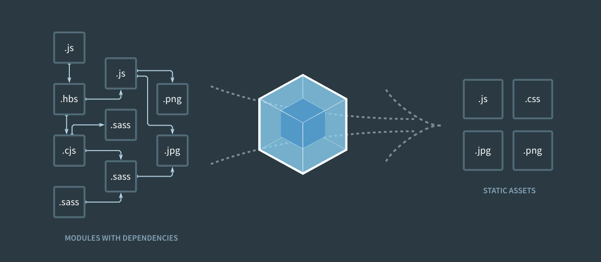

> lógica de módulos muy sofisticada -> El archivo creado por webpack.

> 1. Inicicamos npm (Web Tool) -> npm init //Esto crea un archivo package.json
>2. Instalamos WebPACK (Web Tool - transpilador) por medio de npm (tool) -> npm install --save-dev webpack. Se crea archivo package.json
>3. Agregamos shortcuts dentro del archivo package.json - > "script": {"start": "node serve.js", "build": "webpack"}     //Al ejecutar npm run build se ejecuta el archivo build.js.
>4. Creamos el directorio (dist) donde se guardara el archivo obtenido por WEBPACK (tranpilador).
>5. Creamos un archivo webpack.config.js -> Debe de tener la siguinte configuracion: 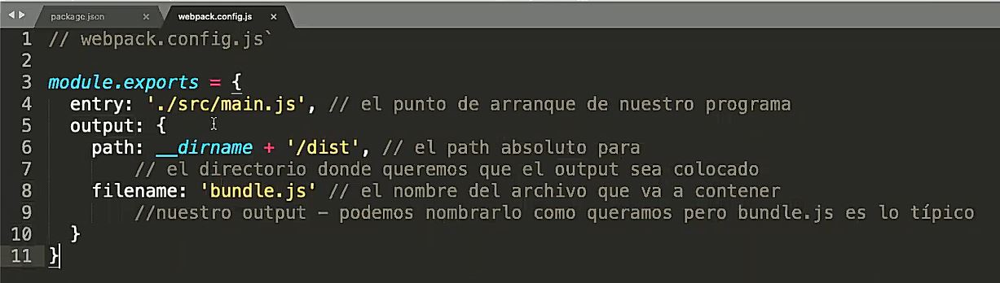
>6. Lor archivos .js  a tranpilar se sugieren guardar en una carpeta llamada src.  
>7. Creamos el archivo bundle.js -> ejecutamos npm run build
>8. Insertar el archivo bundle.js a HTML -> <script src="./dist/bundle.js"" type="text/javascript"></script>

> Bundlers -> Un bundler es una herramienta que combina y optimiza archivos de código fuente y recursos en un solo archivo para su implementación en una aplicación web.

> Cuando el path no es aclarado dentro del parametro de require, automaticamente el ineprete buscara en la carpeta `node_modules`.

>Cada vez que vea un windows en un require en conceptos de modulacion. 
# NOTAS
## **Que es un modulo**
Un modulo puede ser una funcion. Un modulo puede ser una funcion que manda a llamar cinco funciones mas, o modulos. Un modulo busca solucionar una tarea en especifica. 

## **¿Cuando utilizar un modulo?**
Cuando agregamos 2 o mas archivos .js al archivo index.html por medio de la etiqueta script, las variables establecidad en cada archivo se estableceran en el contexto global. Esto quiere decir que podremos utilizar esas variables dentro de esos mismos archivos .js dependiendo del orden en la que se inserten los archivos. 
Cuando queramos crear proyectos mas grandes abra logica o variables que quisieramos ocultar o no querer manipular por lo que haremos uso de los modulos. Al paso del tiempo se crearon modulos como los `commondJS`. Este estandar hacia todo el proceso de importacion e exportacion detras, solo se requiere importar un archivo .js al .html. Mas adelante se establecio `ES Modules` el cual se utiliza export e import.
`commondJS` -> Se dentro de Node.JS engine y `ES Modules` -> Se utiliza para web engine. 

## **JavaScript vs NodeJS**
JavaScript: 
1. Is a programm language.
2. All browsers have a JavaScript engine that helps us run JavaScript in a web Browser.
3. Window object
4. In the browser, we use ES Modules.

NodeJS:
1. Node.js is a runtime environment for JavaScript. 
2. Uses V8 engine directly. This helps run JavaScript outside of the browser.
3. Global Object (Missing web Plataform API, DOM)
4. Node.js Uses the command.js module system. 

## **¿Reglas para utilizar los modulos?**

Supongamos tenemos varios archivos .js
```javascript
// Archivo 1.js
//////////////////////////
let toDo = [];
// Para permitir que otros modulos dependan de este modulo, tenemos qu ehabilidad que variables o funciones estaran disponibles para ser utilizadas en otros modulos. 
// Permite -> toDO
//////////////////////////
// Archivo 2.js
//////////////////////////
toDo.push('nota');
// Para poder usar toDo tenemos que solicitar a la variable toDo.
//////////////////////////
// Archivo 3.js
//////////////////////////
let saludo = "hola";
// SOlicita ->  toDo
// Permite -> Saludo
//////////////////////////
// Archivo 4.js
/////////////////////////
// solicita -> saludo de archivo 3.js. 
// No quiere decir que al solicitar saludo de archivo 3.js tambien heredara todDO
//////////////////////////
```
La siguiente imagen muestra la forma de solicitar y permitir informacion. import -> solicitar (requierd), importacion. module.exports -> exportar, permitir 
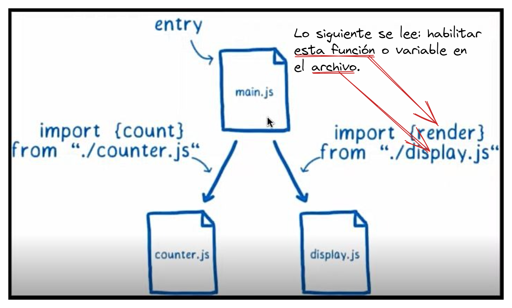

## **Sistema Modular commondJS Exports**
```javascript
// nombres.js
let names = ['Jenn','Misael','Julio'];
let alumno = 'Toni';
let alumna = 'Mati';
let amountOfStudents = names.length + 1; 

exports.alumnoAux = alumno;
exports.name = function name (number) {return names[number];};
exports.number = function number (name) {return names.indexOf(name);};
exports.cantidadDeAlumnos = amountOfStudents;

// Exports es un objeto.
// exports {
//          alumnoAux: alumno, 
//          name: function, 
//          number: function,
//          cantidadDeAlumnos: names.length + 1
//         }
 
//////////////////////////////////////////////////////////////////
// index.js
let a = require('./pruebaCodigos');
// con la funcion require('') solicitamos los elementos disponibles
// del archivo pruebaCodido.js. El valor es un objeto, por lo tanto ->
// a {
//      alumnoAux: alumno, 
//      name: function, 
//      number: function,
//      cantidadDeAlumnos: names.length + 1
//   }

console.log(a.alumnoAux) // >> 'Toni'
console.log(a.name) // >> function: name
console.log(a.name(1)) // >> 'Misael'
console.log(a.number('Jenn')) // 0
```
## **module.export vs exports**
Con module.export podemos agregar cada elemento al objeto export de la siguiente manera: 
```javascript
/// module1.js
module.exports.a = function () {
  console.log('a');
}

module.exports.b = function () {
  console.log('b');
}
// Tambien otra manera de exportar las funciones es la siguiente. 
/* 
let a = function () {
  console.log('a');
}
let b = function () {
  console.log('b');
}
module.exports = {a, b}
*/

//module2.js
let example = require('./pruebaCodigos.js');
example.a();
example.b();
```   

## **Module system ES Modules**
Como se menciono anteriormente, ES modules se utiliza en Engine del Browser. Por lo que no se podra utilizar los import y export en un protocologo file, esto es asi por que los modulos siempre vas asumir que se estan sirviendo atravez de internet, atravez dela web, entonces, este nos dice: Si lo estas sirviendo atravez de la web tienes que servirlo atravez del mismo dominio, osea un dominio basico. Por lo tanto tendriamos que crear un servidor web, cuando trabajamos con los frameworks react este crea un servidores web, local host 3000 y esos. Pero al no usar estos framewroks y al requerir un servidor web utilizamos una extension llamada `Live Server`. una vez echo esto se muestra un ejemplo: 
```javascript
// math.js
export let nums = [1, 2, 3, 4, 5]
export let num1 = 3.4; 
export let saludo = 'Hola';

export let sumar = (x, y) => {
  return x + y;
}

export function saludar() {
  console.log("Hola mundo");
}

//  PARA UTILIZAR ESTE DEFAULT ES NECESARIO IMPORTARLO DE LA MANERA QUE SE MENCIONA EN EL index.js
export default function resta(x, y) {
  return x - y;
}

// index.js
import {nums, saludar, num1, saludo, sumar as otroSumar} from './math.js' // En los corchetes se define lo que queremos importar
// PARA IMPORTAR POR DEFAULT SE HACE ASI:  ---
// import resta from './math.js' ----------- |
let sumar = (x, y) => {                     
  return x + y;                         
}

console.log(nums);
console.log(num1);
console.log(saludo);
console.log(saludar);
console.log(otroSumar(2,3))
console.log(sumar(10,5))
// console.log(resta(10,5))

// HTMl Structure
// ES IMPORTANTE AGREGAR EL type="module"
<body>
  <script src="./index.js" type="module"></script> 
</body>
```
## **¿Cual es la diferencia de module.exports vs exports?**
En principio, ambos apuntan al mismo objeto -vacío-. Esto significa que si utilizamos module.exports.hola = "hola" seguido de un exports.mundo = `mundo`, exportaremos el siguiente objeto:
```javascript
>> {hola: "hola", mundo: "mundo"}
```
Sin embargo, hay cosas que no podemos hacer. Por ejemplo, podemos asignar un objeto a module.exports de la siguiente manera:
```javascript
module.exports = { hola: "hola", mundo: "mundo" }
```
Pero, ¿y si hacemos lo mismo con exports?:
```javascript
exports = { hola: "hola", mundo: "mundo" }
```
Cuando intentamos acceder a alguna de sus propiedades, nos devolverá undefined. Y es que, si pedimos que nos muestre el objeto exportado descubriremos que está vacío {}. 😱😱😱

¿Por qué pasa esto? `Resulta que exports es solamente un atajo`.

¿Recuerdas que empezamos diciendo que ambos apuntan al mismo objeto vacío? No es técnicamente cierto. En realidad module.exports es quien apunta al objeto, mientras que exports apunta a module.exports. Éste funciona entonces como un puente entre exports y el objeto que queremos exportar.

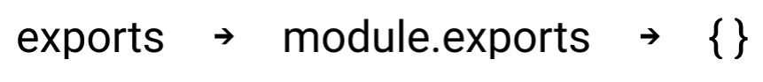

## **Que es un WEBPACK**
Webpack es un empaquetador de módulos, es decir, te permite generar un archivo único con todos aquellos módulos que necesita tu aplicación para funcionar. Para darte una idea, te permite incluir todos tus archivos javascript . js en un único archivo, incluso se pueden incluir hasta archivos de estilos .

Webpack es una herramienta extremadamente poderosa y flexible para construir Javascript, y sus características van mas allá de las cuales tomamos ventaja hoy. Igual, primero, te estarás preguntando... ¿qué es Webpack?

Webpack es un módulo de Node que podes instalar usando npm. Si recordás usando el compilador node-sass de Shoestring para compilar (o, más apropiadamente "transpilar" - ver la nota debajo) nuestros archivos SCSS a un solo archivo CSS - Webpack es como eso!

Webpack toma nuestros archivos JavaScript y produce un solo, archivo JavaScript transformado. De la misma forma node-sass puede reconocer características SCSS (como nesting y @import) y formatear el archivo CSS saliente apropiadamente, Webpack puede reconocerlo cuando tu Javascript usa require y module.exports, y va transformar el archivo Javascript resultante apropiadamente también. Wow!

## **Como configurar un Web Pack**
1. Creamos un directorio para crear un proyecto de WEBPACK. Creamos la carpeta. 
1. Creamoe el archivo package.json. Desde la consola en la direccion del derictorio ingresamos `npm init`. Nota: Con npm init -> se configura el .json de forma manual y con `npm init -y` se configura dado si a todo. 
2. Abrimos el package.json.Se vera como acontinuacion: 
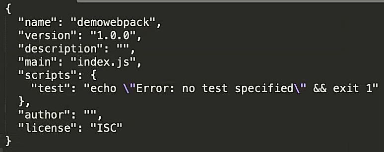
3. AHora, en este ejemplo, crearemos la dependencia el el package.json del WEBPACK. Para esto, configuramos la dependencia para WEBPACK por medio del siguiente comando: `npm install --save-dev webpack webpack-cli`(El comando se obtiene de npmjs.com). Damos enter y dejamos que se instale la dependencia webpack. Se obtiene lo siguiente en el archivo package.json:
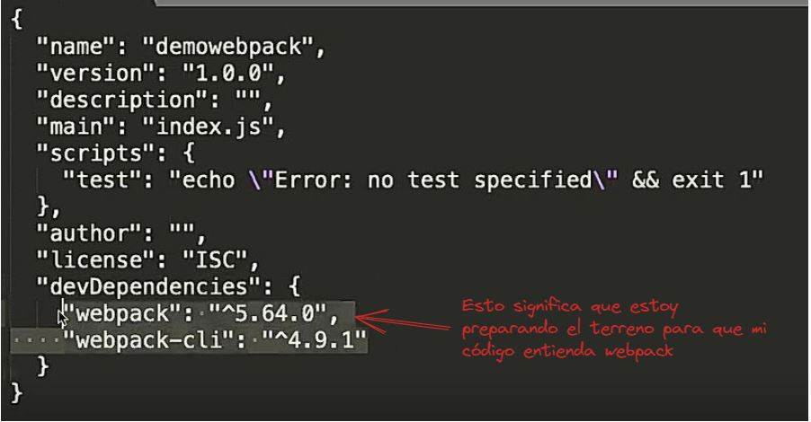
4. Ahora definimos los scripts para start, run build, test, etc. Eliminaremos el script test y agregaremos el start y build: 
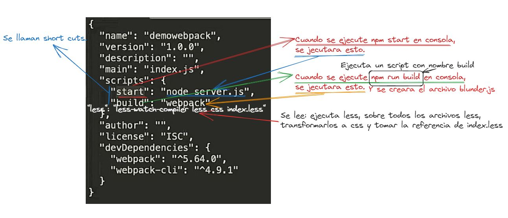 
5. Crear un archivo de configuracion `webpack.config.js`. Esto lo hacemos creando directamnete este archivo tal cual, y agregar el siguiente texto en su contenido: 

En este config se indica que archivo ira a leer, y donde tiene que alojar la salida, osea el archivo blunder.js generado.El main.js es el archivo que leera primero, el archivo central de todos los modulos, se puede observar que se encuentra dentro de una carpeta src. y se establece el destino del archivo bundle.js dentro de una carpera dist.  
6. Ahora, generamos el webpack. Para ver el ejemplo, agregamos contenido en main.js y creamos otro archivo counter.js en la carpeta src para ver como se genera un solo archivo para importar en html: Esto es lo que se agrego en el contenido:
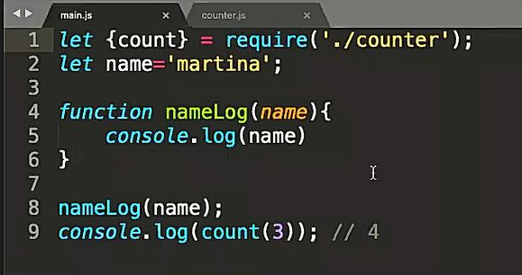
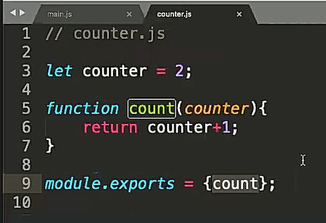
7. El archivo bundle.js se ve asi: 
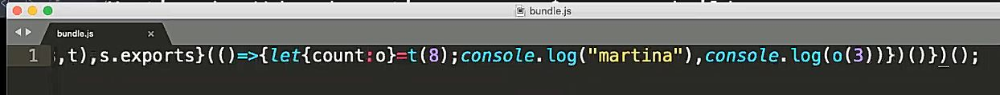
8. Por ultimo importamos el archivo generado en html: 


## **¿Que es un local Host?**
Un servidor web local es aquel servidor instalado en un equipo determinado con el fin de trabajar offline y online. Es una alternativa especialmente útil si lo que buscamos es un entorno en el que desarrollar un sitio web o una aplicación y que nos permita realizar todo tipo de pruebas sin correr riesgos.
# APUNTE

Cuando desarrollamos, queremos que la estructura de nuestro programa/codigo sea lo mas transparente posible, facil de explicar y que cada parte cumpla una tarea definida.

Un programa típico crece de manera organica con el tiempo, nuevas piezas de funcionalidad van siendo agregadas a medida que surgen nuevas necesidades. Esto hace que dar una Estructura -y mantenerla mientras crece- sea fundamental. El problema que mantener esa estructura es un trabajo *extra*, el cual solo veremos los frutos en el futuro, cuando alguien nuevo trabaje en el proyecto.Por lo tanto, lo que puede terminar sucediendo, es que no se haga el trabajo extra y se deja que las partes del programa queden muy entreveradas entre sí.

Finalmente, aparecen dos problemas: el primero, es que entender un programa o sistema sin estructura clara es díficil. Si está tan entreverado que tocar una cosa puede impactar en el todo, al introducir cambios seguramente vas a crear muchos bugs que trendas que corregir. O sea que no podés trabajar de manera aislada una sóla parte del código. Finalmente, te ves obligado a construir un entendimiento del código como un todo. Segundo, si quisieras **reutilizar** una parte de código en otro proyecto, es muy probable que *reescribir* esa funcionalidad sea más fácil que lograr extraerla de tu programa complejo.

## Modules

Los **módulos** son un intento de evitar estos problemas. Un **Módulo** es un pedazo de código que cumple una tarea específica y que indica sobre qué piezas de código depende (*dependencias*).

> **Interfaz** es lo que conocemos en inglés como interface (“superficie de contacto”).
> En informática, se utiliza para nombrar a la conexión funcional entre dos sistemas, programas, dispositivos o componentes de cualquier tipo, que proporciona una comunicación de distintos niveles permitiendo el intercambio de información. Su plural es interfaces.

Estos módulos proveen una interfaz de contacto hacia afuera, es decir que todo el funcionamiento del mismo está encapsulado del mundo externo, y sólo se permite interactuar con el módulo a través de puntos de contactos bien definidos y documentos (en el mejor de los casos).

Es muy similar a cuando interactuamos con un objeto, como un `Array` y usamos sus métodos:

```javascript
    var arreglo = [];
    arreglo.push(1);
```

En el ejemplo, nosotros usamos la función `push` pero no tenemos idea como está implementada adentro, gracias a la documentación sabemos cómo funciona y cómo usarla, pero su funcionamiento está encapsulado dentro de la función.

## Dependencias

Las relaciones entre módulos se llaman **dependencias**. Cuando un módulo necesita una parte de código de otro módulo, vamos a decir que ese módulo *depende* del segundo. En general los módulo van a especificar qué otros módulos son sus dependencias, de tal forma que para usarlo podemos cargar todas esas dependencias.

## Encapsulando Código

En `js`, para lograr esta encapsulación vamos a necesitar que cada módulo tenga su propio **scope**.

Poner nuestro código en diferentes archivos no es suficiente, ya que si cargamos varios archivos, todos comparten el mismo contexto global. Por lo tanto podría haber colisiones entre módulos e interferir entre ellos, rompiendo el encapsulamiento.

## Paquetes

Bien, ahora imaginemos que intenamos encapsular el código para poder usarlo como una pieza en nuestro proyecto (más abajo veremos cómo se hace). Cuando llegue el momento de usar ese código en otro proyecto, lo que hagamos, probablemente, es copiar ese código y *reutilizarlo*. Imaginemos ahora, que en el nuevo proyecto detecto un bug en el código y decido corregirlo. Ahora tambien debería ir al proyecto viejo y corregirlo tambien. Como se pueden imaginar, esto no se puede escalar. Cuando el número de proyectos en el que usamos ese código crezca, va a ser inmanejable la tarea de updatear cada pedazo de código en cada proyecto manualmente.

La solución a este problema son los **paquetes**. Un **paquete** es un pedazo de código que puede ser distribuido (copiado e instalado). Cada paquete puede contener uno o más módulos y a su vez tiene información sobre las dependencias que tiene con otros paquetes. Generalmente, estos paquetes viene acompañado de documentación que indican al usuario cómo usarlos y qué hacen.

Cuando un error es encontrado en algún paquete, o se le agrega funcionalidad nueva. Es corregido y updateado. Ahora los proyectos que dependen de ese paquete pueden actualizar esos paquetes a la nueva versión.

Para lograr distribuir estos paquetes y mantenerlos correctamente actualizados, vamos a necesitas la ayuda de un **gestor de paquetes**. El gestor de paquetes es un pedazo de software que se encarga de manejar esto de manera automática. En el mundo de JavaScript, el gestor de paquetes más usados es NPM (<https://npmjs.org>).

NPM es un servicio online en donde estan hosteados los paquetes que los usuarios comparten, y a su vez un programa que se puede instalar en cualquier SO, que te ayuda a descargarlos, instalarlos y mantenerlos actualizados.

> Veremos NPM más en detalle en el módulo de Back-End.

## Creando Módulos

Hasta 2015, JavaScript no tenía una forma *nativa* de construir módulos. Pero de todos modos, las personas lo usasron para construir grandes proyectos a lo largo de diez años. Por lo tanto, los desarrolladores crearon su propia forma de crear módulos en JavaScript. Lo lograron usando funciones para crear scopes isolados, y usaron objetos para crear las interfaces de los módulos.

Vamos a crear un módulo que nos ayude a trabajar con fechas, va a tener dós métodos que nos permiten pasar un Integer y recibir el nombre del día, y al revés.

```js
const weekDay = function() {
  const names = ["Domingo", "Lunes", "Martes", "Miercoles",
                 "Jueves", "Viernes", "Sabado"];
  return {
    name: function name(number) { return names[number]; },
    number: function number(name) { return names.indexOf(name); }
  };
}();

console.log(weekDay.name(weekDay.number("Domingo")));
// → Sunday
```

La interfaz está creada en el objeto que retornamos. Que tiene los dos métodos antes mencionados. Lo interesante es notar, que se logro encapsular el código a traves de un **IIFE** (Inmidiatly invoked function expression), y creando un closure con el arreglo `names`. De esta manera, en el scope global, si hubiera una variable `names` no interfiere con la que declaramos en nuestro módulo.

>Pensá que ocurriría si no hubiesemos creado el close con al IIFE. ¿Qué pasaría si alguien usa nuestro código y en su proyecto ya tenía declarada una variable `names`?

Este tipo de solución solo ofrece isolación, pero no habla de dependecias, solamente pone su interfaz en el contexto global (el objeto `weekDay`). Por mucho tiempo, esta fue la forma de programar módulos en la web.

## Mejorando los módulos

Una siguiente mejora lógica para nuestros módulos, sería poder tenerlos en archivos separados, por ejemplo, tener nuestro módulo de los días en el archivo: `weekDay.js`, y tener alguna manera de *importarlo*.

Para hacer eso deberíamos tener la capacidad de leer el contenido de un archivo ('strings') y poder pasarla al interprete para que la ejecute. Hay varias formas de lograr esto en JS.

La primera es usando una función especial de JS llamada `eval`. Básicamente esta función recibe un `string` como parámetro y va a ejecutar el código en el scope actual (como si lo estuvieras copiando y pegando ahí).

```js
const x = 1;
function evalAndReturnX(code) {
  eval(code);
  return x;
}

console.log(evalAndReturnX("var x = 2"));
// → 2
console.log(x);
// → 1
```

Este método no es muy efectivo, como vemos esta función puede romper el sistema de scopes tradicional, por lo tanto no es muy predecible.

Otra forma, más predecible, es usar el constructor de `Function` (es el constructor que JS utiliza internamente para crear funciones). Este recibe dos argumentos: una string que contiene una lista separada por comas de argumentos, y una string que contiene el cuerpo de la función.

```js
// estas dos formas producen la misma funcion
function plusOne(n) {
    return n +1;
}

let plusOne = Function("n", "return n + 1;");
console.log(plusOne(4));
// → 5

```

Utilizando esto, vamos a poder encapsular un módulo dentro de una función y usar el scope de esa función como el scope del módulo.

## CommonJS

El sistema que finalmente elegió NodeJS ( y por lo tanto casi haciendo que sea standart) es conocido como **CommonJS**. Es el sistema de módulos utilizado por la mayoría de paquetes de `npm`.

El concepto más importante de CommonJS es una función llamada `require`, que recibe una string que indica el nombre de una dependencia. Cuando es invocada, esta función busca el módulo, lo carga y retorna la interfaz de ese módulo. Esta función, además, envuelve todo el módulo en una función, por lo tanto cada módulo automaticamente tiene su propio scope.

Para pasar el módulo que hicimos antes a CommonJS, básicamente vamos a necesitar utilizar un objeto llamado `exports`. En CommonJS este objeto es donde debemos poner todo lo que queremos que esté en la interfaz de nuestro módulo, es decir, todo lo que querramos que el mundo exterior pueda ver.

Siguiendo con el ejemplo del módulo de las fechas, veamos como podríamos hacer un verdadero módulo usando CommonJS: Primero creamos un archivo con nombre `weekDays.js` con el siguiente contenido:

```js
var names = ["Domingo", "Lunes", "Martes", "Miercoles",
                 "Jueves", "Viernes", "Sabado"];

exports.name = function name (number) { return names[number]; };
exports.number = function number(name) { return names.indexOf(name); };
```

Para usarlo, tenemos que usar `require` en el archivo que quisieramos utilizar nuestro módulo:

```js
var weekDays = require('./WeekDays.js');

console.log(weekDay.name(weekDay.number("Domingo")));
```

Viendo esto, podríamos imaginar cómo funciona `require` por adentro:

```js
require.cache = Object.create(null);

function require(name) {
  if (!(name in require.cache)) {
    let code = readFile(name); // funcion que lee un archivo de texto
    let module = {exports: {}};
    require.cache[name] = module;
    let wrapper = Function("require, exports, module", code);
    wrapper(require, module.exports, module); // pasa la funcion require por si es necesario usarla adentro (otras dependencias)
  }
  return require.cache[name].exports;
}
```

> En este código `readFile` es una función inventada que lee un archivo de texto y retorna su contenido como una string. JS no tiene una función tal, pero el ambiente donde se ejecuta el motor (Node o el browser), puede proveer la forma de leer archivos a JS.

Para evitar tener que cargar el mismo módulo muchas veces, `require` tiene un *cache* de módulos que ya fueron cargados. Si el módulo ya fue invocado, estará en el objeto `cache`, si no, leerá el código del módulo, lo envolverá en una función e lo invocará.

## Que son los Bundlers?

Bien, ahora que sabemos algo sobre módulos, veamos cómo estos revolucionaron la forma de escribir código para el front-end con la introducción de los bundlers.

Como sabemos, la forma de importar librerías (que a su vez son módulos) en HTML es la siguiente:

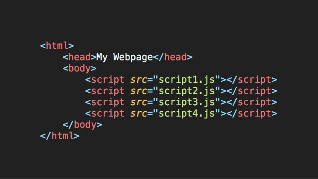

Si pensamos en detalle que sucede cuando importamos cada uno de esos scripts, veremos que básicamente todos terminan cayendo al mismo contexto, el global. Para salvar esto, las librerías básicamente elegían arbitrariamente un nombre de variable donde exponer su funcionalidad. Por ejemplo, `jQuery` utilizaba el signo `$`. Ahora bien, si otra librería decidía utilizar el mismo nombre de variable para su interfaz, tendríamos un conflicto, y ambas librerías no podrían ser usadas en el mismo HTML.

Al principio, sólo se importaba una cantidad pequeñas de librerías para el front, por lo tanto esto no era un problema tan grande. pero a medida que la complejidad del front fue aumentando, y la cantidad de librerías tambien, se tuvo que pensar una nueva forma para resolver esto.

Acá aparecieron los **Module Bundlers**. Como por ejemplo: `Browserify`, `Webpack`, `Rollup`, etc... Básicamente lo que hacen es ejecutar un proceso que lee todas las dependencias de nuestro proyecto, y luego genera un archivo JS que contiene todos los módulos necesarios que podemos incluir en nuestro HTML.

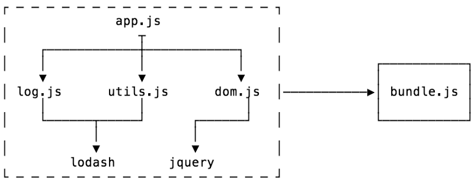

Hay dos cosas etapas en tarea de un Bundler:

* Resolución de dependecias
* Empaquetamiento

Entrando desde un entry point (nuestro archivo `.js` principal), el objetivo de la resolución de dependencias es buscar todas las dependencias del código y construir un grafo (llamado grafo de dependencias).

Una vez hecho esto, podés empaquetar o convertir todo tu grafo de dependencias en un sólo archivo que tu aplicación va a usar. Finalmente, obtenemos un archivo único (el **bundle**) que vamos a importar en nuestro HTML. De esta forma, resolvemos los problemas de encapsulamiento que mencionamos anteriormente.

> Cuando veamos *React*, vamos a aprender a usar el bundeler *webpack*.

## Homework

Completa la tarea descrita en el archivo [README](https://github.com/soyHenry/FT-M2/blob/master/05-Bundlers/homework/README.md)
