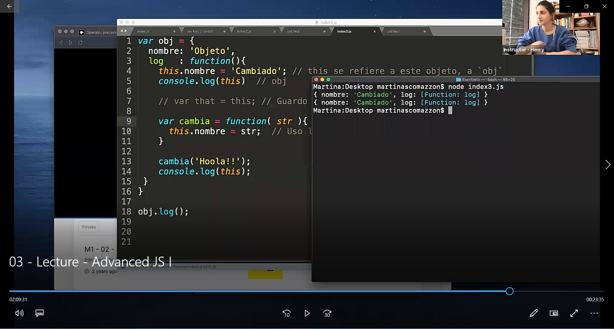
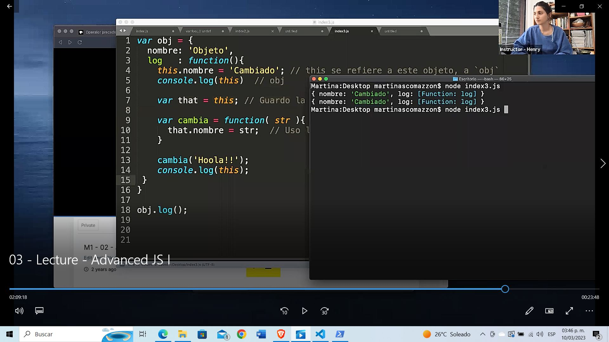

# **A. Computer Science**
## **Lecture**

#### Introducción

Computer Science (CS) es el estudio de procesos algorítmicos, sistemas computacionales y las computadoras per se. A continuación se darán a conocer las tres principales áreas de estudio.

### Teoria Computacional

Aquí se encuentra el aprendizaje y análisis de algoritmos. Un algoritmo es una sucesión de pasos ordenados que al repetirse de forma sistemática logra resolver un problema. A su vez, los algoritmos traen consigo un nuevo concepto: la complejidad.
Por otro lado, en este mismo se encuentra la teoría de grafos, criptografía, hardware y estructuras de datos. Estos últimos se utilizan para organizar los datos de forma eficiente para su posterior uso.

### Aplicaciones

Por otro lado, existe la inteligencia artificial, robótica, machine learning, satisfacibilidad booleana,  procesamiento de imágenes, procesamiento de lenguaje natural, realidad aumentada. Por último, big data y lo que se conoce como hacking ético.

### Ingeniería Computacional

En última instancia, ingeniería computacional. En esta instancia podemos encontrar ingeniería del software, donde prevalece el desarrollo del mismo. El conocimiento y desarrollo de diversos lenguajes de programación, arquitectura de computadoras, compiladores de código, entre otros.

## Circuitos Eléctricos

Para poder entender el funcionamiento de una computadora y sus orígenes, antes tenemos que conocer qué es y cómo funciona un circuito eléctrico.
Un circuito eléctrico es una interconexión de componentes eléctricos que transporta corriente eléctrica a través de una trayectoria cerrada. Imaginemos una batería, ahora pensemos que dicha batería está conectada a través de cables a una lámpara, si deseamos prender la lámpara necesitamos que la misma reciba corriente, ¿Cómo haríamos eso? Podemos tener un interruptor el cual, al cerrarlo prenda la lámpara.


En el caso ilustrado para poder prender la lámpara necesitamos cerrar tanto A como B. Esto se debe a que si cierro A pero no B, la energía de la batería logra llegar hasta el interruptor B, pero dado que el interruptor B está abierto, la energía se pierde y por lo tanto no llega al otro extremo derecho, no llega a la lámpara.
Si A está abierto, pero B cerrado, la energía no llega al interruptor B, y por consiguiente, la lámpara no podría prenderse.
En el caso de que tanto el interruptor A como el interruptor B estén cerrados, la energía logra fluir hasta llegar a la lámpara y lograr prenderla.

Una alternativa, sería colocar dos interruptores de forma paralela de forma tal que si cierro uno, pero mantengo el otro abierto, la energía tiene un camino alternativo por donde pasar.


En este caso, si cierro el interruptor A pero mantengo el interruptor B abierto, la lámpara se prende igual. Esto se debe a que la energía de la batería pasa por el camino cerrado hasta alcanzar la lámpara. Análogo es el caso en el que el interruptor A está abierto y el interruptor B cerrado.

Si buscamos asociar lo ya mencionado a lógica, podríamos considerar que cuando el interruptor está abierto su valor es 0 y cuando el interruptor está cerrado su valor es 1. Y la lámpara encendida es 1. Por lo tanto, en el primer caso, para poder prender la lámpara necesitamos que tanto el interruptor A como el interruptor B estén cerrados, es decir que ambos valores estén en 1. En el segundo caso, con que uno esté abierto ya es suficiente, por lo tanto podríamos tener A con un valor 0 y B con un valor 1 o viceversa, o ambos con valor 1.

En conclusión, el uso de interruptores en serie (primer caso) representa un AND, y el uso de interruptores en paralelo (segundo caso) representa un OR. A partir de diversas combinaciones podremos lograr cada uno de los conectores lógicos.

#### Conectores Lógicos

A continuación y a modo de repaso, las tablas de verdad para cada uno de los conectores lógicos más utilizados: AND, OR, XOR, NOT

A | B | AND
--| --| --
1 | 1 |  1
1 | 0 |  0
0 | 0 |  0
0 | 1 |  0

A | B | OR
--| --| --
1 | 1 |  1
1 | 0 |  1
0 | 0 |  0
0 | 1 |  1

A | B | XOR
--| --| --
1 | 1 |  0
1 | 0 |  1
0 | 0 |  0
0 | 1 |  1

A | NOT
--| --
1 |  0
0 |  1

## Half Adder

En función de las compuertas o puertas lógicas y a través de la combinación de estas podemos lograr diversas operaciones, por ejemplo un sumador de números.
En la escuela nos enseñaron a sumar con números decimales pero, las computadoras en su interior trabajan con un sistema binario, es decir 1 y 0s.
Por ejemplo, si quisiéramos sumar 19+24 sabemos que la suma de 9+4 = 13, por lo tanto en el resultado final en la unidad nos queda un 3 y debemos “llevarnos” la decena. Luego, para la decena debemos sumar 1 + 2 + 1 = 4. Obteniendo como resultado final 43.
En el Half Adder, ese rol de acarreo lo hace la puerta lógica AND mientras que el XOR efectúa la suma. Si quisiéramos trasladar el mismo ejemplo ya mencionado, en primer lugar debemos conocer cual es el valor de 19 y 24 en binario. Más adelante veremos cómo hacer dicha transformación, pero por ahora, confíen que 19 = 10011 y 24 = 11000.

1 | 0   | 0     | 1   | 1
-- | --- | ----- | ----| ---
1| 1 | 0  |0 |0

Comenzando de derecha a izquierda. 1 AND 0 = 0 por lo tanto NO acarreo, y por otro lado debo hacer 1 XOR 0 = 1. El segundo, es análogo

1 | 0   | 0     | 1   | 1
-- | --- | ----- | ----| ---
1| 1 | 0  |0 |0
| |   |1 |1

0 AND 0 = 0, NO acarreo. Luego, 0 XOR 0 = 0. Por lo tanto,

1 | 0   | 0     | 1   | 1
-- | --- | ----- | ----| ---
1| 1 | 0  |0 |0
|1 |  0 |1 |1

Llegamos al último caso, 1 AND 1 = 1, por lo tanto hay acarreo.

1|1 | 0   | 0     | 1   | 1
--|-- | --- | ----- | ----| ---
|1| 1 | 0  |0 |0
||1 |  0 |1 |1

1 XOR 1 = 0

1|1 | 0   | 0     | 1   | 1
--|-- | --- | ----- | ----| ---
|1| 1 | 0  |0 |0
|0|1 |  0 |1 |1

Se completa con 0s. Por lo tanto, resta resolver 1 AND 0 = 0, NO hay acarreo. 1 XOR 0 = 1.

1|1 | 0   | 0     | 1   | 1
--|-- | --- | ----- | ----| ---
0|1| 1 | 0  |0 |0
1|0|1 |  0 |1 |1

101011 = 43

## Sistemas de Numeración

### Sistema Unario

Es el sistema de numeración más simple, posee un único símbolo para representar todos los números existentes. Supongamos que el símbolo elegido sea “I”, si quisiéramos representar el número 3 del sistema decimal, lo haríamos de la siguiente manera: “III”. Su principal desventaja es que no nos permite simbolizar de forma cómoda y rápida un conjunto con muchos elementos.

### Números Romanos

En este caso existen 7 símbolos o signos para representar todos los números posibles. El orden de estos símbolos, importa, se basa en un sistema aditivo, cada signo representa un valor que se va sumando al anterior. La numeración romana, luego, evolucionó a un sistema sustractivo, en el cual algunos signos en lugar de sumar, restan. Si el valor a la izquierda es menor, entonces resta.

Por ejemplo:

CXVII = cien + diez + cinco + uno + uno

MCMV = mil  + (mil - cien) + cinco

### Sistemas Posicionales

Un sistema posicional es aquel en donde cada dígito posee un valor que depende de su posición relativa, la cual está determinada por la base, número de dígitos necesarios para escribir cualquier número. En el caso de un sistema decimal, base 10, ya que el número de dígitos es 10, de 0 a 9.

Por lo tanto, además del número de unidades que representa, considerado en forma asilado, tiene un significado o peso distinto según la posición que ocupa en el grupo de caracteres del que forma parte.

### Binario <> Decimal

Ahora es momento de entender cómo transformar un número binario en un número decimal y viceversa. Si queremos realizar una transformación de binario a decimal debemos utilizar la fórmula que se encuentra a la derecha (2).

Por ejemplo:
Supongamos 10101, comenzando de derecha a izquierda, cada 1 o 0 será multiplicado por 2^n en donde n describe la posición en el que se encuentra, siendo el más derecho, la posición 0. El resultado final será la sumatoria de todos ellos.

 1 | 0   | 1     | 0   | 1
-- | --- | ----- | ----| ---
2^4| 2^3 |  2^2  | 2^1 | 2^0

Por lo tanto:
1x2^4 + 0x2^3 + 1x2^2 + 0x2^1 + 1x2^0 = 16 + 0 + 4 + 0 + 1 = 21

En cuanto al pasaje de decimal a binario, debemos dividir por dos y quedarnos con el resto, dicho resto va a ser quien nos marque el binario involucrado.

Por ejemplo:
Realizamos la operación inversa, convertimos 21 en binario.

21/2 = 10 (resto 1)
10/2 = 5 (resto 0)
5/2 = 2 (resto 1)
2/2 = 1 (resto 0)
1/2 = 0 (resto 1)

Ahora leemos de abajo hacia arriba los restos, al concatenarlos, obtendremos nuestra solución en binario 10101.

## Lenguaje de Maquina

Recordemos que las computadoras, solo entienden 0s y 1s. Ahora bien, ¿Nosotros escribimos en 1's y 0's? No.
Existen lenguajes de alto y bajo nivel que luego deben ser traducidos a lenguaje maquina, lenguaje interpretable por la computadora. La "traducción" lo llamaremos compilación.


## Homework

Completa la tarea descrita en el archivo [README](https://github.com/soyHenry/FT-M1/tree/master/01-IntroToCS/homework)

# NOTAS
## Git y GitHub
### Esquema de trabajo


# **COMANDOS ADICIONALES**
> ## **Comando split()**
 **Def:** El split descompone el valor asociado a el de la  forma que se indique en el argumento. **No se puede hacer split a un numero, solamente a un string**.

**Ejem. 1:**

    '1010'.split('');
    output: ['1', '0', '1', '0']
    // Separa el numero 1010 en un array con los mismos valores

**Ejem. 2:**

    'hola'.split('o');
    output: ['h', 'l', 'a']

>## **Comando Number()**
**Def:** Convierte un numero de string a un numero. 

**Ejem. 1:**

    Number('5');
    Output: 5

>## **Comando join()**
**Def:** Une los valores de un arreglo y lo convierte en un string. 

**Ejem. 1:**

    array.join('') // Donde array = [1,0,1,0]
    output: '1010'

>## **Comando (objecto).toString();**
**Def:** Convierte un numero cualquiera en string. 

**Ejem. 1:**

    (100).toString();
    output: '100'
# INTRODUCTION TO COMPUTER SCIENCE | Homework

## 📒 Temas de la clase

-  Lenguaje y teoría computacional.

-  Sistemas de numeración.

---

## 👀 Aprendizaje esperado

Al finalizar esta homework comprenderás la lógica computacional a través de la construcción de funciones que cumplan con un comportamiento específico.

---

## ⏱ Duración estimada

> 45 minutos

---

## 📋 Instrucciones preliminares

1. Para ubicarte dentro de la carpeta homework escribe en tu terminal los siguientes comandos:
   -  cd + [01-IntroToCS].
   -  cd + [homework].
2. Luego, instalaremos las dependencias con el comando:

```javascript
npm install
```

3. Listo! Ya puedes correr los test con el comando:

```javascript
npm test
```

---

## 👩‍💻 **CONSIGNA**

Esta homework consta de dos ejercicios sencillos. En ambos deberás declarar funciones. Cada función tiene que permitir traducir un número a los dos diferentes sistemas numéricos que vimos en clase.

En el archivo **_homework.js_** resuelve los siguientes ejercicios:

</br >

### 🟡 **Ejercicio 1: BinarioADecimal**

Declara una función que reciba por parámetro un número en formato string en base binaria y retorne el mismo número en base decimal. El valor retornado debe ser de tipo number. Por ejemplo:

```javascript
BinarioADecimal('1100'); // debe retornar 12
```

</br >

### 🟡 **Ejercicio 2: DecimalABinario**

Escribe una función que reciba por parámetro un número en base decimal y retorne el mismo número en base binaria. El valor retornado debe ser de tipo string. Por ejemplo:

```javascript
DecimalABinario(8); // debe retornar '1000'
```

---

## 🧠 Recuerda que...

Las ciencias de la computación han avanzado a pasos agigantados, pero aún las operaciones más complejas se reducen, dentro de la computadora, a ceros y unos. Es decir: el sistema binario.
# B. JavaScript Avanzado I
Empecemos con algunos fundamentos:

## Single Threaded y Sincrónico

En ciencias de la computación un thread (o hilo de ejecución) es la secuencia de instrucciones más pequeña que puede ser manejada por un _planificar de recursos_ (él que se encarga de repartir el tiempo disponible de los recursos del sistema entre todos los procesos) del Sistema Operativo.


JavaScript es __Single Threaded__ y sincrónico, es decir que sólo puede hacer un sólo comando o instruccion en cada momento y que lo hace en orden, empieza la instrucción siguiente cuando termina la anterior. Esto puede sonar confuso, porque vemos que, en el browser por ejemplo suceden muchas cosas al _mismo tiempo_ o bien, cuando tiramos una función asincrónica y esta se realiza mientras nosotros hacemos otras cosas, etc... esto sucede porque en general usamos javascript en conjunto con otros __procesos__, que pueden ser o no single threaded y en conjunto nos da la sensación que está ocurriendo todo al mismo tiempo, aunque es muy probable que no sea así.

> Los procesadores son tan rápidos que nos dan la sensación de paralelismo en tareas cuando en realidad se hacen en serie.

## Syntax Parser

Un programa que lee tu código y determina qué hace y si su sintaxis es válida. Si todo está bien se generá código legible por la computadora que luego es ejecutado como instrucciones. Lo importante de esto, es que el intérprete  además puede agregar ciertos comportamientos extras, vamos a ver algunas de esas cosas extras que el intérprete maneja por nosotros.

> CP: Es el que nos indica cuando aya un error. 

## Lexical Environment

El lexical environment tiene que ver con _dónde_ están declarados ciertos statements o expresiones en tu código. Es decir, el comportamiento de JavaScript puede cambiar según dónde hayas escrito el código.

```js
function hola() {
  var foo = 'Hola!';
}

var bar = 'Chao';
```
> CP: El Lexical Enviroment, da a conocer donde esta declarada cada informacion. Observando el siguiente codigo: 
```js
function hola() {
  var foo = 'Hola!';
  var bar = 'bar';
}

var bar = 'Chao';
```
> Se observa que la variable bar esta en la zona de la funcion y en la zona global, por lo tanto, se denominan funciones diferentes. Esta en un Lexical Enviroment diferente.

Por ejemplo, para el intérprete las dos declaraciones de variable del arriba tendrán significados muy distintos. Si bien la operación es igual en los dos (asignación) al estar en lugares distintos (una dentro de una función y la otra no) el intérprete las parseará de forma distinta.

> En otros lenguajes puede que el lexical environment no cambie el comportamiento de la ejecución del código.

## Execution Context

El contexto de ejecución contiene información sobre _qué_ código se está ejecutando en cada momento. Además de mantener el código que tiene que ejecutar, también mantiene más información sobre desde dónde se invocó ese código, en qué lexical enviroment está, etc...

> CP: Es importante saber que todo lo que se ejecute en JS se va a ejecutar en un contexto de ejecucion, todo!. Si se tiene el siguiente codigo:
```js
console.log('hola');
```
>CP: Este se ejecutara en un contexto de ejecucion.
El Execution Enviroment tiene 2 fases, uno de creacion y una de ejecucion:
>
> **Fase de creacion**
>1. Leer todo el codigo. En este paso reserva espacio de memoria para guardar las variables y funciones definidas. No agina los valores de la varibales(no asigna ningun valor), solo reserva los espacios y el datos de cada variables los establece como "undefined". Para el caso de las funciones, este guarda toda la a funcion Ej: function nombre(){....}, copia toda la funcion, esto debido a que JS maneja las funciones como objetos. 
>
> **Ejecucion**
> 1. Empieza a leer el codigo nuevamente, si se encuentra que las variables contenian un valor, este las empieza a asignar. 
> 2. Posteriormente,procede analisar el codigo, si se encuentra que una variable esta definida como una ejecucion de una funcion, este nuevamente crea un nuevo contexto de ejecucion (FASE DE CREACION) y nuemvamente, se rraliza la ejecucion el cual define los valores undefined. En cuanto se encuentre con un return, el contexto de ejecucion se elimina. 

**Eliminacion del conxtexto de ejecucion**
De de seguir con el proceso de ejecuion, el proceso se encuentra que ya no hay nada ,as que ejecutar, por lo tanto, elimina el contexto de ejecucion al terminar con su tarea. 
>
>CPS: Si no se aclara se trabaja en un contexto de ejecucion global (se vera mas adelante como se aclara). En el encontraremos informacio de que variables estan definidas, incluso, invocaciones, todo lo que esta definido en nuestro archivo. Va a tener un objeto que va a representar al contexto llado this. Por lo tanto: Lexical -> Donde y Execution context -> que

### Global Enviroment

Cada vez que ejecutamos algo en JavaScript __se corre dentro de un contexto de ejecución__. Como todo el código corre en un contexto, si no especificamos ese contexto (veremos cómo se hace despues) entonces el código se va a ejecutar en el __contexto global__, que es el contexto de base que nos crea automáticamente el interprete.

> Básicamente, vamos a decir que es __global__ cualquier bloque de código que no esté declarado dentro de una función.

Además de ejecutar el código que le pasemos, también crea un __objeto global__ y además crea una variable llamada __this__. Por ejemplo, si usamos el engine de javaScript de Chrome ( este es el intérprete ), y vamos a la consola vamos a ver que el _objeto global_ que mencionamos el es objeto `window` y que la variable `this` hace referencia a ese objeto. Esos objetos los generó el interprete cuando creó el ambiente de ejecución. Si abro otra pestaña voy a tener otro objeto `window` similar, ya que es otro contexto de ejecución, y dependiendo de donde se ejecute el contexto, este creara su propio entorno de contexto, osea la syntaxys del contexto. 


> Si corremos JavaScript en otro ambiente que no sea el browser, por ejemplo con NodeJs o con otros engines, es muy probable que el objeto global no sea `window` y sea otro. Pero siempre hay UN objeto global.

En JavaScript, cuando declaramos variables y funciones en el contexto global, estos se guardan en el objeto global. Si declaramos variables y funciones en la consola de desarrollador, vamos a ver que estás aparecerán dentro de `window` que es el objeto global.


Por último, el contexto de ejecución tambien mantiene una referencia a otros contextos de ejecución (desde donde fue creado). Como ahora hablamos del contexto global, esta referencia contiene el valor `null`, ya que no hay otro contexto que haya invocado a este.


### Creando el contexto de ejecución / Hoisting

Veamos como el intérprete crea el contexto de ejecución global. Cuando el interprete lee un bloque de código realiza un proceso llamado `hoisting`. Básicamente lee todo el código buscando declaraciones de variables y funciones, y reserva un espacio en memoria para ellas.

Probá ejecutar lo siguiente en JavaScript:

```javascript
bar();
console.log(foo);

var foo = 'Hola, me declaro';
function bar() {
 console.log('Soy una función');
}
```

En otros lenguajes, si intentaramos invocar una función o una variable que está definida _'más abajo'_ seguramente tendríamos un error. Pero JavaScript, al realizar el proceso de `hoisting`, ya tiene reservado el espacio para esas variable y funciones, por lo tanto no se genera un error (Esto aplica unicamente para las variables de tipo _var_ y las _functions_, para los _const_ y _let_ no funciona. ). Notesé que a la función la pudo ejecutar, esto quiere decir que durante el hoisting guardó su contenido también, no sólo reservó el espacio. Pero con el caso de la variable, sólo reservo el espacio, ya que cuando hacemos el `console.log` vemos que contiene `undefined`.

> Podemos pensar el Hoisting como que el interprete '_mueve_' las declaraciones a la parte de már arriba de nuestro código. Sólo lo hace con las declaraciones y no con las inicializaciones.

Para entender por qué el interprete hace esto, tenemos que saber cómo se crea el contexto de ejecución. Esto se hace en dos fases. La primera es la fase de creación (creation phase). En esta fase el interprete genera el _objeto global_, asigna la variable _this_ y las referencias a otro contexto de ejecución (Outer Context), y además reserva el espacio para todas las variables y funciones que vaya a utilizar ese contexto, justamente en este último paso es donde se genera el proceso de `hoisting`.


> El hosting es el primer ejemplo de las _cosas extras_ que hace el interprete sin que nosotros se lo pidamos. Si no las conocemos, nos puede pasar que veamos comportamientos extraños y no sepamos de donde vienen (como que podamos usar funciones que no hemos declarado antes de invocarlas!!)

La segunda fase es la _fase de ejecucción_, en esta fase, ya tenemos todo lo que se creo en la primera fase, y ahora sí el intérprete __ejecuta__ nuestro código, línea por línea!.

Este proceso de crear contextos de ejecución sucede siempre al principio cuando se crea el contexto global, ahora vamos a ver que también sucede cada vez que invocamos una función en nuestro código, como se pueden imaginar, en un script cualquiera, es muy probable que se creen varios contextos de ejecución (muchas invocaciones a funciones), estos contextos se van a ir _apilando_ en la __pila de ejecución o execution stack__.

## Execution stack

Para ilustar cómo se van creando y cómo se apilan los contextos veamos el siguiente código:

```javascript
function b() {
  console.log('B!')
};

function a() {
  // invoca a la función b
  b();
};

//invocamos a
a();
```

Veamos que ocurre cuando corremos este script: Como sabemos, lo primero que pasa es la creción del contexto global y el proceso de _hoisting_, entonces la función `a` y `b` van a estar en memoria. Una vez que termina eso, empieza la fase de ejecución, en esa fase es que el interprete va a recorrer línea por línea el script. En nuestro ejemplo hay una única línea para ejecutar (las otras las leyó durante el _hoisting_) que es la línea donde invocamos a `a()`.

Lo que sucede ahora, es que se crea un _nuevo contexto de ejecución_ que se va a poner arriba del contexto de ejecución global (creando la pila). Básicamente, el contexto que esté arriba de la pila, es el que se está ejecutando en ese momento ( o cuando le den tiempo de procesador a JavaScript). Cuando se creó ese contexto nuevo, pasó lo mismo que cuando creamos el global, el intérprete generó la variable `this` y pusó las referencias al `outer context` (en este caso el outer context es el contexto global), después de hacer todo eso, el intérprete va a ejecutar línea por línea el código del nuevo contexto, es decir, _el código de la función `a`. Ahora, dentro de `a` hay una sóla línea de código, y en esa línea se invoca a `b`. Si! como se imaginan, el intérprete va a crear un_nuevo_ contexto de ejecución para la función `b` (haciendo de nuevo los pasos previamente mencionados), y poniendolo en la cima de la pila.


> Cada invocación a una función crea un contexto de ejecución nuevo, que pasa por las dos fases de creación antes mencionadas. Cuando se termina de ejecutar, se _destruye_ y se saca de la pila de ejecución para seguir con los que quedan.

### Scope

Ahora que sabemos que existen los contextos de ejecución, podemos entender más fácilmente que ocurre con las variables que creamos dentro de las funciones que invocamos. Cada contexto maneja sus propias variables, y son independientes de los demás. Justamente por eso, podemos usar los mismos nombres de variables dentro de funciones que creamos sin que _pisen_ las demás.
También sabemos que podemos acceder a una variable declarada en el contexto global dentro de una función. Esto se debe a que JavaScript primero busca una variable dentro del contexto que se está ejecutando, si no la encuentra ahí, usa la referencia al `outer context` para buscarla dentro de ese contexto. Gracias a esto vamos a poder acceder a variables que estén afuera de nuestro contexto (siempre y cuando no hayamos declarado una nueva con el mismo nombre!!).

Veamos en el código siguiente el comportamiento de las variables:

```javascript
var global = 'Hola!';

function a() {
  // como no hay una variable llamada global en este contexto,
  // busca en el outer que es el global
  console.log(global); 
  global = 'Hello!'; // cambia la variable del contexto global
}

function b(){
  // declaramos una variable global en nuestro contexto
  // esta es independiente 
  var global = 'Chao'; 
  console.log(global);
}

a(); // 'Hola!'
b(); // 'Chao'
console.log(global); // 'Hello'
```

Para esto vamos a introducir el término `scope (alcance)`, este es **el set de variable, objeto y funciones al que tenemos acceso en determinado contexto**. En el ejemplo anterior, la variable `global` está definida en dos `scopes` distintos, uno es el `scope global` y el otro es el `scope` de la función `b`, esto quiere decir que, a pesar de tener el mismo nombre, estas dos variables son distintas.

Justamente, cuando JavaScript no encuentra una variable en su scope, lo que hace es buscar en otros scopes (de contextos que esten en la referencia de `outer contexts`). A esta búsqueda en distintos scope se la conoce como __the scope chain__, ya que el intérprete busca en cadena scope por scope por el nombre de la variable, hasta llegar al scope global. Noten que el `outer enviroment` no es necesariamente el contexto que esté debajo en la pila de ejecucción, ni tampoco el contexto en donde se invocó la función, si no __es el contexto en donde se definió la función!__ (Se acuerdan que dijimos que en javascript el _lexical enviroment_ era importante?).

> Si el intérprete llega el scope Global sin encontrar la variable, entonces va a tirar un error.

Prueben el siguiente código y miren comó cambió todo cuando declaramos la funcion `a` __dentro__ de la función `b`:

```javascript
var global = 'Hola!';

function b(){
 var global = 'Chao'; 
 console.log(global); // Chao
 function a() {
  // como no hay una variable llamada global en este contexto,
  // busca en el outer que es scope de b;
  console.log(global); //Chao 
  global = 'Hello!'; // cambia la variable del contexto de b()
 }  
 a();
}

//a(); Ya no puedo llamar a a desde el scope global, acá no existe.
b();
console.log(global); // 'Hola!'
```

## Asynchronous non blocking

Ahora que sabemos un poco más sobre cómo hace JavaScript para ejecutar el código, veamos que pasa cuando usamos una función asincrónica a la que le pasamos un callback.

> __Callback__: Le llamamos así a una función que le pasamos como argumento a otra función, para que sea invocada en esta ultima, en general cuando se cumpla una condición o termine de realizar algo (leer un archivo, escribir en una base de datos, traer datos de internet, etc...) .

Cuando decimos código _Asincrónico_ quiere que su ejecución o su completitud está diferida en el tiempo. Por ejemplo, cuando declaramos un evento, el código o la función callback se va a ejecutar cuando suceda ese evento y no cuando el intérprete lee esas líneas, o cuando hacemos un request tipo _AJAX_ y esperamos que llegue la respuesta, etc... En todos estos casos, el engine JavaScript sigue haciendo o ejecutando otras líneas de código, y esto nos puede dar la _sensación_ que estamos haciendo más de una cosa a la vez. Pero al principio dijimos que javascript es sincrónico y que ejecuta _una sóla cosa a la vez_, veamos cómo logra darnos esa [_sensación_](https://www.youtube.com/watch?v=nJXVIjxRq_A).

Para entender esto, tenemos que ver un poco la imagen grande. Cuando hablamos del engine Javascript tenemos que comprender que nunca actuá sólo, siempre va a estar acompañado por otros componentes de software. El Engine de JavaScript tiene formas de comunicarse con estos otros componentes. Por ejemplo, el componente encargado de _renderizar_ las páginas, o el componente encargado de hacer _http requests_ (en general estos están programados en C o C++). Lo que sucede entonces, es que JavaScript le __pide__ cosas a los demás componentes y les pide que le __avise__ cuando terminen de hacer esas cosas. Por lo tanto, los demás componentes del browser se encargán de hacer ese trabajo y cuando sucede un evento o terminan una tarea le _avisan_ al engine, este interrumpe su proceso normal y mete el callback en el execution stack para realizarla.

Para lograr este comportamiento, el engine JavaScript tiene lo que se conoce como __Event Queue__, que es una cola que inicialmente está vacía y es en donde el browser (o quien se encarge de realizar las tareas) va a ir poniendo los avisos notificando que se terminó de ejecutar tal tarea. Ahora el engine JavaScript intercala cosas que tienen que ejecutar de su _execution stack_ con cosas que tiene que hacer del __event queue__, de esta forma nos da la sensación que hay cosas que se hacen en paralelo. Cuando en realidad estamos delegando las tareas a otros componentes.

> Para entender exactamente como trabaja el _Event queue_ en conjunto con los demás componentes miren [este video](https://www.youtube.com/watch?v=8aGhZQkoFbQ), en donde está perfectamente explicado.

## Operadores y Tipos de Datos en JavaScript

Antes de avanzar repasemos algunos conceptos de programación.

## Tipos de Datos

### Static Typing vs Dynamic Typing

Todos los lenguajes de programación tienen características distintas que los caracterizan. Una de ellas es la forma con la que trabajan con variables y tipos de datos. JavaScript en particular tiene lo que se conoce como `tipado dinámico` o `dynamic typing`. Esto quiere decir que no tenemos que decirle al intérprete que tipo de datos contiene una variable, él lo calcula por si mismo. En otros lenguajes, al declarar una variable tenemos que avisarle qué tipos de datos vamos a guardar en ella (`static typing` o `tipado estático`). Otra cosa importante, es que JavaScript nos permite __cambiar__ el tipo de datos que guardamos en una variable, por ejemplo, podemos tener una variable con un número y luego guardar una string en la misma variable, en otros lenguajes hacer esto nos resultaría en un error.

> Cuando queremos convertir algo de un tipo de datos a otro, usamos el termino _castear_.

### Tipos de datos Primitivos en JavaScript

Un tipo de datos Primitivo, son tipos de datos básicos que vienen previamente definidos con el lenguaje. Usando estos tipos de datos primitivos vamos a poder crear tipos de datos más complejos.
En Javascript hay seis tipos de datos primitivos:

* __undefined__: Este representa que algo no está definido, como por ejemplo cuando declaramos una variable y no le asignamos nada, toma el valor `undefined` por defecto.
* __null__: Este tambien representa que algo no existe. Lo vamos a usar para decir que una variable está vacía o no tiene nada adentro. (No es lo mismo decir que una variable no está definida, a que NO tiene nada adentro. En el segundo caso _sabemos_ que no tiene nada.)
* __Boolean__: true o false.
* __Number__: Este tipo de datos representa un número real. En JavaScript todos los números son representados como tipo flotantes.
* __String__ : Una secuencia de caractéres.
* __Symbol__: Este tipo de datos es nuevo, está en el nuevo standart ES6. Por ahora lo ignoraremos.

## Operadores

Un operador no es otra cosa que una función, pero al ser funciones básicas para el Engine y que se utilizan muchos, se escriben de una forma particular y que en general es corta y simple. Generalmente, los operadores toman dos parámetros y retornan un resultado.
Por ejemplo: Para el intérprete al ver el signo `+`, sabe que tiene que ejecutar la función suma (que tiene internamente definida), y toma como parámetros los términos que estén a la izquierda y la derecha del operador. De hecho, es equivalente a tener una función que se llame `suma` y que reciba dos parámetros:

```javascript
var a = 2 + 3; // 5

function suma(a,b){
 return a + b; 
 // usamos el mismo operador como ejemplo
 // Si no deberiamos hacer sumas binarias!
}
var a = suma(2,3) // 5
```

De hecho, esa forma de escribir tiene un nombre particular, se llama notación notación `infix` o `infija`, en ella se escribe el operador entre los operandos. Pero también existen otro tipos de notación como la `postfix` o `postfija` y la `prefix` o `prefija`. En estas última el operador va a la derecha de los operandos o a la izquierda respectivamente.


En fin, lo importante a tener en cuenta es que los operadores _son_ funciones.

## Precedencia de Operadores y Asociatividad

Esto parece aburrido, pero nos va a ayudar a saber cómo piensa el intérprete y bajo que reglas actua.

La _precedencia de operadores_ es básicamente el orden en que se van a llamar las funciones de los operadores. Estás funciones son llamadas en _orden de precedencia_ (las que tienen __mayor__ precedencia se ejecutan primero).  O sea que si tenemos más de un operador, el intérprete va a llamar al operador de mayor precendencia primero y después va a seguir con los demás.

La _Asociatividad de operadores_ es el orden en el que se ejecutan los operadores cuando tienen la misma precedencia, es decir, de izquierda a derecha o de derecha a izquierda.

> Podemos ver la documentación completa sobre Precedencia y Asociatividad de los operadores de JavaScript [acá](https://developer.mozilla.org/en/docs/Web/JavaScript/Reference/Operators/Operator_Precedence#Table)

Por ejemplo: `console.log( 3 + 4 * 5)` Para resolver esa expresión y saber qué resultado nos va a mostrar el intérprete deberíamos conocer en qué orden ejecuta las operaciones. Al ver la tabla del link de arriba, vemos que la multiplicación tiene una precedencia de 14, y la suma de 13. Por lo tanto el intérprete primero va a ejecutar la multiplicación y luego la suma con el resultado de lo anterior -> `console.log( 3 + 20 )` -> `console.log(23)`.

> Cuando invocamos una función en Javascript, los argumentos son evaluados primeros (se conoce como [__non-lazy__ evaluation]()), está definido en la [especificación](http://es5.github.io/#x11.2.3).
> No confundir el orden de ejecución con asociatividad y precedencia, [ver esta pregunta de StackOverflow](http://stackoverflow.com/questions/13849906/operator-precedence-and-associativity-with-math-floormath-random).

Ahora si tuvieramos la misma precedencia entraría en juego la asociatividad, veamos un ejemplo:

```javascript
var a = 1, b = 2, c = 3;

a = b = c;

console.log(a, b, c);
```

Qué veriamos en el console.log? Para eso tenemos que revisar la tabla por la asociatividad del operador de asignación `=`. Este tiene una precedencia de 3 y una asociatividad de `right-to-left`, es decir que las operaciones se realizan primero de derecha a izquierda. En este caso, primero se realiza `b = c` y luego `a = b` (en realidad al resultado de `b = c`, que retorna el valor que se está asignando). Por lo tanto al final de todo, todas las variable van a tener el valor `3`. Si la asociatividad hubiese al revés, todos las variables tendrían el valor `1`.

## Coerción de Datos

Ahora, como JavaScript tiene `dynamic typing`, a veces el intérprete sólo cambia el tipo de datos de un valor a otro. Esto es conocido como __Coercion__. Por ejemplo, si hacemos `var a = 1 + 'hola'`, el resultado va a ser `1hola`. Lo que ocurrió es que el número `1` fue convertido a un string, y luego se realizó la operación de concatenado entre el `1` y el string `hola`. Lo importante es que nosotros nunca le pedimos a javascript que nos haga la conversión, el decidió hacerlo sólo (en otros lenguajes nos devolvería un error si quisieramos hacer lo mismo!).

> Cuando usamos el operador `===` le estamos diciendo al intérprete que __NO__ convierta los operadores antes de hacer la comparación.

A veces es obvio lo que JavaScript va a hacer cuando convierte una valor a otro, como por ejemplo, cuando convierte un número a un string. Pero a veces no es intuitivo. Con la función `Number()` podemos convertir valores a números, veamos algunos ejemplos:

```javascript

Number('3') // devuelve el número 3. Obvio!
Number(false) // devuelve el número 0. mini Obvio.
Number(true)  // devuelve el número 1. menos mini Obvio.
Number(undefined) // devuelve `NaN`. No era obvio, pero tiene sentido.
Number(null) // devuelve el nuḿero 0. WTFFFF!!! porqueeEE no debería ser `NaN`??
```

Tampoco es obvio cuando dejamos que el intérprete haga conversiones cuando comparamos por igualdad, de hecho hay una [tabla](https://developer.mozilla.org/en-US/docs/Web/JavaScript/Equality_comparisons_and_sameness#A_model_for_understanding_equality_comparisons) donde podemos ver qué cosas son iguales y cuáles no cuando usamos coercion.

> Podríamos decir que el valor `NaN` es un tipo primitivo de JavaScript. Este aparece cuando Js intenta convertir algo a un número, pero no puede hacerlo. Literalmente significa `Not a Number`.

Ahora sabiendo todo esto, qué cosa sucede en esta expresión `console.log(3 < 2 < 1)`. Por qué el resultado es `true`? Viendo las asociatividades y la coerción que está sucediendo deberíamos poder explicarlo.

> Prueben ver a qué convierten las cosas, para booleanos podemos usar Boolean(), para strings String().

## Funciones y Objetos

### First Class Functions

Algo muy importante de JavaScript es que las funciones son de tipo `first class`, esto quiere decir que las funciones pueden ser tratadas igual que cualquier otro tipo de valor. Es decir, que podemos pasar una funcion como argumento, podemos asignar una función a una variable, podemos guardarla en un arreglo, etc..
Esta es una de las features de JavaScript que lo hace muy poderoso, hay otros lenguajes que pueden hacer lo mismo, pero el más popular es JavaScript.
De hecho, las funciones en JavaScript son un tipo especial de objetos. Este objeto, además de poder tener cualquier propiedades adentro (como cualquier objeto) tiene dos propiedades especiales: La primera es el nombre (`name`), que contiene el nombre de la función, esta propiedad es opcional ( funciones anónimas ). La segunda propiedad se llama `code` (código) y en ella se guarda el código que escribiste para la función.


En el código de abajo, declaramos una función y luego le agregamos una propiedad llamada `saludo` a ella. Como la función es un objeto, entonces podemos hacer esto sin problemas.

```javascript

function hola(){
 console.log('hola');
}

hola.saludo = 'Buen Día';
console.log(hola);
```

También vemos que al hacer el console.log de la función, el intérprete nos devuelve el código que tiene adentro la función en una string. Esto es justamente la propiedad `code` que tienen todas las funciones.

### Expresión

Una Expresión es una unidad de código que evaluá a un valor. Por ejemplo, `a = 3`, es una expresión que devuelve el número `3`. `1 + 2` también es una expresión que retorna `3`. Las expresiones pueden ser escritas en cualquier lugar donde se espera un valor, por ejemplo: `console.log( 1 + 2);`.

### Statement

Los Statements, no producen un valor directamente, si no que _hacen algo_, generalmente tienen adentro expresiones. Según el statement que usemos vamos a tener un comportamiento distinto, ejemplos de statements son `if`, `while`, `for`, etc...

En javascript, en términos de funciones podemos tener ambos `functions statements` y `functions expressions`, veamos la diferencia de ambos.

```javascript
function saludo(){
 console.log('hola');
}
```

El de arriba es un `function statement`, cuando esto es ejecutado por el intérprete no retorna nada, pero sí hace algo: reserva un espacio en memoria para la función que definimos.

```javascript
var saludo = function(){
 console.log('Hola!');
}

console.log(function(){
 //hola;
})
```

En este segundo caso, estamos usando una `function expression`, en la cual estamos creando un objeto de tipo función (anónima) y además la estamos guardando en una variable llamada `saludo`. Justamente, la variable saludo va a apuntar a una dirección de memoria que contiene el objeto de tipo función que creamos anónimamente en una expresión (esa expresión retornó el objeto que se _guardó_ en la variable.). Cuando declaramos una función anónima y la pasamos como argumento, también estamos haciendo una `function expression`.

### Pasando variables por referencia o por valor

Hay dos formas de pasar variables en cualquier lenguaje de programación, en algunos podemos elegir la forma nosotros pero en JavaScript el intérprete elige la forma él mismo.

Las dos formas son, por valor o por referencia. Veamos la siguiente animación:


Cuando pasamos algo por referencia, estamos pasando una _referencia_ o un puntero al objeto. Por lo tanto, cualquier cambio que hagamos a esa referencia, se va a ver reflejado en el objeto original. En el ejemplo, pasamos una referencia a la taza y en nuestra función la llenamos de café. Al ser una referencia al objeto `cup`, vemos que se ve reflejado el cambio en ella (se llena de café) ya que son el __mismo__ objeto!.

En cambio, cuando pasamos algo por valor, estamos pasando el elemento por sí mismo, o una copia de él. En el ejemplo de la tasa, pasamos la tasa por valor, es decir que pasamos una tasa nueva, que existe por si misma (no es una referencia, si no la tasa misma). Por eso, cuando llenamos esa tasa de café, la otra se mantiene igual, ya que son dos _objetos distintos_.

En lenguajes como _C++_ el programador puede decidir si enviar el objeto en sí (por valor) o enviar una referencia al objeto (por referencia). En JavaScript, según qué cosa estemos pasando, el intérprete decide si es por valor o referencia. Básicamente, si pasamos un valor primitivo (números, strings, etc.. ) estos se pasan por _valor_, pero si pasamos un objeto (cualquier objeto, incluso funciones) este se pasa _por referencia_. Podemos probar este comportamiento:

```javascript
var a = 1, b = 2;

a = b;
b = 1;

console.log(a);
// Como se pasó el valor de `b` y no la referencia,
// cuando cambiamos b no impacta en el valor de a. 
```

```javascript
var a;
var b = { nombre : 'hola'};

a = b ;

b.nombre = 'Chao';

console.log(a.nombre); // 'Chao'
// Cuando se hizo la asignación se pasó la referencia de b, por lo tanto
// cuando cambiamos la propiedad nombre de b, se ve reflejado en a
// porque ambas variables "apuntan" al mismo objeto en memoria
```

## Variable `this`

Habiamos dicho que cuando se crea el `execution context`, el interprete reserva el espacio de memoria para las variables (hoisting), guarda la referencia al `outer enviroment` y además setea la variable `this`. Esta variable va a apuntar a distintos objetos dependiendo en cómo fue invocada la función. Esto puede causar algunas confusiones. Veamos algunos escenarios:

## Contexto global inicial

Este es el caso cuando ejecutamos código en el contexto global (afuera de cualquier función). En este caso `this` hace referencia al objeto `global`, en el caso del browser hace referencia a `window`.

```javascript
// En el browser esto es verdad:
console.log(this === window); // true

this.a = 37;
console.log(window.a); // 37
```

## En el contexto de una función

Cuando estamos dentro de una función, el valor de `this` va a depender de _cómo sea invocada la función_.

### Llamadas simples

En este caso, el interprete le da a `this` una referencia al objeto `global`.

```javascript
function f1(){
  return this;
}

f1() === window; // global object
```

> Si usamos el modo `strict` de Javascript, el ejemplo de arriba va a devolver `undefined`, ya que no le deja al interprete _asumir_ que `this` es el objeto global.

### Cómo un método de un objeto

Cuando usamos el keyword `this` dentro de una función que es un método de un objeto, `this` toma hace referencia al objeto sobre el cúal se llamó el método:

```javascript
var o = {
  prop: 37,
  f: function() {
    return this.prop;
  }
};

console.log(o.f()); // logs 37
// this hace referencia a `o`
```

En este caso, _no depende_ donde hayamos definido la función, lo único que importa es que la función haya sido invocada como método de un objeto. Por ejemplo, si definimos la función afuera:

```javascript
var o = {prop: 37};

// declaramos la función
function loguea() {
  return this.prop;
}

//agregamos la función como método del objeto `o`
o.f = loguea;

console.log(o.f()); // logs 37
// el resultado es le mismo!
```

De todos modos, hay que tener cuidado con el keyword `this`, ya que pueden aparecer casos donde es contraintuitivo ( Como varias cosas de JavaScript ). Veamos el siguiente ejemplo:

```javascript
var obj = {
 nombre: 'Objeto',
 log   : function(){
  this.nombre = 'Cambiado'; // this se refiere a este objeto, a `obj`
  console.log(this)  // obj

  var cambia = function( str ){
   this.nombre = str;  // Uno esperaria que this sea `obj`
  }

  cambia('Hoola!!');
  console.log(this);
 }
}
```

Si ejecutamos el código de arriba, vamos a notar que después de ejecutar el código, la propiedad `nombre` de `obj` contiene el valor `Cambiado` y no `'Hoola!!'`. Esto se debe a que el keyword `this` dentro de la función cambia __NO hace referencia a `obj`__, si no que hace referencia al objeto global. De hecho, si buscamos dentro del objeto global la variable `nombre`, vamos a encontrar con el valor `'Hoola!!'` que seteamos con la función `cambia`. Esto quiere decir que no importa en donde estuvo declarada la función, si no __cómo la invocamos__.

Este comportamiento es considerado como un `bug` por mucha gente. Siempre hay que tener en mente, que JavaScript en sí es un programa codeado por personas, y que este mismo puede _tener bugs_ como cualquier otro pedazo de código!.

> Prácticamente, no podemos saber a ciencia cierta que valor va a tomar el keyword hasta el momento de ejecución de una función. Porque depende fuertemente de cómo haya sido ejecutada.

Para resolver este tipo de problemas existe un patrón muy común, y se basa en guardar la referencia al objeto que está en `this` antes de entrar a una función donde no sé a ciencia cierta que valor puede tomar `this`:

```javascript
var obj = {
 nombre: 'Objeto',
 log   : function(){
  this.nombre = 'Cambiado'; // this se refiere a este objeto, a `obj`
  console.log(this)  // obj

  var that = this; // Guardo la referencia a this

  var cambia = function( str ){
   that.nombre = str;  // Uso la referencia dentro de esta funcion
  }

  cambia('Hoola!!');
  console.log(this);
 }
}
```

De esta forma, `that` (puede tener cualquier nombre) va a apuntar al objeto `obj` (`this` apuntaba a ese objeto cuando hicimos la asignación). Ahora si, podemos usar `that` en vez de `this` y estar seguros qué es lo que va a tener adentro.

## Immediately invoked functions expressions (IIFE)s

Vamos a ver un concepto ampliamente usado por los desarrolladores de JavaScript, y ver cómo nos puede servir. Ya vimos la diferencia entre una `function statement` y una `function expression`. Tambien sabemos que las funciones son objetos, y que podemos invocarlas usando el operador `()`. Por lo tanto podemos hacer los siguiente:

```javascript
var hola = function(){
 return 'hola';
}() // ACA ESTOY INVOCANDO LA FUNCIÓN!.
```

Lo que hicimos fue _invocar la función inmediatamente despues de escribir la expresión_, de ahi viene el nombre de IIFE.

```javascript
var hola = function( nombre ){
 return 'Hola ' + nombre;
}('Toni')
```

Podemos usar todo lo que sabemos de funciones con las IIFE, en el ejemplo de arriba la función recibe un parámetro, que se lo pasamos cuando la invocamos inmediatamente. Luego de ejecutar eso, la variable `hola` va a contener la string `Hola Toni`.

También podemos declarar funciones anónimas en una `function expression` y __ejecutarla__ sin tener que guardarla en ningún lugar, la ejecutamos como si fuera cualquier expresión, para eso voy a tener que envolver la declaración de la función con `()` (de hecho lo hacemos para _engañar al syntax parser_):

```javascript
(function(nombre){
 console.log(nombre);
}('Toni')) // IIFE
```

Este es el clásico ejemplo de una _IIFE_, este patrón lo vas a ver en casi todos las librerías y frameworks que hay hoy. Ya que nos permite ejecutar código _sobre la marcha_. Además, cuando llega a esa linea, y ejecuta esa función, el interprete invoca la función y por lo tanto crea un nuevo _contexto de ejecución_ para ese código. Por lo tanto, las variables que declare adentro, van a estar viviendo en ese nuevo _contexto_ y no en el __contexto global__. Esto último es lo más importante de este patrón, ya que nos crea un nuevo _namespace_ sólo para nosotros y estamos seguros que no vamos a colisionar con variables que fueron declaradas en el contexto global por otras personas (Justamente por esto, los frameworks y librerías utilizan fuertemente este patrón).

A veces es necesario acceder al objeto global dentro de nuestra función. Lo que podemos hacer, es pasar una referencia al objeto global cuando invocamos nuestra función:

```javascript
(function(global, nombre){
 console.log(nombre);
}(window, 'Toni')) // IIFE
```

De esta forma, tenemos acceso al objeto global y estamos protegidos de cualquier accidente. Nuestro código está a salvo!

# APUNTES ADICIONALES
## Event Loop


JavaScript tiene una ejecucion sincrona y secuencial, es decir, se ejecuta una sola linea de codigo y, en cuanto termina la ejecucion pasa a la siguiente linea de codigo hasta que aparece una linea con alguna funcion asincrona, por lo que Event Loop se encarga de ejecutar las ejecuciones asincronas. 
El event loop es parte del motor de la implementacion de JavaScript. Se puede llevar acabo la asincronia de JS gracias al sistema del event loop.

### Representacion de Event Loop

Las siguientes secciones explican un modelo teorico. Los motores modernos de JavaScript implementan y optimizan fuertemente la sematica descrita a continuacion. La siguiente imagen muestra la representacion:


La imagen anterior muestra la Call Stack (Pila -> First In Last Out) y el CallBack Queue (Cola -> First In First Out)

**Ejemplo1. :**

```js
function saludarMasTarde(){
  var saludo = "Hola Buneas tardes";
  setTimeout( function saludo(){
    console.log(saludo);
  },3000)
}

saludarMasTarde();
```
Explicacion: En primer lugar se ejecuta la instruccion _saludarMasTarde()_ dentro del _Call Stack_, posteriormente, se ejecuta la instruccion setTimeout(func...){..., 3000} arriba del stack, y despues el programa se dio cuenta que es algo que el no podia trabajar al contener un tiempo de espera, por lo tanto, lo direcciono al Web Apis (El Web Apis, al terminar de ejecutar las instrucciones que le fueron asignadas, las direcciona a una cola llamada _Callback Queue_ y en forma paralela se seguiran ejecutando las instrucciones de la zona Call Stack) en cuanto se teminen los porcesos del Call Stack se ejecutaran llos procesos del Call Back.


# COMANDO EXTRAS

> <>

Este simbolo indica "totalmente vinculado"

> Comando alert()

**Ejem. 1:**
    
    kdj

# **PREGUNTAS - DUDAS**

¿Donde encuentro dentro de la consola la opcion para selecionar el entorno de javascrip asi como el video de Henry?




# JavaScript Orientado a Objetos

Primero empezemos con una diferencia fundamental (sobre todos para los que ya programaron en otros lenguajes orientados a objetos); la diferencia entre herencia de objetos _clásica_ vs _basada en prototipos_.

> __Herencia__: Un objeto puede heredar propiedades y métodos de otro objeto ( o clases ), esto se conoce como herencia o inheritance, es un concepto fundamental de la programación orientada a objetos.

No vamos a hablar mucho de la [herencia clásica](https://en.wikipedia.org/wiki/Inheritance_(object-oriented_programming)), ya que JavaScript no soporta este tipo de herencia. JavaScript tiene una forma de herencia mucho más simple, donde no hay tanto protocolo ni restricciones. Esto hace que sea más flexible y fácil de entender.

## Prototypal Inheritance

Como sabemos, los objetos de javascript tienen propiedades y métodos, y sabemos cómo acceder a ellos. Lo que no sabíamos es que además de las propiedades y métodos que nosotros le agregamos __todos los objetos tienen una referencia a otro objeto llamado proto__. Veamos para que le sirve:


En el ejemplo de arriba tenemos al objeto `Objeto`, que contiene dos propiedades `propiedad1` y `propiedad2`. Por lo tanto si quisiera acceder a cualquiera de esas propiedades podría usar la `dot notation`: `Objeto.propiedad1`. Ahora, como se ve en la imagen `Objeto` tiene una referencia a otro objeto llamado `proto`, y a su vez este objeto tiene una propiedad llamada `propiedad3`. Ahora lo interesante, es que si nosotros queremos acceder a la `propiedad3` del objeto `Objeto`, lo vamos a poder hacer! Cuando escribimos `Objeto.propiedad3` lo que ocurre es que el intérprete busca en el objeto por esa propiedad, y si no la encuentra antes de lanzar un error, busca en el objeto `proto` (que lo tienen _todos_ los objetos) a ver si no encuentra esa propiedad, si la encuentra la devuelve.


De hecho, el objeto al que hace referencia `proto` también podría tener una referencia a otro `proto`. Digamos el objeto al que hace referencia el segundo `proto` contiene la propiedad `propiedad4`. Si nosotros intentaramos acceder a `propiedad4` desde `Objeto` usando `Objeto.propiedad4`, el interprete primero buscaría en `Objeto`, como no está esa propiedad ahí entonces va a buscar en el objeto al que hace referencia `proto`, como tampoco está ahí se fija si ese objeto tiene una referencia en `proto`, como la tiene, va a buscar la propiedad en ese objeto al que hace referencia. En nuestro ejemplo, finalmente encuentra la `propiedad4` en este último y por lo tanto la accede. Esto es lo que se conoce como __Prototype Chain__.

> Las propiedades _parecen_ que están en el Objeto que intentamos acceder, pero en realidad están en _otro_ objeto y son accedidas a traves del __prototype chain__.

Lo más importante de esto, es que si tuvieramos un segundo objeto: `Objeto 2`, cuya propiedad `proto` hace referencia al _mismo objeto_ al que hacia referencia el `proto` de `Objeto`, entonces ambos objetos __compartirian__ un subset de propiedades. En este caso, si quisieramos acceder a `Objeto2.propiedad3` (que no existe en el objeto 2), la encontraríamos siguiendo el prototype chain, y accederiamos a la misma propiedad que si hicieramos `Objeto1.propiedad3`.


Veamos algunos ejemplos:

```javascript
var persona = {
 nombre: 'Default',
 apellido: 'Default',
 getNombre: function() {
  return this.nombre + ' ' + this.apellido;
 }
}

var juan = {
 nombre: 'Juan',
 apellido: 'Maquiavelo'
}

// no hacer esto en producción es sólo para demostración
// hay otras formas de asiganar prototipos.

juan.__proto__ = persona;

// Ahora podemos usar los métodos de `persona`

juan.getNombre();
```

> En el ejemplo, ambos objetos (persona y juan) tienen la propiedad `firstname`. En estos casos, el interprete va a devolver la primera que encuentra, y no va a seguir la cadena de prototipos.

# Todo es un objeto en JavaScript (o una primitiva)

Cualquier cosa en JavaScript que NO sea una primitiva, es un objeto! O sea: funciones, arreglos, objetos, todos tienen un prototipo.
Sin embargo hay un objeto especial, que no tiene un prototipo. Este objeto se llama `base object`. Este objeto se encuentra siempre al final del prototype chain, y termina ahí porque `base object` no tiene un prototype.

De hecho, `base object` tiene definido una serie de propiedades y métodos. Y como todos los demás objetos lo tiene en su cadena de prototipos, entonces, estos métodos y propiedades son accesibles por todos los objetos de JavaScript. Por ejemplo, el método `toString` está definido en el `base object`.

En el caso de cualquier función, su prototipo por defecto es un objeto llamado `Empty`, que es a su vez una función. Cualquier función que creemos va a tener este proto y por ende van a tener acceso a todas las propiedades y métodos de `Empty`. Por ejemplo, la funciones `apply`, `bind` y `call` están definidas en este Objeto.

Con los arreglos pasa algo similar, todos los arreglos tiene como proto a un `arreglo base`. En este último se encuntran definido todos los métodos que usamos en los arreglos, como `push`, `shift`, `length`, etc...

Veamos un ejemplo:

```js
var a = {}; // un objeto vacio
var b = function(){ };
var c = [];

a.__proto__ // veamos que tiene en su proto
// tiene Object {} que es el `base object`
a.__proto__.toString // contiene este metodo

// funcion b
b.__proto__ // function Empty()
b.__proto__.bind // funcion bind!

//arreglo
c.__proto__ // [] arreglo vacio base
c.__proto__.push // funcion push!

// y el proto del proto?

a.__proto__.__proto__ // Object {}
b.__proto__.__proto__ // Object {}
c.__proto__.__proto__
```

Esta es la razón por la que tenemos acceso a todos esas propiedades y métodos que vienen `por defecto` y que usamos a menudo.

## Reflexion and Extend

La _Reflexion_ es la capacidad que tienen los objetos de mirarse a si mismos, listando y cambiando sus propias propiedades y métodos. Todos los objetos tiene un método llamado `hasOwnProperty` que recibe un string, y devuele un booleano en base a si el objeto en cuestión tiene o no la propiedad con el nombre del string pasado. Lo importante es que este método, se fija __solo__ en las propiedades del objeto y __no__ sigue el `prototype chain`.

Por ejemplo:

```javascript
var persona = {
 nombre: 'Default',
 apellido: 'Default',
 getNombre : function() {
  return this.nombre + ' ' + this.apellido;
 }
};

var santi = {
 nombre: 'Santi',
 apellido: 'Scanlan'
};

santi.__proto__ = persona;

for (var key in santi){
 console.log( key + ":" + santi[key] );
} // imprime todo! inclusive getNombre, que esta en su proto.

for(var key in santi){
 if(santi.hasOwnProperty(key)){
  console.log( key + ":" + santi[key] );
 }// imprime solo las propiedades del objeto Santi.
}
```

Este concepto nos permite realizar algo simililar al  prototipado, pero con ciertas diferencias importantes. Esta forma no es nativa en JavaScript, pero es tan útil que muchos frameworks y librerías la implementan.  Por ejemplo, [underscore.js](https://underscorejs.org/), tiene una implementación. Esta nueva forma es conocida como __extend__, y vamos a explicarla con un ejemplo usando la librería antes mencionada:

En este ejemplo, tenemos varios objetos que tiene algunas propiedades y/o métodos que nos gustaría reutilizar.

```javascript
var guille = {
 direccion : 'Armenia 636 6to F',
 getNombreFormal : function(){
  return this.apellido + ', ' + this.nombre
 }
}
var toni = {
 getPrimerNombre : function() {
  return this.nombre;
 }
}

_.extend(santi, guille, toni);
```

Lo que hace `extend`, es combinar todas los métodos y propiedades de `guille` y `toni` dentro del objeto `santi`.  Si ahora vemos el objeto `santi`, vemos que conserva sus propiedades y métodos, pero ahora tiene las de `guille` y `toni`. Y, a diferencia de haberlas obtenido a traves del `prototype chain`, _estas propiedades y métodos_ __son__ de `santi`.

> Pueden bajar la librereia underscore y buscar entre sus funciones a la función _extend_ y ver cómo está implementada. Se pueden imaginar cómo la hicieron antes de ver el código?

## Construyendo Objetos

Ahora que conocemos el prototipado, la cadena cadena de prototipos, y conocemos los Objetos base, podemos empezar a hablar de las mejores formas de _construir objetos_.

Ya conocemos algunas, como _objects literals_:

```javascript
var objeto = {
 propiedad1: valor1,
 propiedad2: valor2,
 metodo1   : function1() {

 }
}
```

Pero hay varias formas de construirlos, sobre todo cuando se trata de setear el __proto__ del objeto creado.

### Functions Constructors y new

Hay algunas features del lenguaje cuya inclusión no fueron por razones técnicas. Es más, existen algunas que tienen que ver con el __marketing__ del lenguaje. (de hecho, el nombre `javascript` fue elegido para atraer a desarrolladores `java`, que estaba muy de moda en aquel momento). Lo que termina ocurriendo es que aparecen ciertas formas de escribir o hacer cosas que vienen de otros lenguajes, ya que los desarrolladores estaban acostumbrados a hacerlas de ese modo. Finalmente lo que pasa es que escribimos algo de una forma que sí tiene sentido para otro lenguajes, pero no tanto para JavaScript. El caso del keyword `news` es este. Esta forma de crear objetos, tiene que ver con la forma de instanciar clases de lenguajes como `java`. Pero en JavaScript no tendría sentido, porque no existen las clases. En JavaScript son todos objetos, no hay clases. De todas formas, esa forma de crear objeto fue heredada de esta manera, por marketing.

Veamos un ejemplo de la sintaxis del keyword `this` y cómo funciona examinando el siguiente código:

```javascript
function Persona() {
 this.firstname = 'Juan';
 this.lastname = 'Perez';
}

var juan = new Persona();
console.log(juan)
```

Qué ven de raro en la función `Persona()`? por empezar no retorna nada, y además no está claro a qué hace referencia el keyword `this`. Pero si nos fijamos, cuando la usamos con `new`, vemos que nos creó un objeto con las propiedades definidas en esa función. Para empezar a entender, primero tenemos que saber el `new` es en realidad un operador en JavaScript. Lo que hace es operador es, primero, crear un objeto vacío. Luego invoca la función que le pasamos como argumento, con la particularidad que bindea el nuevo objeto vacio que había creado, de tal forma que en ese nuevo contexto de ejecucieon el keyword `this` haga referencia a este objeto nuevo. Por último retorna ese objeto que había creado (y que fuera modificado por la función ejecutada).

```javascript
var a = {};
Persona().call(a);

return a; // algo asi
```

Por lo tanto, esto nos permite crear un objeto al invocar una función, justamente esta función (en el ejemplo `Persona()`) cumple el rol de `function constructor`. Seguro estarán pensando que la función `Persona` me sirve para crear objetos que sean iguales, veamos como mejorar eso. Cómo los `functions constructors` __son funciones__, entonces podemos hacer lo siguiente:

```javascript
function Persona(nombre, apellido){
 this.nombre = nombre || 'Juan';
 this.apellido = apellido || 'Perez';
}
var toni = new Persona('Toni', 'Tralice');
var santi = new Persona('Santi', 'Scanlan');
var guille = new Persona('Guille', 'Aszyn');
```

No pierdan de vista, que estamos invocando una función, asi que podemos utilizar adentro __todo__ los que sabemos de funciones.

Lo que todavía no vimos, es cómo setear el __proto__ cuando creamos objetos usando `function constructors`. Antes que nada, veamos qué objeto tienen seteado como __proto__ los objetos creados con algún `function constructor`. Sorpresa! Ya tienen seteados un __proto__ y cómo vemos, hace referencia a un objeto que tiene el mismo nombre que la función que los construye. Para entender esto, tenemos que recordar qué las funciones son objetos especiales, que tenian algunas propiedades extras cómo `Code` y `Name`. También tenemos que saber que _todas_ las funciones tienen la propiedad `prototype`, y que se setea siempre cómo un objeto vacío, __cuando invocamos la función con el operador `new`__  la propiedad `prototype` de la función va a ser usada como el \_\_proto\_\_ de __todos__ los objetos que hayan sido creadas con ella.  

> Mucho cuidado con confundirse la propiedad prototype con el \_\_proto\_\_ de un objeto. No es lo mismo, prototype es simplemente el nombre que , unfortunadamente, eligieron para esa propiedad.

Por lo tanto, todo lo que pongamos dentro de la propiedad `prototype` de la función constructora, va a ser _heredado_ por los objetos creados usando está función con `new`. Por ejemplo:

```javascript
function Persona(nombre, apellido){
 this.nombre = nombre || 'Juan';
 this.apellido = apellido || 'Perez';
}
Persona.prototype.getNombre = function () {
 return this.nombre + ' ' + this.apellido;
}

var toni = new Persona('Toni', 'Tralice');
var santi = new Persona('Santi', 'Scanlan');
var guille = new Persona('Guille', 'Aszyn');

toni.getNombre() // funciona!
santi.getNombre() // tambien!
guille.getNombre() // :D 
```

> Agregar funciones en el prototype del constructor y no dentro del mismo, es una buena practica. __Ya que tener metodos replicados en cada objeto ocupa mucho espacio__. En cambio, si los tenemos en el proto, todos comparten el mismo.

## Object.create y Pure Pototypal Inheritance

Dijimos que los _function constructors_ fueron creados pensados en imitar el comportamiento de otros lenguajes de programación, por lo tanto son un poco extraños. Existen muchos programadores que directamente dicen que es mejor aceptar el hecho que JavaScript tiene un modelo de herencia basado en prototipos ( a diferencia de otros modelos de herencia de otros lenguajes ) y que para crear objetos usemos métodos consecuentes a este hecho. Para hacerlo, javaScript nos provee de la función 'Object.create'. Veamos como funciona:

```javascript
var person = {
 nombre: 'Defecto',
 apellido: 'Defecto'
}; // un objeto cualquiera

var Santi = Object.create(person); // le paso el objeto que creamos
console.log(Santi) // es un objeto
console.log(Santi.__proto__) // es el objeto person que creamos al principio!!
```

Object.create recibe un objeto como parametro y crea un nuevo objeto cuyo prototipo es el primero que le pasamos. Por lo tanto, vamos a poder aceder a todas las propiedades y métodos del objeto _base_ en los nuevos objetos creados.
Ahora, si quisieramos cambiarle algunas propiedades, lo único que deberíamos hacer es escribirle nuevas propiedades con le mismo nombre al objeto en cuestión. En nuestro ejemplo, si quisieramos que le nuevo objeto tuviese un nombre y apellido que no fuera el por defecto (heredado) deberíamos hacer lo siguiente:

```javascript
Santi.nombre = 'Santiago';
Santi.apellido = 'Scanlan';
```

Esto es posible gracias a cómo funciona el _Prototype Chain_, que va a buscar esa propiedad primero en el objeto en sí, si la encuentra no tiene la necesidad de buscarla en el prototipo.

## ES6 y Clases (class)

En la última versión del estandar JS va a tener la posibilidad de declarar [clases](https://es.wikipedia.org/wiki/Clase_(inform%C3%A1tica)), que es el concepto que utilizan otros lenguajes para implementar herencia. De todos modos, en JS las clases no van a se exactamente iguales que en otros lenguajes, ya que en JS existe el modelo de prototipado. Veamos cómo se ven las clases en JavaScript:

```javascript
class Persona {
 
 constructor (nombre, apellido){
  this.nombre = nombre,
  this.apellido = apellido
 }

 saludar() {
  console.log('Hola!' + this.nombre);
 }
}

var toni = new Persona('Toni', 'Tralice');
toni.saludar();
```

Cuando definimos una clase usamos el nuevo statement __class__. Dentro de el primero definimos su constructor, que es el método que va a recibir todos los parámetros y va _crear_ el objeto nuevo basado en esta clase. Podemos decir que es similar a los _functions constructors_ que habiamos visto. Luego podemos agregar métodos que van a estar disponibles para todos los objetos creados con esa _clase_.

> Los que ya programaron en otros lenguajes orientados a Objetos tienen que tener en cuenta que la implementación de Clases no es igual en JS. De hecho, en este ejemplo la clase _Persona_ ES un __objeto__, este objeto es utilizado como prototipo para los nuevos objetos creados con ella.

Para agregar un prototipo a la clase creada se utiliza el keyword __extends__, que también está inspirado en otros lenguajes:

```javascript
class Empleado extends Persona {
 constructor (nombre, apellido, empleo, sueldo){
  super(nombre, apellido);
  this.empleo = empleo;
  this.sueldo = sueldo;
 }
}

var toni = new Empleado('Toni', 'Tralice', 'Profesor', 100);
toni.saludar();
```

El método __super__ nos permite usar el constructor de la clase de la cual estamos _heredando_, en este caso de la clase _Persona_.

> Estas nuevas formas son __sólo distantas formas de _escribir_ lo mismo__, por atrás JS crea los objetos de la misma forma que usando otros métodos. Esto es conocido como _syntactic sugar_: Una forma distinta de escribir algo, pero que no cambia cómo el intérprete trabaja.

## Modelando Objetos

### Programación Orientada a Objetos

Un __paradigma de programación__ representa un enfoque particular o filosofía para diseñar soluciones. Los paradigmas difieren unos de otros, en los conceptos y la forma de abstraer los elementos involucrados en un problema, así como en los pasos que integran su solución del problema, en otras palabras, el cómputo.
La OOP (Object Oriented Programming) es un paradigma de programación. donde los datos están encapsulados en __objetos__ que tienen _propiedades_ y _métodos_, y todas las operaciones que hacemos la hacemos sobre estos objetos.

Veamos algunos conceptos claves de OOP:

* __Clase__: Una clase define las características de un objeto. Es el template donde se definen las _propiedades_ y _métodos_ que van a tener las instancias de esa clase. Una _clase_ es algo abstracto, representa algo pero no _es_ ese algo, hasta que se instancie. Por ejemplo: la _clase_ Empleados, representa a los empleados, pero no es ninguno en particular.
* __Objeto__ : _Instancia_ de una clase. Es cuando usamos la abstraccion de la clase para _Crear_ (instanciar) un objeto. Siguiendo el ejemplo de _Empleados_, podriamos instanciar un objeto _Jorge_(instancia) que _es un_ Empleado (clase).
* __Atributos__: Características que tiene la clase, por ejemplo, en Empleados, puede ser: _nombre_, _apellido_, _salario_, etc...
* __Método__ : Es el comportamiento de la clase, en general son funciones. Por ejemplo, en empleados un método puede ser: _cobrarSueldo()_, o _trabajar()_.
* __Herencia__: Una clase (subclase) puede _heredar_ de otra clase (superclase). Esto quiere decir que extiende a la superclase, es decir que tiene todas las propiedades y métodos de ella y que además tiene otros atributos o métodos particulares. Por ejemplo, la clase _Manager_ puede heredar de _Empleado_ y tener un método nuevo: _darOrdenes()_.
* __Abstracción__: Es el principio básico bajo el cuál diseñamos las clases, básicamente _abstraemos_ un conjunto de objetos con sus atributos y métodos. Esto nos da la posibilidad de pensar un problema desde un nivel más alto.
* __Encapsulamiento__: Es la capacidad de poder agrupar propiedades y métodos en un entorno con límites bien definidos. De hecho las _clases_ son son otra cosa que _abstracciones_ __encapsuladas_ bajo un nombre en particular.
* __Polimorfismo__: Comportamientos diferentes, asociados a objetos distintos, pueden compartir el mismo nombre; al llamarlos por ese nombre se utilizará el comportamiento correspondiente al objeto que se esté usando.
* __Modularidad__: Se denomina "modularidad" a la propiedad que permite subdividir una aplicación en partes más pequeñas (llamadas módulos), cada una de las cuales debe ser tan independiente como sea posible de la aplicación en sí y de las restantes partes. Estos módulos se pueden compilar por separado, pero tienen conexiones con otros módulos.
* __Principio de ocultación__: Cada objeto está aislado del exterior, es un módulo natural, y cada tipo de objeto expone una "interfaz" a otros objetos que especifica cómo pueden interactuar con los objetos de la clase.

Como la OOP es un _paradigma_, cada lenguaje lo interpreta y lo implementa de distintas maneras. De hecho, Javascript no usa el concepto de _herencia_, si que utiliza el concepto de _prototipado_, que de alguna forma lo emula. Es decir, que hay lenguajes donde podemos programar orientado a objetos pero que no es la única forma en la que podemos programar. Vamos a hacer una comparación con __Java__, que es un lenguaje muy preparado para programar OOP:

|Class-based (Java) |Prototype-based (JavaScript)|
|-------------------|----------------------------|
| Clases y Objetos son entidades distintas. | Todos los objetos pueden heredad de otro objeto.|
|Se define una clase con una definición de clase, y se instacia un objeto de esa clase usando un constructor | Se define y se crean objetos usando una función constructor.|
|Crea un nuevo objeto con el operador _new_ | Lo mismo.|
|Construye una jerarquía de clases, donde cada clase hereda de otras clases existentes. |Construye una jerarquía de objetos, donde cada objeto tiene asociado un prototipo con un constructor.|
|Los objetos heredan propiedades y métodos según la cadena de clases. | Los objetos heredan propiedades y métodos siguiente la cadena de prototipos.|
| La definición de una clase especifica _TODAS_ las propiedades y métodos de ella, no se pueden cambiar dinámicamente durante el _run time_. | Las funciones constructoras especifican una serie de propiedades y métodos _INICIALES_. Se pueden agregar o sacar propiedades y méetodos dinámicamente durante el _run time_.|
# MANEJO DE ERRORES
# Manejo de Errores en JavaScript

Escribir programas que anden bien cuando todo funciona como esperabamos es un buen comienzo. Pero esto no sucede todo el tiempo, siempre vamos a encontrar situaciones que estaban más allá de lo que podiamos esperar que suceda (usuarios). Y acá es donde se pone un poco más díficil. Veamos como podemos manejar situaciones inesperadas dentro de nuestro código, para eso vamos a aprender sobre __errores__ en JavaScript.

## Tipos de Errores

Mientras codeamos, o mientras ejecutamos nuestro programas pueden aparecer distintos tipos de errores en distintos momentos según quién causa el error, el tipo de error y cuando ocurre. Vamos a poder distinguir entre los siguientes tipos:
* __Errores de Sintaxis__: Se producen porque el programador no respeta las reglas sintácticas del lenguaje.
* __Errores Semánticos__: Se dan por el mal uso de algún _Statement_ del lenguaje. ej: Loop infinito.
* __Errores Lógicos__: Aparecen porque el código no realiza lo que esperabamos que haga.

Desde el punto de vista de _cuando_ surge el error, podemos tener:
* __Errores en tiempo de Compilación__: Aparecen cuando nuestro código es parseado por un compilador o intérprete (errores de sintaxis). 
* __Errores de Runtime__: Los errores semánticos y de lógica van a aparecer cuando el código se este ejecutando.

Según quien causa el error:
* __Errores de Programación__: Es causado por un error del programador, por ejemplo: Utiliza mal una función y pasa argumentos incorrectos. Estos son los famosos `bugs`.
* __Problemas Genuinos__: Escapa a las manos del programador y ocurren en programas que están bien codeados, por ejemplo, cunado un usuario ingresa un input que la función no esperaba o el servidor al que nos queríamos conectar está caído, etc...

Podemos intentar resolver estos problemas (o alertar que ocurren) usando algunas funciones conocidas del lenguaje, como hacer un console.log() con un mensaje, o retornar un valor extraño cuando ocurra un error (por ejemplo -1), etc... Pero todo esto sólo nos servirá para controlar algunos errores en ambientes semi controlados (yo mismo invoco las funciones que estoy armando, y voy a entender cómo manejar los errores). Para los demás errores, o cuando sucede algo extraño, queremos se frene la ejecución (o cambie de rumbo) y continuar en un lugar en donde se sepa como _manejar_ el error. Hacer esto, en varios lenguajes, es conocido como __manejo de excepciones__.

## Manejo de excepciones

Básicamente, es posible que el código _levante (raise)_ o _tire (throw)_ una excepción, que es un valor (un objeto). Podríamos decir que es parecido a un `return`, pero con superpoderes, porque este `return` puede volver no sólo _salir_ de la función en la que está, si no saltear varios execution contexts hasta llegar el entorno más alto donde se haya iniciado la serie de invocaciones que llegaron a generar una excepción. En inglés este proceso se conoce como _unwinding the stack_. 
Por suerte, cuando programamos podemos intentar _agarrar (catch)_ una excepción que va _subiendo_ (o _bajando_) por el stack de ejecución, de tal forma que ejecutemos código en donde agarramos la excepción y seguir desde ahí.
Para hacer esto en JavaScript vamos a usar el statement: `try` y `catch`:

```javascript
      try {
         //Código a ejecutar
         [break;]
      } 
      
      catch ( e ) {
         // Código a ejecutar si ocurre una excepción (acá la agarramos)
         [break;]
      }
      // el finally es opcional 
      [ finally {
         // Siempre se ejecuta este código, haya o no una excepción
      }]
```

Por ejemplo:

```javascript
function lastElement(array) {
  if (array.length > 0)
    return array[array.length - 1];
  else
    throw "No existe el último elemento de un arreglo vacío.";
}

function lastElementPlusTen(array) {
  return lastElement(array) + 10;
}

try {
  print(lastElementPlusTen([]));
}
catch (error) {
  print("Hubo un problema ", error);
}
```

Cómo vemos en el ejemplo, `throw` es el _keyword_ usado para crear una excepción. Ahora, cualquier código que se ejecute, o haya sido ejecutado desde lo que esté dentro del `try` statement, al generar una excepción, va a frenar su ejecución y devolver la excepción al `catch` statement. La variable `error`, en este caso, es el __nombre__ que le damos a la _excepción_ que acabamos de capturar. 

> Si no hay excepciones, entonces nunca se ejecuta lo que está en `catch`.

Noten que la función `lastElementPlusTen` no tiene idea que `lastElement` puede no funcionar, simplemente la invoca. Eso es lo bueno de manejar excepciones, sólo nos tenemos que concentrar en donde se produce, y donde la atrapamos, todas las invocaciones en el medio, no tienen que enterarse.

---

Tal vez no lo sabíamos, pero muchos errores en realidad lo que hacen es tirar una excepción. Por ejemplo:

```javascript
try {
  console.log(hola);
}catch (error) {
  console.log("Atrapado: " + error.message);
}
```

En casos como este, Objetos especiales son tirados como error. Estos objetos contienen una propiedad `message`, que contiene una descripción del problema. Podemos crear nosotros mismos este tipo de Objetos usando el constructor:

```javascript
throw new Error('Hola no existe!!!');
```

Cuando una excepción es _tirada_, pero no hay nadie que la _atrape_, empieza a subir por el stack de ejecución, hasta que finalmente llega hasta el ambiente global, en donde es _atrapada_ por este. Por lo tanto, cada _enviroment_ va a manejar como quiera la excepción, en general dejan de ejecutar lo que estaban haciendo y te muestran la excepción con un formato particular.

### Errores con el Event Emitter

En ciertos casos, por la naturaleza asincrónica de JavaScript, podemos perder el rastro de cómo suben las excepciones, o tal vez queremos saber si hay un error o no en otro contexto por el cúal no _subirá_ la excepción. Para resolver esto, podemos usar el __event emitter__ como un emisor de errores. Básicamente, pondríamos un _listener_ a escuchar por un evento de tipo __Error__, y luego, en nuestro código simplemente emitiriamos un evento de este tipo cuando encontremos un error.

### Error-Fist callback

Cuando codeamos funciones que ejecutan callbacks, si existió un error podemos crear un nuevo `Error` y pasarlo como __primer parámetro__ cuando invocamos el callback:

```javascript
  //hubo un error
  return cb(new Error('pasó tal cosa'), null);

  // no hubo problemas
  return cb(null, datos);
```

Noten, que cuando hacemos esto no ejecutamos un `throw`, ya que esperamos que alguien lo haga cuando vea el resultado del callback. De esta forma, estamos generando errores __Asincrónicos__.

> Si usamos el patrón de Event Emitter o error first callback los errores se generan asincrónicamente, si lo hacemos con `throw` lo estamos haciendo de manera sincrónica.

### Ejemplos de funciones conocidas y cómo manejan los errores

| __Función__   | __Tipo de función__| __Ejemplo de error__  | __Tipo de error__ | __Qué usa__ | __Como lo manejamos__|
|--------   | ----:| ----:| ----: | ----: | ----: |
|`fs.stat`| asincrónico | archivo no encontrado | genuino| callback | manejamos el error del callback |
|`JSON.parse`| sincrónico | input incorrecto | genuino| `throw` | `try / catch` |
|`fs.stat`| asincrónico | `null` como input | programación| `throw` | arreglamos el bug |

> `fs.stat` devuelve datos sobre un archivo en particular, está en la librería core `fs`.


Links copados:

* [Joyent](https://www.joyent.com/node-js/production/design/errors)


# Homework JavaScript Avanzado I
# JAVASCRIPT AVANZADO I | Homework

## 📒 Temas de la clase

-  Scope
-  Hoisting.
-  Coerción de datos.
-  Contexto de ejecución y entorno léxico.
-  Event loop.
-  Objeto `this`.

---

## 👀 Aprendizaje esperado

Al finalizar esta homework entenderás cómo la computadora interpreta código Javascript. También habrás trabajado con diferentes contextos que pueden surgir dentro del lenguaje. Por último, aprenderás cuál es la conversión automática de un tipo de dato a otro cuando se ejecuta el código.

---

## ⏱ Duración estimada

> 90 minutos

---

## 📋 Instrucciones preliminares

Este homework no tiene tests. Sólo consiste en leer código y anticipar la respuesta que dará antes de ejecutarlo.

---

## 👩‍💻 **CONSIGNA**

Hoy no te hará falta escribir código, ¡sino leerlo! Tu objetivo es: entender **cómo** funciona el ejercicio que ves escrito y también comprender **por qué** funciona de esa manera. Para esta práctica es imprescindible que actives tu capacidad **_lógico && reflexiva_**.

En este homework encontrarás 5 ejercicios. Tomando en cuenta lo visto en la clase de hoy…

</br >

🟡 1. Lee detenidamente cada uno de los siguientes ejercicios. Analiza cuáles son los scopes que contiene y con qué tipo de datos te encuentras.

</br >

🟡 2. Deja comentado debajo o al lado de cada ejercicio cuál crees que será la respuesta que dará el código si lo ejecutas. Tienes que anticiparlo, así que ¡sin trampas!

</br >

🟡 3. Una vez que tienes escrita tu respuesta, ejecuta el ejercicio en tu terminal con Node.js.

</br >

🟡 4. Finalmente, compara el código que anticipaste con el que devolvió tu terminal. ¿Fue la misma respuesta? ¿Resultó algo inesperado? ¿Puedes identificar por qué? Estas preguntas te ayudarán a mejorar la comprensión de cada ejercicio.

---

## 🧠 Recuerda que...

-  El orden en el que se ejecutan las operaciones en una misma línea está determinado por la precedencia y la asociatividad.
-  Una variable puede estar o no en un determinado contexto de ejecución, dependiendo de la manera y el lugar en el que fue declarada.


## Scope & Hoisting

Determiná que será impreso en la consola, sin ejecutar el código.

> Investiga cuál es la diferencia entre declarar una variable con `var` y directamente asignarle un valor.

```javascript
x = 1;
var a = 5;
var b = 10;
var c = function(a, b, c) {
  var x = 10;
  console.log(x);
  console.log(a);
  var f = function(a, b, c) {
    b = a;
    console.log(b);
    b = c;
    var x = 5;
  }
  f(a,b,c);
  console.log(b);
}
c(8,9,10);
console.log(b);
console.log(x);
```

```javascript
console.log(bar);
console.log(baz);
foo();
function foo() { console.log('Hola!'); }
var bar = 1;
baz = 2;
```

```javascript
var instructor = "Tony";
if(true) {
    var instructor = "Franco";
}
console.log(instructor);
```

```javascript
var instructor = "Tony";
console.log(instructor);
(function() {
   if(true) {
      var instructor = "Franco";
      console.log(instructor);
   }
})();
console.log(instructor);
```

```javascript
var instructor = "Tony";
let pm = "Franco";
if (true) {
    var instructor = "The Flash";
    let pm = "Reverse Flash";
    console.log(instructor);
    console.log(pm);
}
console.log(instructor);
console.log(pm);
```
### Coerción de Datos

¿Cuál crees que será el resultado de la ejecución de estas operaciones?:

```javascript
6 / "3"		//2
"2" * "3"	//NaN	// 6
4 + 5 + "px"	//'5px' // '9px'
"$" + 4 + 5	//'$9'
"4" - 2		//2
"4px" - 2	//NAN
7 / 0		//nose  // Infinity
{}[0]		// nose // undefine
parseInt("09")	// 9
5 && 2		// nose // 2 ¿Por que?
2 && 5		// nose // 5 ¿Por que?
5 || 0		// 5
0 || 5		// 5
[3]+[3]-[10]	// 23	¿Por que 23?
3>2>1		// true
[] == ![]	// true    ¿Por que?
```

> Si te quedó alguna duda repasá con [este artículo](http://javascript.info/tutorial/object-conversion).


### Hoisting

¿Cuál es el output o salida en consola luego de ejecutar este código? Explicar por qué:

```javascript
function test() {
   console.log(a); // Undefine
   console.log(foo()); // 2

   var a = 1;
   function foo() {
      return 2;
   }
}

test();
```

Y el de este código? :

```javascript
var snack = 'Meow Mix';

function getFood(food) {
    if (food) {
        var snack = 'Friskies';
        return snack;
    }
    return snack;
}

getFood(false);
```


### This

¿Cuál es el output o salida en consola luego de ejecutar esté código? Explicar por qué:

```javascript
var fullname = 'Juan Perez';
var obj = {
   fullname: 'Natalia Nerea',
   prop: {
      fullname: 'Aurelio De Rosa',
      getFullname: function() {
         return this.fullname;
      }
   }
};

console.log(obj.prop.getFullname());

var test = obj.prop.getFullname;

console.log(test());
```

### Event loop

Considerando el siguiente código, ¿Cuál sería el orden en el que se muestra por consola? ¿Por qué?

```javascript
function printing() {
   console.log(1);
   setTimeout(function() { console.log(2); }, 1000);
   setTimeout(function() { console.log(3); }, 0);
   console.log(4);
}

printing();
```
# JavaScript Avanzado II

## Closures (calusulas o Funciones de Cierre)

Otro tema importante en JavaScript es `closures`. Veamos a que se refieren con un ejemplo:

```javascript
function saludar( saludo ){
  return function( nombre ){
    console.log(saludo + ' ' + nombre);
  }
}

var saludarHola = saludar('Hola'); // Esto devuelve una función

saludarHola('Toni'); // 'Hola Toni'
```

Veamos paso a paso lo que va a ocurrir cuando ejecutemos este código. Primero se creará el `contexto de ejecución global`, en esta etapa el interprete guardará espacio para la declaración de la función `saludar`. Luego, cuando se encuentra con la invocación a la función `saludar`, va a crear un nuevo contexto, y como vemos dentro de ese contexto la variable saludo va a tomar el valor que le pasamos por parámetro:`'Hola'`. El stack quedaría cómo está representado en la primera parte de la figura de abajo.


Luego de terminar de ejecutar y retornar una funcion (la que estamos guardando en `saludarHola`), ese contexto es _destruido_. Pero que pasa con la variable `saludo`?. Bueno, el interprete saca el contexto del stack, pero deja en algún lugar de memoria las variables que se usaron adentro (hay un  proceso dentro de JavaScript que se llama `garbage collection` que eventualmente las va limpiando si no las usamos. ). Por lo tanto, esa variable todavía va a estar en memoria (Segunda parte de la imagen).
Por último ejecutamos la función `saludarHola` y pasamos como parámetro el string `'Hola'`. Por lo tanto se crea un nuevo contexto de ejecucción, con la variable mencionada. Ahora, cómo adentro de la función `saludarHola` hacemos referencia a la variable `saludo`, el interprete intenta buscarla en su scope; Cómo `saludo` __no está definida en ese contexto__, el interprete sale a buscarla siguiente la `scope chain` y a pesar que el contexto ya no existe, __la referencia al ambiente exterior y a sus variables todavía existe__, a este fenómeno es que le llamamos _CLOSURE_. En el ejemplo, el _closure_ está definido por el rectángulo punteado de rojo. Las _closures_ no son algo que se escriban, o qué se le indique al interprete, simplemente son una _feature_ del lenguaje, simplemente ocurren. Nosotros no tenemos que pensar ni ocuparnos de mantener variables en memoria según el contexto de ejecucción en el que estemos, el interprete se encargará de esto siempre. Los _Closures_ nos van a permitir armar algunos patrones interesantes.

### Ejemplo Closures

```javascript
var creaFuncion = function(){
  var arreglo = [];

  for ( var i=0; i < 3; i++){
    arreglo.push(
      function(){
        console.log(i);
      }
    )
  }
  return arreglo;
}

var arr = creaFuncion();

arr[0]() // 3 sale un 3, qué esperaban ustedes??
arr[1]() // 3
arr[2]() // 3
```

¿Porqué el console log da todos `3`?

Para entenderlo veamos cómo se van creando los contextos de ejecución y donde van quedando los objetos que creamos.
En un primer momento se creará el contexto global, donde van estar definida la función `creaFuncion` y también el arreglo `arr`.

En un segundo momento, se va a crear el contexto de la función `creaFuncion` que fue ejecutada. Dentro de ella, se reserva espacio para un arreglo llamado `arreglo`, y para la variable `i`.


Cuando el interprete llega a la línea del `return`, se _destruye_ el contexto de ejecucción de `creaFuncion` y volvemos al contexto global. La siguiente ejecución que se produce es la de `arr[0]()`. Cabe notar que la variable `arr` _apunta_ o _hace referencia_ al arreglo `arreglo` que _vive_ en el contexto de `creaFuncion`, esto sucede porque los arreglos son _objetos_ y estos se pasan por referencia y no por valor. Como vemos, se crea el contexto de ejecución para esa función (`arr[0]`). Dentro de esta hay una referencia a la variable `i` , que también _vivia_ en el contexto de `creaFuncion`, ya destruido. Como el interprete no encuentra otra variable `i` dentro del nuevo contexto, sale a buscarla en sus referencias y ,como sabemos, la va a encontrar en el _closure_ que envuelve estas variables. Luego, ejecuta las siguientes funciones `arr[1]()` y `arr[2]()`, y en ambos casos sucede lo mismo. Justamente por eso, en cada console log, se imprimi el valor que tiene la variable `i`, que es `3` (el valor que quedó cuando se terminó el lazo dentro de `creaFuncion`).

Si quisieramos que cada función guardase el valor de `i`, deberíamos crear un _execution content_ donde se cree una variable nueva en cada iteración. Para eso vamos a usar una _IIFE_ a la cuál le vamos a pasar como parámetro `i`. Como estamos ejecutando la función, se va a a crear un contexto nuevo por cada ejecución, y por ende van a exisiter tres variables `j` (cada una en un contexto distinto) que contendrán los valores recibidos por parámetro (_1, 2 y 3_).

```javascript
var creaFuncion = function(){
  var arreglo = [];
  for ( var i=0; i < 3; i++){
    arreglo.push(
      (function(j){
        return function() {console.log(j);}
      }(i))
    )
  }
  return arreglo;
}

var arr = creaFuncion();

arr[0]() // 1
arr[1]() // 2
arr[2]() // 3
```
> CP: Loq ue esta pasando en el codigo anterior, es que se entan guardando varias funciones en un arreglo. 

> CP:El ejemplo anterior tiene un apartado,
```javascript
      (function(j){
        return function() {console.log(j);}
      }(i))
 
```
>CP:Que seria igual a escribir:

```javascript
      function extra(j){
        console.log(j);
      }
      extra(i)
```
>CP: La diferencia es, que en el primer ejemplo la funcion se ejecuta de forma instantanea "Es una funcion instantanea" se invoca por si sola y la otra se debe de invocar. En el primer ejemplo el _(i)_ indica el parametro que se guardara en la cariable _j_.
### Function Factory

Vamos a ver un patrón para crear funciones, muy usado en el desarrollo de frameworks, y que existe gracias a los _closures_.

Veamos el siguiente código, primero definimos una función que va retornar otra función (esta sería nuestra _fábrica de funciones_), esta recibe como parámetro el lenguaje del saludo, y retorna una función que salude (console loguee) en el idioma recibido.

```javascript
function hacerSaludo( lenguaje ){
  return function(){
    if ( lenguaje === 'en'){
      console.log('Hi!');
    }

    if ( lenguaje === 'es'){
      console.log('Hola!');
    }
  }
}

var saludoIngles = hacerSaludo('en');
var saludoEspaniol = hacerSaludo('es');
```

Si pensamos que ocurre cuando ejecutamos esas líneas, vamos a ver que se crearon dos closures. Uno para cada ejecución de la función `hacerSaludo`, en un closure la variable `lenguaje` contiene `es` y en el otro contiene `en`. Entonces, cuando invoquemos las funciones `saludoIngles` o `saludoEspaniol`, el intérprete va a salir a buscar la referencia a esa variable fuera del contexto de ejecución y la va a encontrar en el closure correspondiente.

O sea, que estamos usando el concepto de __closure__ para setear un parámetro para que viva sólo dentro de una función, además nadie puede ingresar al valor de `lenguaje`, esto agrega un poco de seguridad a nuestro código.


> Cada vez que invocamos una función se genera un execution context para esa ejecución. Si invocamos muchas veces la misma función ocurre lo mismo.

### Closures and Callbacks

Ahora que sabemos lo que son los _closures_, si pensamos en todo lo que hicimos algunas vez con JavaScript, es muy probable que nos demos cuenta que ya lo veniamos usando (tal vez sin saberlo).

Por ejemplo:

```javascript
function saludarMasTarde(){
  var saludo = 'Hola';

  setTimeout( function(){
    console.log(saludo);
  },3000)
};

saludarMasTarde();
```

En el ejemplo de arriba, cuando inocamos a `saludarMasTarde` estamos creando un execution context, en el que invocamos a la función `setTimeout` y donde definimos la variable `saludo`. Ese execution context es destruido, pero `setTimeout` contiene una referencia a `saludo`. Closure, Maybe?
Lo que realmente ocurre es que cuando pasan los tres segundos (esto lo hace algún componente externo al interprete), se lanza un evento diciendo que hay que ejecutar el callback, que es justamente una `function expression`. Entonces se crea un execution context para esa función, y dentro de ella se usa `saludo`, pero no está en ese contexto, entonces el interprete sale a buscarla afuera, y la encuentra en el `closure`!

O sea que se hicieron algo parecido a esto (tal vez usando eventos), entonces ya usaron _functions expressions_ y muy probablemente _closures_ tambien!

## Call, Apply and Bind

Cuando vimos el keyword `this`, dijimos que el interprete era el que manejaba el valor de este. Bueno, esto no es del todo cierto, hay una serie de variables que nos van a permitir poder setear nosotros el keyword `this`.

Como en JavaScript las funciones son un tipo objeto especial (vimos que tenian algunas propiedades especiales como `code` y `name`), estas también contienen métodos propios. Todas las funciones tienen acceso a los métodos:

* call()
* bind()
* apply()

Justamente invocando estos métodos vamos a poder tener control sobre el keyword `this`. Veamos algunos ejemplos:

```javascript

var persona = {
  nombre: 'Franco',
  apellido: 'Chequer',

  getNombre: function(){
    var nombreCompleto = this.nombre + ' ' + this.apellido;
    return nombreCompleto;
  }
}

var logNombre = function(){
  console.log(this.getNombre());
}
```

En este ejemplo, vamos a usar el keyword `this` para invocar el método del objeto persona. Como verán, el código de arriba produce un error, ya que cuando ejecutamos `logNombre()`, el `this` que está adentro hace referencia al objeto global, y ese objeto no tiene un método `getNombre`.

```javascript

var logNombrePersona = logNombre.bind(persona);
logNombrePersona();
```

La función `bind()` devuelve una __copia__ de la función, la cúal tiene internamente asociado el keyword `this` al objeto que le pasemos por parámtro. Si la llamamos sobre `logNombre` y le pasamos `persona` como argumento, vamos a ver que al ejecutar la _nueva_ función `logNombrePersona()` se va a loguear correctamente el nombre de `persona`.

Si usamos `bind()` entonces la nueva función queda __siempre__ ligada al objeto que pasamos cómo argumento. O sea que si quisieramos usarla para otro objeto, tendríamos que crear una nueva _copia_ de la función y _bindiarle_ un nuevo objeto.
Si ese es el caso, podríamos usar `call()`, veamos cómo funciona:

```javascript
logNombre.call(persona);
```

En este caso, estamos invocando la función original `logNombre`, pero con `call` le estamos indicando a qué objeto tiene que hacer referencia `this` dentro de esa función.

El primer argumento de `call` es el objeto a usar cómo `this`. Despues de este puedo pasar otros argumentos, que serán pasados a la función que estamos invocando. Por ejemplo, si nuestra función recibiera argumentos, usariamos `call` de la siguiente manera:

```javascript
var logNombre = function(arg1, arg2){
  console.log(arg1 +' '+ this.getNombre() +' '+ arg2);
}

logNombre.call(persona, 'Hola', ', Cómo estas?'); //Hola Franco Chequer , Cómo estas?
```

De hecho, la función `apply` es casi igual a `call`, excepto que recibe los argumentos de distinta manera. `apply` necesita dos arguemntos, el primero es el objeto a bindear con `this` (igual que `call`) y el segundo parámetro es un arreglo, en este arreglo pasamos los argumentos que va a usar la función que invocamos. Por ejemplo, para obtener el mismo comportamiento que arriba, pero con `apply`:

```javascript
var logNombre = function(arg1, arg2){
  console.log(arg1 +' '+ this.getNombre() +' '+ arg2);
}

logNombre.apply(persona, ['Hola', ', Cómo estas?']); //Hola Franco Chequer , Cómo estas?
```

Un arreglo puede ser más fácil de pasar cuando no sabemos a priori cuantos argumentos le voy a pasar.

> Vamos a usar `call` o `apply` según nos convenga para resolver el problema que necesitemos.

Vamos a usar estos métodos muchas veces cuando programemos, tal vez ahora no se imaginen un caso puntual, pero los habrá! se los aseguro!
Veamos un simple ejemplo donde podríamos usarlos, esto se conoce cómo __function borrowing__ (tomando prestadas funciones). Vamos a crear una segunda _persona_, pero que no tenga el método `getNombre` como la primera:

```javascript
var persona2 = {
  nombre: 'Manu',
  apellido: 'Barna'
};
```

Ahora, vamos a pedirle prestado el método `getNombre` a la primera _persona_ y la vamos a usar con la nueva.

```javascript
persona.getNombre.call(persona2); //'Manu Barna'
```

Con esto pudimos invocar un método de un objeto, pero usándolo con otro!

Veamos otro mini patron: _function currying_, este involucra `bind`.
Como `bind` crea una nueva función, si le pasamos parámetros, estos quedan __fijos__ en la nueva función. En el ejemplo no vamos a bindiar `this` con nada, pero si unos parámetros.
Digamos que tenemos una función que multiplica dos números recibidos por parámetro. Y nos gustaría construir una función que multiplique un número recibido por argumento por dos. Para esto podríamos usar `bind` y le pasamos cómo primer parámetro `this` (en este caso `this` hace referencia al contexto global), y como segundo parámetro un `2`. Guardamos el resultado en una nueva variable:

```javascript
function multiplica(a, b){
  return a * b;
}

var multiplicaPorDos = multiplica.bind(this, 2);
```

De esta forma, tenemos una nueva función donde el parámetro `a` es siempre `2`, gracias a `bind`. Nótese, que dentro de `multiplicaPorDos`, `this` sigue haciendo referencia al objeto global, porque cuando lo bindeamos le pasamos ese parámetro.

> Function Currying se refiere a crear una copia de una función pero con algunos argumentos preseteados. En JavaScript lo hacemos con `bind`.

## Homework

Completa la tarea descrita en el archivo [README](https://github.com/soyHenry/FT-M1/blob/master/03-JavaScriptAvanzado-II/homework/README.md)

```javascript
"use strict";

// Clousers

// Ejercicio 1
/////////////////////////////////////////
function counter(){
  var value = 1;
  return function(){
    console.log(value ++)
  }
}

var counterFunction = counter();
//counterFunction(); // COn este codigo se manda a llamar la funcion

  /*
  La función counter debe retornar otra función. Esta función retornada debe actuar como un contador, retornando un valor numérico que empieza en 1 e incrementa con cada invocación.

  Ejemplo:
  const nuevoContador = counter()
  nuevoContador()     // 1
  nuevoContador()     // 2
  nuevoContador()     // 3

  const otroContador = counter()
  otroContador()      // 1
  otroContador()      // 2
  otroContador()      // 3
   */

  
//////////////////////////////////////////////////

//Ejercicio 2
//////////////////////////////////////////////////
 /* Tu tarea aquí es lograr, mediante un closure, que cacheFunction actúe como una memoria caché para el callback que recibe por parámetro (cb); es decir, que "recuerde" el resultado de cada operación que hace, de manera que, al realizar una operación por segunda vez, se pueda obtener el resultado de esa "memoria" sin tener que efectuar otra vez cálculos que ya se hicieron anteriormente.

  cacheFunction debe retornar una función. Esta función debe aceptar un argumento (arg) e invocar a cb con ese argumento; hecho eso, debe guardar el argumento junto con el resultado de la invocación (tip: usá un objeto donde cada propiedad sea el argumento, y su valor el resultado de la correspondiente invocación a cb) de manera que, la próxima vez que reciba el mismo argumento, no sea necesario volver a invocar a cb, porque el resultado estará guardado en la "memoria caché".
*/

let operation = (op,cb) => {
  let cache = {};
  let operation = op;

  return function (num1, num2) {
    if(cache.hasOwnProperty(`${num1}${num2}`)){
      console.log("Segunda Vez")
      return cache[`${num1}${num2}`];

    }else{
      cache[`${num1}${num2}`] = cb(operation, num1, num2);
      console.log("Primera Vez");
      return cache[`${num1}${num2}`];
    }

  }

}
let selecOperation = (op,num1,num2) => {
  switch(op){
    case "multi":
    return num1*num2;
    case "div":
    return num1/num2;
    case "sum":
    return num1+num2;
    case "rest":
    return num1-num2;
  }
}

let multiplicar = operation("multi",selecOperation);
let dividir = operation("div",selecOperation);
let sumar = operation("sum",selecOperation);
let restar = operation("rest",selecOperation);
console.log(multiplicar(10,2)); //20
console.log(dividir(10,2)); //5
console.log(sumar(10,2)); // 12
console.log(restar(10,2)); // 8
/////////////////////////////////////////////////


//Ejercicio 3
//////////////////////////////////////////////////
/* IMPORTANTE: no modificar el código de arriba (variables instructor y alumno, y función getNombre)

  Usando el método bind() guardar, en las dos variables declaradas a continuación, dos funciones que actúen como getNombre pero retornen el nombre del instructor y del alumno, respectivamente.
*/
var instructor = {
  nombre: "Franco",
  edad: 25,
};

var alumno = {
  nombre: "Juan",
  curso: "FullStack"

}

function getNombre(){
  return this.nombre;
}

let getNombreInstructor = getNombre.bind(instructor);
let getNombreAlumno = getNombre.bind(alumno);

/////////////////////////////////////////////

//Ejercicio 4
/////////////////////////////////////////////
/*  Sin modificar la función crearCadena, usar bind para guardar, en las tres variables declaradas a continuación, tres funciones que retornen una cadena (string) y el delimitador especificado (asteriscos, guiones, y guiones bajos, respectivamente). Las funciones obtenidas deberían recibir solamente un argumento - la cadena de texto - ya que los otros argumentos habrán sido "bindeados". 
*/

function crearCadena(delimitadorIzquierda, delimitadorDerecha, cadena) {
  return delimitadorIzquierda + cadena + delimitadorDerecha;
}

let textoAsteriscos= crearCadena.bind (this, "*", "*");
let textoGuiones= crearCadena.bind (this, "-", "-");
let textoUnderscore= crearCadena.bind (this, "_", "_");

textoAsteriscos("cadena");
```
# **B.A. DOM**
## **Que es el DOM**
El Document Object Model (DOM) es una estructura de árbol que representa el contenido HTML de una página web. Permite a los desarrolladores acceder y manipular el contenido de una página web usando lenguajes de programación como JavaScript.

CSS, por otro lado, es un lenguaje utilizado para definir el aspecto visual de una página web. Se utiliza para establecer cosas como el color de fondo, la fuente del texto y el tamaño del elemento en una página web.

Cuando se combinan HTML, CSS y JavaScript, los desarrolladores pueden manipular el DOM para cambiar la apariencia de una página web en función de las acciones del usuario o de otros eventos.

En resumen, el DOM es una representación estructurada del contenido de una página web, y CSS se utiliza para definir cómo se ve ese contenido. Juntos, el DOM y CSS permiten a los desarrolladores crear páginas web interactivas y atractivas para los usuarios.
## **Que son los selectores del DOM**

Los selectores de elementos del DOM son una forma de identificar y seleccionar elementos HTML específicos dentro del Document Object Model (DOM).

Los selectores de elementos del DOM se escriben en CSS y se utilizan para aplicar estilos específicos a los elementos HTML en una página web. Por ejemplo, si se desea aplicar un estilo específico a un encabezado _h1_ en una página web, se puede utilizar un selector de elemento para seleccionar ese elemento específico.

Los selectores de elementos del DOM se basan en el nombre del elemento HTML, por lo que para seleccionar un elemento, simplemente se escribe el nombre del elemento precedido por un símbolo de hash (#) o un punto (.) según corresponda.

Por ejemplo, para seleccionar todos los elementos _p_ en una página web, se puede escribir:

```css
p {
  color: blue;
}
```

## **DOM Events**
Los eventos del DOM (Document Object Model) son acciones que ocurren en una página web y que pueden ser detectadas y manejadas por JavaScript. Algunos ejemplos de eventos del DOM incluyen hacer clic en un botón, mover el cursor sobre un elemento, escribir texto en un campo de entrada, cargar una página web, entre otros.

Los eventos del DOM son importantes porque permiten a los desarrolladores crear interacciones y comportamientos dinámicos en una página web. Cuando un evento ocurre, se puede activar una función de JavaScript que realiza una tarea específica, como cambiar el texto de un elemento o mostrar una ventana emergente.

Además, los eventos del DOM también pueden ser anulados o detenidos, lo que significa que se pueden evitar acciones no deseadas o prevenir que un evento propague a otros elementos en la página.

En resumen, los eventos del DOM son acciones que ocurren en una página web que pueden ser detectadas y manejadas por JavaScript, lo que permite a los desarrolladores crear interacciones dinámicas y personalizadas en una página web.

## **Motor del navegador y el parseo**
El motor del navegador es un software que interpreta el código HTML, CSS y JavaScript de una página web y lo convierte en una representación visual para el usuario.

El motor del navegador consta de varios componentes, incluyendo el motor de renderizado, que se encarga de interpretar el código HTML y CSS de una página web y renderizarlo en la pantalla del usuario. El motor de JavaScript también es una parte importante del motor del navegador, ya que se encarga de interpretar y ejecutar el código JavaScript en una página web.

Por otro lado, el parseo es el proceso de analizar y dividir el código fuente de una página web en diferentes componentes, como elementos HTML, atributos, etiquetas, entre otros. El parseo es una parte fundamental del motor del navegador ya que permite al motor de renderizado entender cómo se estructura el contenido de la página web.

En resumen, el motor del navegador es un software que interpreta y renderiza el código HTML, CSS y JavaScript de una página web, mientras que el parseo es el proceso de analizar y dividir el código fuente de una página web en diferentes componentes. Ambos son esenciales para el correcto funcionamiento y visualización de una página web en un navegador.

## **CSS PreProcessors**
Los preprocesadores nos ayudaran a definir al css de forma mas legible y facil de entender, esto se logra, gracias a que los preprocesadores añadiran caracteristicas como variables, mixins, selectores anidadosm entre otros.
Un ejemplo de estos es el `https://lesscss.org/`. si quisieramos o tendriamos dudas acerca de lees nos dirigimos a la documentacion.


Uno de los beneficios de los preprocesadores, es que no facilita en la modificacion del codigo, si tuvieramos que modificar el valor o el nombre de cualquier elemento varias veces, lo mejor seria guardar ese nombre en una variable y asi al cambiar la variable se cambia todo. 

En el hambito de los preprocesadores tambien existe el hosting (lassy evaluation). Cuando hacemos importaciones el lassy evaluaton no aplica para estas. 


# DOM

#### Introducción al *DOM*

<div class="hide">
En esta Lesson se verán los siguientes temas:

* `DOM`
* `script`
* `document`
* `document` Selectors
* Element Methods
* Event Handlers

</div>

El nombre `DOM` proviene de sus siglas en ingles de 'Document Object Model'. Cuando un navegador carga una página web, toma todo el contenido HTML y genera un modelo para dicho contenido. Utilizando código Javascript podemos acceder y manipular ese modelo ya sea agregando o quitando elementos, cambiando sus atributos y también modificando sus estilos.

## El elemento *script*

Es posible inyectar código Javascript dentro de una página HTML utilizando el elemento `script`. Para ello existen dos formas distintas de realizarlo:

1. Insertando la etiqueta `<script>` en el `<head>` de la página HTML:

```html
    <html>
        <head>
            <script>
                // Acá es donde irá el código Javascript
                alert('Inyectando código Javascript');
            </script>
        </head>
    </html>
```

2. Utilizar la etiqueta `<script>` para inyectar código Javascript contenido en un archivo externo en nuestra página HTML:

```html
    <html>
        <head>
            <script type="text/javascript" src="./index.js" async></script>
        </head>
    </html>
```

*Nota: el atributo `type` debe colocarse como "text/javascript" y en el `src` se debe indicar la ubicación del archivo con código Javascript que queremos inyectar. Es posible también incluir la palabra `async` al final de la etiqueta para indicarle al navegador que debe cargar dicho script de forma asincrónica*

## Document

Mediante la ejecución de Javascript tenemos la posibilidad de acceder a un objeto global denominado `document` que contiene las propiedades del DOM y métodos de su prototipo que nos permiten acceder a los elementos del DOM y manipularlos.

>En el motor de JS que se ejecuta en el browser, el objeto global es `document`, es decir que `this` apunta a `document` cuando lo usamos en el contexto global.

## Selectors

Cuando el Browser parsea el documento HTML, crea una estructura de árbol (el DOM), pensemos que el DOM es un modelo de la página en forma de objetos. JavaScript no sabe cómo trabajar con HTML, pero sí con objetos. Por lo tanto, cada elemento html que esté en el dom, podremos usarlo como un objeto, que tendrá sus propiedades y métodos. Dentro de todos los métodos que contiene `document` en su prototipo los más útiles son los **selectores**. Los **selectores** nos permitiran buscar y recuperar un elemento del DOM. (como cuando buscabamos un elemento en un árbol de búsqueda), sólo que ahora el elemento retornado es un objeto JS que representa una entidad HTML.

Los principales 5 selectores son los siguientes:

### getElementsByClassName

`document.getElementsByClassName` se encarga de encontrar elementos en función del nombre de su clase. Devuelve un array conteniendo los objetos que coincidieron con la búsqueda que puede ser iterado. Debemos brindarle como parámetro un string con el nombre de la clase que deseamos buscar. Ejemplo:

```javascript
    const divs = document.getElementsByClassName('divClass');
```

*En este ejemplo estamos buscando los elementos que contengan 'divClass' como su clase definida*

### getElementById

`document.getElementById` se encarga de encontrar un único elemento en función de su id, por lo que devolverá dicho elemento. Debemos brindarle como parámetro un string con el id del elemento que deseamos buscar. Ejemplo:

```javascript
    const div = document.getElementById('divId');
```

*En este ejempo estamos buscando el elemento cuyo id es igual a 'divId'*

## querySelector

`document.querySelector` es un método que busca los elementos basándose en uno o más selectores CSS. Recordemos que es posible hacer referencia a clases utilizando un `.`, a ids con `#` y a elementos usando el nombre de su etiqueta directamente. Es recomendable utilizar sólo ids con `querySelector` ya que sólo retornará el primer elemento que coincida con el selector indicado. Ejemplo:

```javascript
    const div = document.querySelector('.divId');
```

*En este ejemplo obtendremos el primer elemento con la clase 'divId' pero si hay más elementos con dicha clase no los tendrá en cuenta*

### querySelectorAll

`document.querySelectorAll` funciona de la misma forma que `querySelector` pero en vez de devolver únicamente el primer elemento que coincida con el selector devolverá un array con todos los elementos que coincidan it returns an array like object containing all elements that match the selector. Ejemplo:

```javascript
    const divs = document.querySelectorAll('.divId');
```

*En este ejemplo obtendremos un array con todos los elementos que contengan la clase 'divId'*

### createElement

En el caso de que queramos crear un elemento para agregarlo al `DOM` podemos utilizar `document.createElement`. Este método recibe como parámetro un string indicando el tipo de elemento que deseamos crear y devuelve un elemento vacío de dicho tipo. Ejemplo:

```javascript
    const newDiv = document.createElement('div');
    
```

*En este ejemplo estamos creando un nuevo elemento 'div' vacío*

## Element Methods

Una vez seleccionado el elemento podemos utilizar distintos métodos y propiedades para modificarlo como por ejemplo cambiar su estilo, cambiar de atributos, agregar/eliminar elementos anidados, agregar/eliminar `event listeners`. Algunos de los métodos más comunes son:

### .innerHTML

Con el método `innerHTML` podemos acceder a la información que se encuentra entre las etiquetas de apertura y cierre de un elemento HTML tanto para simplemente lectura o para su modificación. Ejemplo:

```javascript
    const p = document.querySelector('#pId');
    console.log(p.innerHtml) // Va a imprimir el texto dentro del párrafo con el id 'pID'

    p.innerHTML = 'Nuevo texto'; // Acá estamos modificando el texto del párrafo mencionado anteriormente

    console.log(p.innerHTML); // Va a imprimir el nuevo texto que le seteamos, es decir: "Nuevo texto"
```

### .[attribute] y .setAttribute

Podemos llamar al método `.setAttribute` para agregar un atributo a un elemento o sobreescribirlo en el caso de que ya se encuentre definido. Otra forma equivalente de realizarlo pero más corta sería llamando a `.[nombre del atributo] = [nuevo valor]`. Ejemplo:

```javascript
    const a = document.querySelector('#linkHenry'); // Obtengo el elemento a cuyo id es 'linkHenry'

    a.setAttribute('href', 'https://www.soyhenry.com/'); // Seteo el atributo href del elemento a para que redireccione a la página principal de Henry

    a.href = 'https://www.soyhenry.com/'; // Equivalente al anterior pero más corto
```

### .style

Podemos modificar el estilo de un elemento utilizando `.style`. Cabe mencionar que con esto no estamos accediendo al estilo CSS sino que lo que estamos haciendo es agregarle la propiedad `style` dentro de la etiqueta HTML. Ejemplo:

```javascript
    const div = document.querySelector('#divId');

    div.style.height = '300px'; // Le damos una altura de 300 pixeles al div cuyo id es 'divId'
    div.style.background = 'red'; // Le seteamos el color de fondo en rojo a dicho div
```

### .className y .id

Podemos utilizar `.className` y `.id` para acceder y modificar las clases o ids de los elementos. Esto es útil cuando ya tenemos definido en los estilos CSS un estilo en particular asociado a una clase o id y queremos simplemente modificando la clase o id del elemento cambiar su estilo sin tener que modificar propiedad por propiedad. Ejemplo:

```javascript
    const div = document.querySelector('#divId');

    console.log(div.id); // Utilizando ',id' accedemos al nombre de su id, en este caso 'divId'
    div.className = 'nuevaClase'; // Le seteamos la clase 'nuevaClase'
    div.id = 'nuevoId'; // Le seteamos el id 'nuevoId'
```

### .appendChild

Es posible agregar elementos directamente al `DOM` utilizando `.appendChild` sobre el elemento que queremos que sea su padre. Ejemplo:

```javascript
    const body = document.querySelector('body');
    const newDiv = document.createElement('div'); // Creamos un nuevo elemento div

    body.appendChild(newDiv); // Agregarmos el div recién creado dentro del body de la paǵina

```

## Event Listeners

Un `Event Listener` es una función que se ejecuta luego de que ocurra un determinado evento. Existen diferentes tipos de eventos, entre ellos se encuentran: un click, un desplazamiento del mouse por encima del elemento, el apretado de una tecla, etc. Para ver la lista completa pueden consultar el siguiente [link](https://developer.mozilla.org/es/docs/Web/Events)

### Click

El evento más común es el de 'click' y en particular es el único que posee la propiedad `.onclick` para asignarle una función que será ejecutada al clickear el componente indicado. Ejemplo:

```javascript
    const div = document.querySelector('#divId');
    div.onclick = function() {
        console.log('clickeado');
    };
```

*En este ejemplo lo que estamos haciendo es indicarle que cuando se clickee el div cuyo id es 'divId' se ejecute la función ahí definida que lo único que hará en este caso es escribir por consola "clickeado"*

### addEventListener y otros eventos

`.addEventListener` es un método que recibe como primer parámetro el tipo de evento que va a estar esperando y como segundo parámetro una función callback que es la que va a ejecutarse cuando ocurra dicho evento. Nota: es mejor utilizar addEventListener en todos los casos incluyendo los clicks. Ejemplo:

```javascript
    const div = document.querySelector('#divId');
    div.addEventListener('mouseenter', function() {
        console.log('El mouse entró!');
    });
```

*En este ejemplo lo que estamos haciendo es indicarle que cuando el mouse ingrese al div cuyo id es 'divId' se ejecute la función ahí definida que lo único que hará en este caso es escribir por consola "El mouse entró!"*

## Homework
# **B.A. CSS**
# **B.A. ES6**
# **B.A. AJAX**

