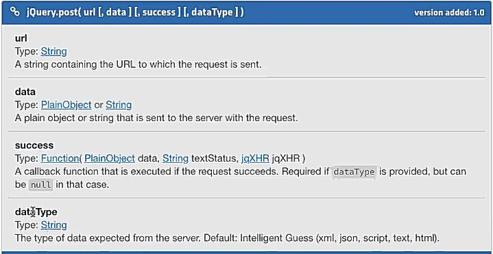

# **JavaScript**
## **Comandos**
> ## **split()**
 **Def:** El split descompone el valor asociado a el de la  forma que se indique en el argumento. **No se puede hacer split a un numero, solamente a un string**.

**Ejem. 1:**

    '1010'.split('');
    output: ['1', '0', '1', '0']
    // Separa el numero 1010 en un array con los mismos valores

**Ejem. 2:**

    'hola'.split('o');
    output: ['h', 'l', 'a']

>## **Number()**
**Def:** Convierte un numero de string a un numero. 

**Ejem. 1:**

    Number('5');
    Output: 5

>## **join()**
**Def:** Une los valores de un arreglo y lo convierte en un string. 

**Ejem. 1:**

    array.join('') // Donde array = [1,0,1,0]
    output: '1010'

>## **(objecto).toString();**
**Def:** Convierte un numero cualquiera en string. 

**Ejem. 1:**

    (100).toString();
    output: '100'
> ## **_charCodeAt()_**

El método charCodeAt() en JavaScript se utiliza para devolver el valor numérico del carácter Unicode en la posición especificada en una cadena de caracteres. Este método toma un parámetro obligatorio, que es el índice de la posición del carácter en la cadena.

Por ejemplo, si tenemos la cadena de caracteres "Hola Mundo" y queremos obtener el valor numérico del carácter en la posición 1 (que es la letra 'o'), podemos utilizar el método charCodeAt() de la siguiente manera:
> **throw new TypeError**

En JavaScript, throw new TypeError es una declaración que se utiliza para lanzar un error de tipo en tiempo de ejecución.
Cuando se ejecuta esta declaración, se detiene la ejecución del programa y se genera un objeto TypeError con el mensaje de error especificado. El mensaje puede ser cualquier cadena de texto que describa el error que se ha producido. Ejemplo:

```javascript
var edad = "25";
if (typeof edad !== "number") {
  throw new TypeError("La edad debe ser un número");
}
```


>**typeof _variable_**

En JavaScript, el método typeof se utiliza para determinar el tipo de datos de una variable o expresión.

```javascript
 nombre = "Juan";
console.log(typeof nombre); // devuelve "string"

var esMayorDeEdad = true;
console.log(typeof esMayorDeEdad); // devuelve "boolean"

var persona = { nombre: "Juan", edad: 25 };
console.log(typeof persona); // devuelve "object"

function saludar() {
  console.log("Hola!");
}
console.log(typeof saludar); // devuelve "function"
```

>**charCodeAt()**

El método charCodeAt() en JavaScript se utiliza para devolver el valor numérico del carácter Unicode en la posición especificada en una cadena de caracteres. Este método toma un parámetro obligatorio, que es el índice de la posición del carácter en la cadena.

Por ejemplo, si tenemos la cadena de caracteres "Hola Mundo" y queremos obtener el valor numérico del carácter en la posición 1 (que es la letra 'o'), podemos utilizar el método charCodeAt() de la siguiente manera:

```javaScript
let cadena = "Hola Mundo";
let valor = cadena.charCodeAt(1);
console.log(valor); // devuelve 111
```

>**return**

El return, dentro de una funcion, nos permite retornar un valor para que este sea utilizado en la asigancion del dato de una variable. Esto no quiere decir que cambiara el valor de la variable. 

>**let()**

El comando let, nos permite definir una variable de forma "temporal", para comprender mas esta situacion empezaremos explicando el siguiente caso:

```javascript
var instructor = "Tony";
if(true) {
    var instructor = "Franco";
}
console.log(instructor);

output: 'Tony'
        'Franco'
```
Al cambiar _var_ por _let_ en la variable _instructor = 'Franco'_ el output cambiara:

```javascript
var instructor = "Tony";
if(true) {
    let instructor = "Franco";
}
console.log(instructor);

output: 'Tony'
        'Tony'
```
Esto es debido a que _let_ nace y muere entre llaves _({})_.

### Diferencia entre let y var
Cuando se ejecuta el programa y se crea el contexto global, las variables definidas con _let_ no se guardan como un metodo(propiedad) en el objeto this y, por otro lado, cuando se utiliza _var_ siempre se mantendra en memoria este registro de la variable.

> # **bind**

```javascript

var persona = {
  nombre: 'Franco',
  apellido: 'Chequer',

  getNombre: function(){
    var nombreCompleto = this.nombre + ' ' + this.apellido;
    return nombreCompleto;
  }
}

var logNombre = function(){
  console.log(this.getNombre());
}
```

En este ejemplo, vamos a usar el keyword `this` para invocar el método del objeto persona. Como verán, el código de arriba produce un error, ya que cuando ejecutamos `logNombre()`, el `this` que está adentro hace referencia al objeto global, y ese objeto no tiene un método `getNombre`.

```javascript
var logNombrePersona = logNombre.bind(persona);
logNombrePersona();
```

La función `bind()` devuelve una __copia__ de la función, la cúal tiene internamente asociado el keyword `this` al objeto que le pasemos por parámtro. Si la llamamos sobre `logNombre` y le pasamos `persona` como argumento, vamos a ver que al ejecutar la _nueva_ función `logNombrePersona()` se va a loguear correctamente el nombre de `persona`.

> # **call()**
```JS
logNombre.call(persona);
```
En este caso, estamos invocando la función original logNombre, pero con call le estamos indicando a qué objeto tiene que hacer referencia this dentro de esa función. Este comando nos permite ejecutar luego luego la funcion a diferencia de bind a la que tenemos que asociarla a una variable para posteriormente invocarla. 
**Por lo tanto, se utiliza bind cuando no queremos ejecutar inmediatamente y call cuando si queremos**

El primer argumento de `call` es el objeto a usar cómo `this`. Despues de este puedo pasar otros argumentos, que serán pasados a la función que estamos invocando. Por ejemplo, si nuestra función recibiera argumentos, usariamos `call` de la siguiente manera:

```javascript
var logNombre = function(arg1, arg2){
  console.log(arg1 +' '+ this.getNombre() +' '+ arg2);
}

logNombre.call(persona, 'Hola', ', Cómo estas?'); //Hola Franco Chequer , Cómo estas?
```

> # **apply**

De hecho, la función `apply` es casi igual a `call`, excepto que recibe los argumentos de distinta manera. `apply` necesita dos arguemntos, el primero es el objeto a bindear con `this` (igual que `call`) y el segundo parámetro es un arreglo, en este arreglo pasamos los argumentos que va a usar la función que invocamos. Por ejemplo, para obtener el mismo comportamiento que arriba, pero con `apply`:

```javascript
var logNombre = function(arg1, arg2){
  console.log(arg1 +' '+ this.getNombre() +' '+ arg2);
}

logNombre.apply(persona, ['Hola', ', Cómo estas?']); //Hola Franco Chequer , Cómo estas?
```

Un arreglo puede ser más fácil de pasar cuando no sabemos a priori cuantos argumentos le voy a pasar.

># **Set()**
El comando set nos permite eliminar datos repetidos de un arreglo. Cuando ejecutamos ese comando, se obtiene una estructura de datos distinta el cual se llama, un objeto Set que se llaman recopiladores de valores. El metodo set tiene sus propios metodos. 

**Ejemplo:**

```javascript
var array = [1, 2, 4 , 5, 3, 3, 3, 1, 8, 6, 7];
var set1 = new Set(array);
console.log(array);
console.log(set1);

cout: [1, 2, 4, 5, 3, 3, 3, 1, 8, 6, 7]
      {1, 2, 4, 5, 3, 8, 6, 7}
```

># **add()**

Este metodo solo aplica para los objeto Set. El metodo set permite agregar un valor, cual sea el tipo de dato, a un objeto Set. Cada valor que va agregando lo agregara siempre al final. AHora, si se intenta agregar un valor repetido no nos lo va a permitir. Tambien se podrian agregar objetos al objeto set

**Eje:**
```javascript
let set1 = new Set();
set1.add(1);
set1.add('dato');
set1.add({a: 1})

output: {1, 'dato', {a: 1}}
```
Los objetos son referencias a memoria, por lo tanto, cada objeto que se agregue a un objeto Set, este lo aceptara ya que los objetos que se agregaron a Set son 2 objetos distintos. Ahora, si se define un objeto en una variable, y este objeto se trata de agregar haciendo mencion a la variable, se rechazara, esto debido a que estamos agregando el mimso objeto que tiene una misma direccion. 

> # **has()**

Para verificar que un valor se encuentra en un objeto tipo Set, se utiliza el metodo has()

**Eje:**

```javascript
let array = [1, 'misa', {a: 1}];
let set1 = new Set(array);
console.log(set1.has(1))
console.log(set1.has('mich'))

output: true
        false
```

># **delete()**

El metodo delete nos permite elminar el valor que establecemos en su argumento solo si este se encuentra dentro del objeto Set.

**Eje:**
```javascript
let set1 = new Set([1, 2, 3, 4, 5])
console.log(set1);
set1.delete(3);
console.log(set1);

output: {1,2,3,4,5}
        {1,2,4,5}
```


> # **Clouser**

**Cuando se nos pide en unas indicaciones que retornemos una funcion, esta hablando de clousers**
**Un clouser es un fenomeno. Es cuando una variable se define en una funcion, esta retorna otra funcion y cuando invocamos la nueva funcion nos permite acceder a cualquier variable establecida en la primera funcion y su valor definido en la funcion 2**

> **Function Borrowing**

Veamos un simple ejemplo donde podríamos usarlos, esto se conoce cómo __function borrowing__ (tomando prestadas funciones). Vamos a crear una segunda _persona_, pero que no tenga el método `getNombre` como la primera:

```javascript
var persona2 = {
  nombre: 'Manu',
  apellido: 'Barna'
};
```

Ahora, vamos a pedirle prestado el método `getNombre` a la primera _persona_ y la vamos a usar con la nueva.

```javascript
persona.getNombre.call(persona2); //'Manu Barna'
```

Con esto pudimos invocar un método de un objeto, pero usándolo con otro!

> **Function Currying (zurra o pelar)**

Veamos otro mini patron: _function currying_, este involucra `bind`.
Como `bind` crea una nueva función, si le pasamos parámetros, estos quedan __fijos__ en la nueva función. En el ejemplo no vamos a bindiar `this` con nada, pero si unos parámetros.
Digamos que tenemos una función que multiplica dos números recibidos por parámetro. Y nos gustaría construir una función que multiplique un número recibido por argumento por dos. Para esto podríamos usar `bind` y le pasamos cómo primer parámetro `this` (en este caso `this` hace referencia al contexto global), y como segundo parámetro un `2`. Guardamos el resultado en una nueva variable:

```javascript
function multiplica(a, b){
  return a * b;
}

var multiplicaPorDos = multiplica.bind(this, 2);
```

De esta forma, tenemos una nueva función donde el parámetro `a` es siempre `2`, gracias a `bind`. Nótese, que dentro de `multiplicaPorDos`, `this` sigue haciendo referencia al objeto global, porque cuando lo bindeamos le pasamos ese parámetro.

> **IMMEDIATE FUNCTIONS**

Las funciones inmediatas se ejecutan luego luego, ademas de que tambien pueden ser llamadas despues. Se escriben entre parentesis (function _funcion_(){}());

>**callback**

Las funciones callbacks son un tipo de funciones que se pasan por parametro a otras funciones. Supongamos qu etenemos una funcion 1 que recibe por parametro otra funcion 2. Cuando la funcion 1 ejecuta a la funcion 2 en su interior se produce un proceso llmado call back. **Esta funciones nos aseguran que una funcion no se va a completar antes de que se ejecute una tarea, funcion, se ejecuta despues de que una tarea se ejecuta**

**Ej. 1:**

```javascript
var devuelvoUsuario = function(){
    return 'Camilo';
};

var devuelvoSaludo = function(){
    return 'Hola'
};

var saludar = function(cb1,cb2){
    return cb1() + '' + cb2();
};

var resultado = saludar(devulevoSaludo, devuelvoUsuario);

console.log(resultado);
```


> **parseInt()**

Es muy similar al comando _number()_, solo que, _parseInt()_ convierte un string a un numero completamente entero. Si se ha de convertir un numero flotante de tipo string, este se redondeara al entero menor. 

>**boolean()**

Calcula el numero booleano de un numero.

> **hasOwnProperty()**

Es un metodo que nos permite saber si al objeto que asignamos tiene esa propiedad que definimos en su argumento. 

> **typeof**

```javascript
console.log(typeof 42);
// Expected output: "number"

console.log(typeof 'blubber');
// Expected output: "string"

console.log(typeof true);
// Expected output: "boolean"

console.log(typeof undeclaredVariable);
// Expected output: "undefined"
```
## **Notas**
> JavaScript no difiere en el tipo de dato

> Si se multiplica un string con un numero da como resuldado un numero

>1. boolean([]) -> true

>2. boolean(![]) -> false

>3. [] == ![] -> true // Ambos son booleans? -> si

>4. [] === ![] -> false // Ambos son booleans y del mismo tipo? -> no
>5. persona[arg] = cb(arg) ---> Asi se guarda una propiedad y su valor en un arreglo. El comando anterior (persona[arg]) nos indica que se guardara una propiedad llamada arg, o lo que contenga la variable arg, en el objeto persona, y su valor sera lo regrese la funcion cb(arg).
>6. La diferencia entre console.log(persona.arg) o console.log(persona[arg]) --> La diferencia es la forma en la que el programa lee el comando. El primer comando el interprete lo lee como: imprimir el valor de la propiedad con la palabra arg. El segundo lo lee como: Imprimir el valor de la propiedad de la variable arg, el cual, la variable arg es un string con un nombre que desconocemos. **Un comando interpreta la texto _arg_ como el nombre del objeto y el otro como una variable _que contiene un estring en ella osea, otro nombre_**.
> 7. Para limitar a un objeto de utilizar ciertos metodos, por ejemplo un array, se utilizan las clases y se agregan en la clase unicamnete los metodos que se quedran utilizar y dejar  aun lado los otros. 
>8. if(!_variable_){} es igual a if(_variable_ === null){}
>9. if(_variable_){} es igual a if(_variable_ !== null){}
>10. 10%3numero. 
# **HTML**
# **CSS**
# **Fless**
# **BOOTSTRAP**
# **Procedimeinto de Estudio**
# **AJAX**
## Comandos
> **Utilizar get en AJAX**
```javascript
$.get('url',function(data){})
// En la url va la url del API
// El primer parametro es la URL y el segundo es la accion que hara. 
// El parametro data es la informacion obtenida. 
```
> **Utilizar eventLisener en AJAX**
```javascript
$('nombreDelElementoDeHTML o NombreDeLaCLase').click(function(){})
```
> **Como configurar JQUERY para utilizar la tecnologia AJAX**
```html
<script src="url"></script>
```

> **Como utilizar POST, PUT and DELETE o tambien GET de otra forma**
```javascript
$.ajax({
    type: "POST/GET/PUT/DELETE",
    url: url,
    data: data,
    success: function(data){},
    dataType: dataType
});
```


> **`$('') & $.get('')`**

`$('') & $.get('')` -> sirve para seleccionar un elemento y el otro para establecer un metodo HTTP

> Algunos metodos importantes: `$('').empty()` -> Nos permite vaciar una etiqueta padre, eliminar sus hijos, `$('').val('')` -> Nos permite obtener el valor de una etiqueta input, `$('').text('')` -> Nos permite agregar contenido (texto) a la etiqueta padre, `$('').apend('')` -> Agrega el contenido que se encuentra en comillas al elemento seleccionado. `$('').apendTo('')` -> Agrega el contenido del selector al elemento indicado en el argumento. 
## Notas
>1. Para las free fake APIs online solo se puede utilizar el elemento get, mas no post, put y delete. Para los demas elementos se utiliza postman o insomnia.
>2. Los selectores getElementsByClassName no son necesarios si utilizamos AJAX, en AJAX se utiliza el $('') para seleccionar un elemento y &.get('',function(){}) para indicar un metodo http.
>3. Los datos de una API son objetos. 
>4. En AJAX el .value de un input se define como acontinuacion -> input[0].value
>5. `npm start` Este ultimo comando no nos retornara la terminal, sino que quedara ejecutando. Necesitamos dejarlo abierto mientras trabajamos. A esto se llama node serve.js


NOTAS ADICIONALES
* Revisar que hace el metodo hasOwnProperty(_Propiedad_)
* Que es let array = new Array[6];